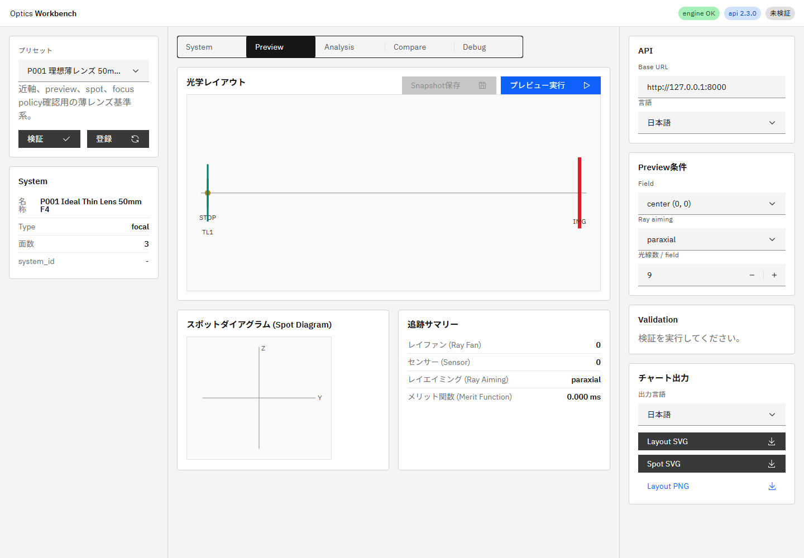
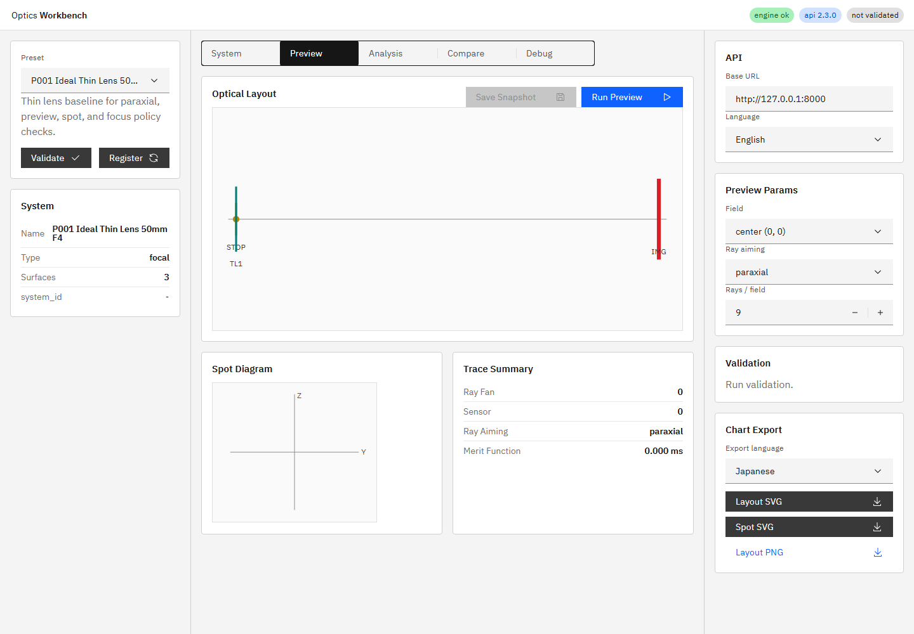
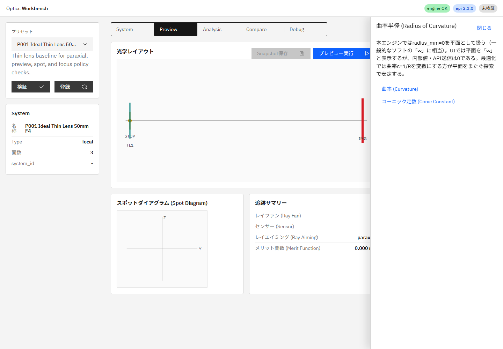

# optics-workbench — Optics Workbench

写真レンズ・双眼鏡・望遠鏡のための教育用光学シミュレーションエンジン＆Web Workbench

**開発中（work in progress）**：APIと仕様は変更されることがあります。

---

## Overview (English)

An educational optical simulation engine (Python, stateless HTTP API) and web workbench (React + TypeScript) for photographic lenses, binoculars, and telescopes: 3D sequential ray tracing, paraxial analysis, aberration/PSF/MTF evaluation, and afocal (visual instrument) analysis. The UI is fully bilingual (ja/en) with a built-in optics glossary. Documentation is primarily in Japanese; the quick-start commands below are language-neutral.

```bash
# Engine (HTTP API)
python -m pip install -e ".[api,test]"
python -m uvicorn optics_engine.api.main:app --host 127.0.0.1 --port 8000

# Workbench UI
npm ci
npm run ui:dev

# Tests
python -m pytest -q && npm run ci
```

License: Apache-2.0. Interested in an English README? Open an issue.

---

## これは何？

本プロジェクトは、以下の2つで構成されています。

- **光学エンジン**（Python）— +X光軸の3次元シーケンシャル光線追跡。球面・非球面・ミラー・絞り・理想薄レンズ、近軸（y-nu）解析、ray aiming、spot / ray fan / 歪曲 / 像面湾曲 / 色収差、幾何PSF/MTF、周辺光量、アフォーカル系（双眼鏡・望遠鏡）の射出瞳・アイレリーフ・角度MTF評価。UIや外部最適化から呼べるステートレスHTTP APIとして公開。
- **Workbench UI**（React + TypeScript + Carbon）— 面テーブル編集、レイアウト表示、解析チャート、スナップショット比較。日英完全対応で、光学用語集と3階層ヘルプ（用語ツールチップ／解説ドロワー／エラー解説）を内蔵。

設計の優先順位は、**①光学を初学者に「見える」ようにする教育用途**、②簡易的な設計検討、③外部最適化エンジン向けの評価バックエンド（DLS向けオペランド/残差API）、の順です。

## スクリーンショット

| Workbench (ja) | Workbench (en) | ヘルプドロワー |
|---|---|---|
|  |  |  |

## クイックスタート

必要環境：Python 3.12+、Node 20+

```bash
# エンジン（HTTP API）
python -m pip install -e ".[api,test]"
python -m uvicorn optics_engine.api.main:app --host 127.0.0.1 --port 8000

# Workbench UI
npm ci
npm run ui:dev                     # http://127.0.0.1:5173
```

テストの実行：

```bash
python -m pytest -q          # エンジン（既知設計とのGolden Test含む）
npm run ci                   # UIビルド + i18n検査 + 用語集カバレッジ
```

## ドキュメント

仕様書（正本・日本語）：

- [`doc/engine_spec.md`](doc/engine_spec.md) — エンジン要求仕様・技術仕様（現行 v2.3）
- [`doc/ui_spec.md`](doc/ui_spec.md) — Workbench UI仕様（現行 v0.3）
- [`AGENTS.md`](AGENTS.md) — AIコーディングエージェント向けの作業ルール

## 開発状況

| 領域 | 状況 |
|---|---|
| エンジンコア（追跡・近軸・収差・PSF/MTF・アフォーカル） | 実装済み（MVP、Phase 1–8） |
| エンジン性能（ベクトル化カーネル、aimingキャッシュ） | 進行中 |
| エンジン最適化API（オペランド・ヤコビアン） | 計画中 |
| UI Phase 1（編集・レイアウト・近軸・preview）＋ i18n/ヘルプ | 実装済み |
| UI Phase 2（解析ビュー・ベストフォーカス・snapshot比較） | 実装済み（snapshot exportは単一JSONのみ。zip exportは未実装） |
| UI Phase 3–4（設計操作・視覚系ビュー） | 計画中 |

## 未確定項目

- `optics-workbench` は公開時に正式リポジトリ名へ置き換えてください。
- `NOTICE` の `TJ16th` は権利者名確定後に置き換えてください。

## ライセンス

Apache License 2.0 — [LICENSE](LICENSE) を参照してください。
