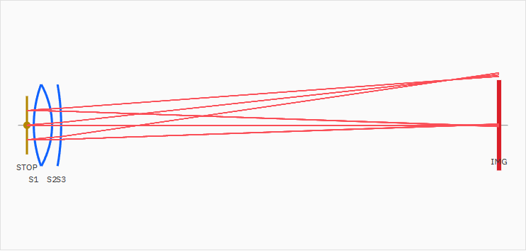

# Layout View Rendering Quality Report

Date: 2026-07-10

## 対象

- Work order: `doc/work_orders/active/codex_layout_view_rendering_quality.md`
- 対象UI: Optical Layout View
- 主な確認プリセット: P003 Achromat Doublet 100mm Demo

## 実装内容

- Layout Viewの光線表示をLOD化し、APIが返した全光線ではなく代表pupil sampleのみを描画するようにした。
- `data-total-rays` / `data-displayed-rays` を `#layout-svg` に保持し、返却光線数と表示光線数を検証可能にした。
- 光線を細線化し、`stroke-width: 0.58` / `stroke-opacity: 0.58` とした。
- 波長帯ごとに F線系 / d線系 / C線系のclassを分け、色で識別できるようにした。
- `semi_diameter_mm` を有効半径として使い、隣接屈折面のclear aperture boundaryを閉じたガラス領域として描画した。
- 空気/ガラス区間を塗り分け、接合面は `surface-cemented` として通常面より控えめな線種にした。
- 接合面など近接するsurface labelは段違いに表示し、ラベル同士の重なりを避けるようにした。
- 隣接面の `min(semiD_a, semiD_b)` 位置でedge thicknessを評価し、負値の場合はガラス領域をwarning styleにする経路を追加した。
- 開発用fixture `F_EDGE_CASE` を追加し、plane-plane境界、plane-sphere境界、負edge thickness時のwarning表示をE2Eで固定した。
- `doc/engine_spec.md` 10.3のedge_thickness定義を `min(semiD_a, semiD_b)` 評価に更新した。
- `doc/ui_spec.md` 17.2にLayout View描画規約を追記した。
- `doc/reports/issues_backlog.md` に、将来の `mechanical_diameter_mm` 導入Issue案を追加した。

## Before / After

| 状態 | スクリーンショット | 返却光線数 | 表示光線数 | ガラス領域 | 接合境界 |
|---|---|---:|---:|---:|---:|
| Before | `doc/images/layout-view-p003-before.png` | 81 | 80 | 0 | 0 |
| After | `doc/images/layout-view-p003-after.png` | 81 | 27 | 2 | 1 |

Afterでは、全光線をほぼそのまま重ねる表示から、field / wavelength / pupil sampleの代表光線だけを出す表示に変えた。P003では表示光線が80本から27本に減り、レンズ面の形状と光線の関係が読みやすくなった。

## 仕様との差分

- `semi_diameter_mm` によるclear aperture boundary表示は実装済み。
- 空気/ガラス/接合面の視覚的区別は実装済み。
- 負edge thicknessで描画を落とさずwarning表示するUI経路は実装済み。
- edge thicknessの仕様文言は更新済み。
- 現Phaseでは製造寸法の描画は未実装。`semi_diameter_mm` は有効半径として扱い、段付き形状などの製造寸法はbacklogの `mechanical_diameter_mm` Issueへ送った。
- ガラス領域の輪郭は、隣接する2面の有効径端を直接閉じるMVP実装。コバ形状や段付き形状を含む詳細断面は、製造寸法モデル追加後に対応する。
- エンジン本体には `edge_thickness` metric算出の実装は見当たらず、metadata列挙のみ存在する。今回の対応はLayout View警告経路と仕様文言更新が中心。

## 検証

- `npm.cmd run ci`
  - 16 Playwright testsを含む全チェック passed
  - `analysis-conditions.spec.ts` 15 tests passed
  - `toggletip.spec.ts` 1 test passed

追加E2E:

- `layout view keeps plane boundary elements and warns on negative edge thickness`
  - plane-plane / plane-sphereのガラス領域が閉じること
  - 負edge thickness時に `glass-element-warning` が付与されること

## スクリーンショット

