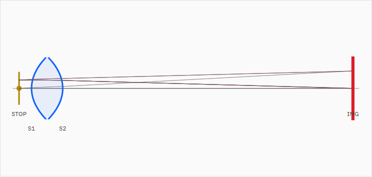
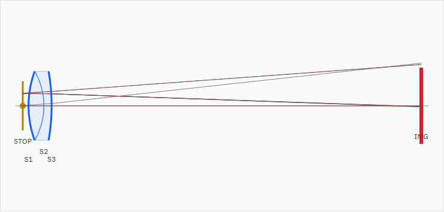
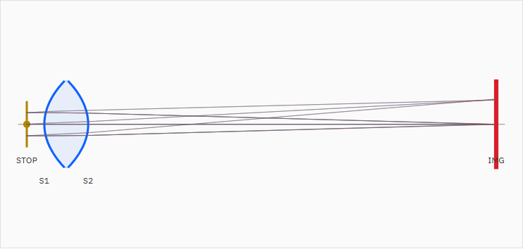
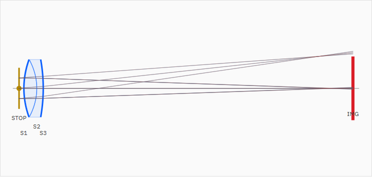

# Layout View LOD Ray Symmetry Report

Date: 2026-07-10

## 対象

- Work order: `doc/work_orders/active/codex_lod_ray_symmetry.md`
- 対象UI: Optical Layout View
- 確認プリセット: P002 N-BK7 Biconvex Singlet 50mm Demo / P003 Achromat Doublet 100mm Demo

## 原因

原因はエンジン側の瞳サンプリングではなく、UI側のLOD代表サンプル選択だった。

エンジンの `/v1/education/preview` レスポンスでは、P002/P003とも3 field、3 wavelength、9 samplesで合計81本が返っていた。STOP位置のY分布は全fieldで上下対称だった。

| Preset | 全光線数 | 全光線STOP Y | 旧LOD表示数 | 旧LOD STOP Y | 旧LOD sample |
|---|---:|---:|---:|---:|---|
| P002 | 81 | -4 .. +4 mm | 27 | 0 .. +4 mm | 0, 4, 8 |
| P003 | 81 | -5 .. +5 mm | 27 | 0 .. +5 mm | 0, 4, 8 |

旧LODは `index % samples` で `0 / mid / last` を選んでいたが、エンジンのgridサンプル順ではそれが「中心・片側・片側寄り」になり、下側瞳位置を落としていた。

## 修正内容

- `layoutRayItems()` を、sample indexではなく実際のSTOP位置Yに基づく選択へ変更した。
- 各 `field × wavelength` グループごとに、STOP位置Yの `lower / center / upper` を選ぶようにした。
- `data-field-index` / `data-wavelength-index` / `data-sample-index` / `data-sample-role` / `data-stop-y-mm` をray path DOMへ付与し、E2Eで検証可能にした。
- E2E mockのpreview pathもsample indexに基づく対称Y分布へ修正した。
- P003 slider previewのE2Eに、表示光線が上下両側を含むこと、fieldごとの表示本数が均等であること、`lower / center / upper` が揃うことを追加した。

## After

| Preset | 返却光線数 | 表示光線数 | 表示STOP Y | fieldごとの表示 | role |
|---|---:|---:|---:|---|---|
| P002 | 81 | 27 | -4 .. +4 mm | 9 / 9 / 9 | lower / center / upper |
| P003 | 81 | 27 | -5 .. +5 mm | 9 / 9 / 9 | lower / center / upper |

## スクリーンショット

Before:

After:

## 検証

- `npm.cmd run ui:build`
  - passed
- `npm.cmd run ui:e2e -- apps/workbench-ui/tests/e2e/analysis-conditions.spec.ts -g "P003 slider preview|layout view"`
  - 5 passed
- `npm.cmd run ci`
  - 16 Playwright testsを含む全チェック passed
