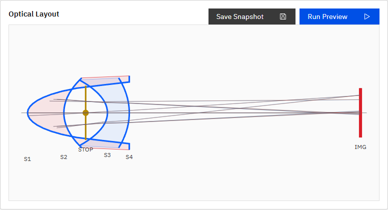

# P007 Fast Positive-Negative Meniscus Pair

Date: 2026-07-10

## Scope

`doc/work_orders/active/codex_preset_fast_negative_pair.md` に基づき、明るいF値で強い正負メニスカス曲率を持つLayout View検証用プリセットを追加した。

## Added Preset

- ID: `P007`
- Name: `Fast Positive-Negative Meniscus Pair 50mm Demo`
- Type: focal
- Wavelengths: F/d/C
- Structure:
  - S1/S2: positive N-BK7 meniscus group
  - STOP: circular aperture, semi-diameter `13.2 mm`
  - S3/S4: negative N-F2 meniscus group
  - IMG: 36 x 24 mm sensor

Primary surface values:

| Surface | Kind | Radius mm | Thickness after mm | Material after | Semi-diameter mm |
| --- | --- | ---: | ---: | --- | ---: |
| S1 | refractive | 14.0 | 5.0 | N-BK7 | 18 |
| S2 | refractive | 60.0 | 3.0 | AIR | 17 |
| STOP | aperture_stop | 0 | 3.0 | AIR | 13.2 |
| S3 | refractive | -35.0 | 3.0 | N-F2 | 16 |
| S4 | refractive | -100.0 | 31.8 | AIR | 17 |
| IMG | sensor | 0 | - | - | sensor 36 x 24 |

## Numeric Check

Local engine check:

```text
validate_system: ok
EFL: 47.46348880880296 mm
BFL: 31.84367107722626 mm
F-number: 1.7978594245758697
Paraxial image position: 45.84367107722626 mm
Paraxial trace: 18/18 arrived
Full aiming trace: 18/18 arrived
```

This is close to the requested 50 mm / F1.8 target while keeping the system simple and stable for Layout View verification.

## UI Changes

- Added P007 to `apps/workbench-ui/src/domain/presets.ts`.
- Added P007 name/summary to ja/en i18n preset resources.
- Added an E2E check for P007 Layout View rendering.

## Verification

追加E2E:

- `P007 fast meniscus pair preset renders strong positive and negative curvature`

確認内容:

- P007 can be selected from the preset list.
- Layout View renders 4 refractive surface profiles.
- Layout View renders 2 glass elements.
- STOP scale is `13.2 mm -> 52.8 px`.
- Positive and negative curvature signs are visually/DOM-distinguishable.
- Preview returns ray paths over 6 surfaces and `data-total-rays=81`.

実行済み:

```text
npm.cmd run ui:build
npm.cmd run i18n:coverage
npm.cmd run ui:e2e -- apps/workbench-ui/tests/e2e/analysis-conditions.spec.ts -g "P007 fast"
```

結果:

- UI build: passed
- i18n coverage: passed
- Targeted E2E: passed, 1 test

## Screenshot


