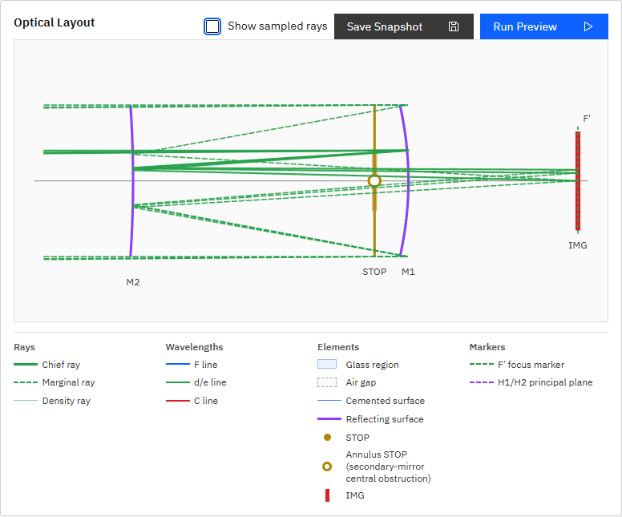

# R44 M2曲率符号・Annulus STOP位置とマーカー表示の再調査

## 結論

- M2の曲率描画は正しい。M1/M2はともに `R < 0` のためグローバルX座標上では同じ向きの弧になるが、入射方向が逆なのでM1は凹面、M2は凸面として作用する。
- Annulus STOPは `X=0 mm`、M1は `X=80 mm`、M2は `X=-570 mm` であり、STOPはM1側にある。
- Annulus STOPの輪郭マーカーが凡例だけに実装され、レイアウト本体では通常STOPの塗りつぶし丸を描いていた。レイアウト本体も輪郭マーカーへ修正した。

## R43で着手済みだった内容

R43ではコード変更前の読取調査まで実施し、正本仕様と「M2だけ弧を反転する」という指示の前提が矛盾することを報告して停止した。コード変更・テスト・リモート操作は行っていない。取消はコミット `f55f177` で記録済みであり、R44が差し替え指示として本調査を継続した。

## 客観的な面データ

| 面 | kind | radius_mm | thickness_after_mm | 頂点X | 入射方向符号 |
|---|---|---:|---:|---:|---:|
| STOP | aperture_stop / annulus | 0 | 80 | 0 | +1 |
| M1 | mirror / spherical | -2000 | -650 | 80 | +1 |
| M2 | mirror / spherical | -1050 | 1050 | -570 | -1 |
| IMG | sensor | 0 | 0 | 480 | +1 |

正本 `doc/engine_spec.md` 5.1節では、`R < 0` は曲率中心が面頂点より-X側にあることを意味する。同6.3節の検証済みカセグレン例もM1=`-2000`、M2=`-1050` と明記している。

Layout Viewは `surfaceSagMm()` でradius符号を含むsagを計算し、`surfaceProfilePoints()` が `vertexX + sag` のSVGパスを生成する。両面とも中央が+X側へ膨らむ同じ向きの弧となるが、M1は+Xへ進む入射光に対する凹面、M2は-Xへ戻る入射光に対する凸面である。画像だけでは反射面の入射側が省略されるため、同じ凹凸に見えたことが認識差の原因だった。

## STOP位置と光学的意味

STOPはM1の80 mm手前にあり、M2まで570 mm離れているためM1側である。R42報告の正確な結論は「M1中央孔そのもの」ではなく、「M2が入射光束中央を遮る効果をM1手前の仮想annulus面で表現する」である。R44指示書内のR42結論の引用とは差があるため、本報告ではR42報告書とP005定義を正として整理した。

## 修正内容

- mirror面へ `data-radius-mm` と `data-mirror-incident-sign` を追加し、M1/M2の曲率符号と入射方向をE2Eで固定した。
- annulus aperture_stopでは通常の `stop-dot` を描かず、凡例と同じ輪郭丸 `stop-annulus-marker` を描くようにした。
- P005で輪郭マーカー1個、塗りつぶしSTOP 0個、M1/M2のradiusと入射方向符号を直接検証した。

## スクリーンショット

R42では実ブラウザのスクリーンショットを取得して目視確認していたが、一時ファイルとして削除し、報告書へ添付していなかった。R44では確認画像をリポジトリへ保存した。

## 検証

- `python -m pytest -q`: `87 passed, 1 skipped`
- `npm run ci`: `27 passed`
- `apps/workbench-ui/tests/e2e/analysis-conditions.spec.ts`
  - M1: `radius=-2000`, `incident_sign=1`
  - M2: `radius=-1050`, `incident_sign=-1`
  - Annulus STOP: outline marker 1、filled stop dot 0
- 実ブラウザ描画: `doc/images/r44-p005-curvature-annulus.png`
