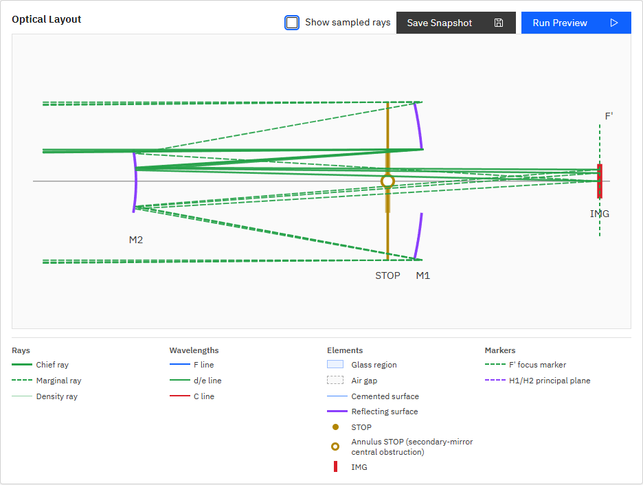

# R45 M1中央開口・M2表示サイズ修正 完了報告

## 結果

P005のLayout Viewについて、主鏡M1を中央開口のある上下2セグメントとして描画し、副鏡M2をannulus STOPの`inner_semi_diameter_mm`と一致する物理スケールで表示するよう修正した。

- M1: `semi_diameter_mm = 100`、中央開口半径 `40 mm`
- M2: `semi_diameter_mm = 40`
- annulus STOP: `inner_semi_diameter_mm = 40`、`outer_semi_diameter_mm = 100`
- 共通表示スケール: `0.92 px/mm`
- M1表示半径: `92 px`
- M2表示半径: `36.8 px`

## 修正内容

- `surfaceProfilePoints`に描画対象の高さ範囲とサンプル数を指定できるようにした。
- annulus STOP直後の最初のmirrorを主鏡として特定し、annulus内半径に相当する中央区間を描画しないようにした。
- 面ごとの独立した上限clampをやめ、系全体の最大有効半径から求めた共通スケールをsurface表示にも適用した。
- P005のM1中央開口、M2サイズ、反射面パス数と中央間隔をE2Eで固定した。
- P001/P002/P003/P005/P006/P007を含む既存Layout View回帰テストを維持した。

## 実画面確認

Playwrightから`http://127.0.0.1:5173/?lng=en`を開き、P005を選択して`Run Preview`を実行した。実DOMで以下を確認した。

- M1中央開口: `40 mm`
- M1 mirror path: 2本
- M1上下セグメント間の視覚的間隔: 約`77 px`
- M2半径: `40 mm`
- M2表示半径: `36.800000000000004 px`
- STOP annulus内半径: `40 mm`
- annulus marker: 1個

## 検証

- `python -m pytest -q`: `87 passed, 1 skipped, 1 warning in 6.62s`
- `npm run ci`: 成功
- `npm run ui:e2e`: `27 passed (38.2s)`
- 直接対象E2E: `apps/workbench-ui/tests/e2e/analysis-conditions.spec.ts`
- 実装根拠: 本報告・指示書移動・コード変更を含むR45コミット（`fix(ui): scale P005 mirrors and show primary hole (R45)`）

## 制約

エンジン上のannulusは副鏡による中央遮蔽を表す。現行system modelにはM1中央開口専用パラメータがないため、R45の指示に従い、Layout Viewではannulusの`inner_semi_diameter_mm`をM1中央開口の表示値として使用している。これは表示上の近似であり、独立したM1穴径の物理モデル追加ではない。

## プロセス整合

機能コミット後にAPI・UIを再起動し、`GET /v1/meta`の`build_info.git_commit`と当該コミットのHEADが一致することを確認してから完了とする。
