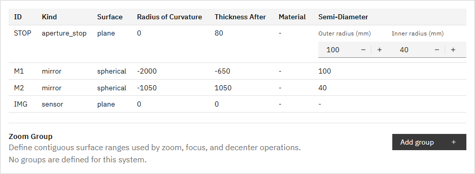

# R47 annulus内外半径のSystemタブ表示・編集 完了報告

## 調査結果

P005のSTOPは1つの`aperture_stop`面であり、定義は次の通りだった。

- `shape: annulus`
- `outer_semi_diameter_mm: 100`
- `inner_semi_diameter_mm: 40`
- 互換用の面プロパティ `semi_diameter_mm: 100`

従来のSystem面テーブルは`surface.semi_diameter_mm`またはcircle用の`aperture.semi_diameter_mm`だけを「Semi-Diameter」に表示していた。このためP005では外半径相当の`100`だけが見え、annulusの内半径を表示・編集するUIは存在しなかった。

## 修正内容

- annulus面のSemi-DiameterセルをOuter/Innerの2つの`NumberInput`として表示した。
- P005ではOuter `100 mm`、Inner `40 mm`を表示し、どちらも編集可能にした。
- Outer編集時は`outer_semi_diameter_mm`と互換用`surface.semi_diameter_mm`を同期する。
- 編集時はsystemをdirtyにし、登録済みsystem ID、trace、解析結果を既存のsystem変更処理で無効化する。
- circle等のannulus以外の面は従来の単一値表示を維持する。
- 日本語・英語の表示ラベルをi18nリソースへ追加した。

## 実画面確認

P005を選択してSystemタブを開き、STOP行にOuter `100`、Inner `40`が同時表示されることを確認した。

## 検証

- `python -m pytest -q`: `87 passed, 1 skipped, 1 warning in 6.99s`
- `npm run ci`: 成功
- `npm run ui:e2e`: `28 passed (40.0s)`
- 追加E2E: `P005 System table displays and edits annulus outer and inner radii`
- 実装根拠: 本報告と同一のR47コミット（`feat(ui): edit annulus radii in system table (R47)`）

## R48への引き継ぎ

Systemタブで確認したP005のSTOPは単一面であり、inner/outerは同じannulus定義に属する。R48ではこの結論を前提に、Layout Viewで同一面がSTOPとAnnulus STOPの2表現として重複描画されていないかを確認する。

## プロセス整合

機能コミット後にAPI・UIを再起動し、`GET /v1/meta`の`build_info.git_commit`と当該コミットのHEADが一致することを確認して完了した。
