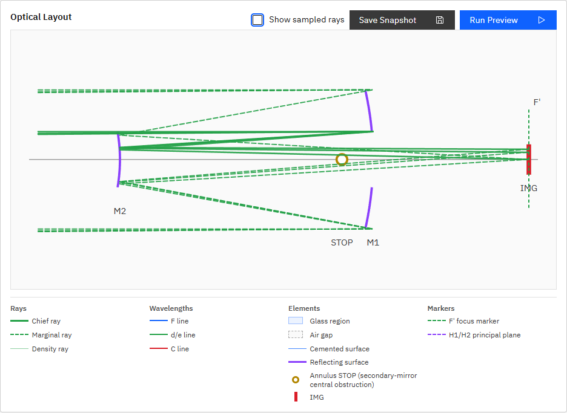

# R48 P005絞り構成・マーカー整合性 完了報告

## 絞り構成の確認

P005に存在する絞り面は`STOP` 1面だけである。

- `id: STOP`
- `kind: aperture_stop`
- `shape: annulus`
- `outer_semi_diameter_mm: 100`
- `inner_semi_diameter_mm: 40`

Layout Viewで見えていた通常STOP表現とAnnulus STOP表現は別面ではなく、同一面に対して通常の面線、中央遮蔽矩形、annulus輪郭記号を重ねていた。仕様9.1の「`aperture_stop`は系内にちょうど1つ」に違反するデータではなかった。

## 修正内容

- annulus STOPでは通常の面線と中央遮蔽矩形を描画せず、annulus輪郭記号1つだけを表示するようにした。
- annulus STOPでは通常STOPの塗りつぶし記号を表示しない。
- 凡例をsystem定義に応じて切り替えた。
  - circle等の通常STOP: `STOP`のみ
  - annulus STOP: `Annulus STOP`のみ
- P005のDOM検証で、annulus記号1、通常STOP記号0、通常面線0、中央矩形0、通常STOP凡例0、annulus凡例1を固定した。

## 絞り種別の判断

P005の主鏡・副鏡は物理的には固定径であり、望遠鏡の通常運用として可変irisを必須とする理由はない。一方、現行エンジン仕様9.1は`aperture_stop`を系内にちょうど1つ要求し、ray aimingと近軸瞳計算の基準面として使う。`mechanical_aperture`は複数配置可能な固定制限であり、現実装では`CompiledSystem.aperture_stop_index`に選ばれない。

したがって、P005のSTOPを単純に`mechanical_aperture`へ変更すると、ray aiming・pupil sampling・近軸瞳計算の基準面が失われる。R41の座標崩れも絞り種別が原因ではなく、Layout Viewの固定Y倍率と面間隔表示が原因だった。

R48では方針(b)として`aperture_stop`を維持した。これは現在のエンジン契約を守るための選択であり、物理的固定絞りと計算上の基準stopが同じkindに束縛されている制約はR49で仕様課題として整理する。

## 実画面確認

## 検証

- `python -m pytest -q`: `87 passed, 1 skipped, 1 warning in 7.36s`
- `npm run ci`: 成功
- `npm run ui:e2e`: `28 passed (39.9s)`
- 実装根拠: 本報告と同一のR48コミット（`fix(ui): render P005 annulus as one marker (R48)`）

## R47との整合

R47で確認した「P005のinner/outerは単一annulus面に属する」という結論と一致する。R48はその単一面の表示だけを1つの記号へ整理しており、SystemタブのOuter/Inner編集や光線追跡のannulus判定は変更していない。

## プロセス整合

機能コミット後にAPI・UIを再起動し、`GET /v1/meta`の`build_info.git_commit`と当該コミットのHEADが一致することを確認して完了した。
