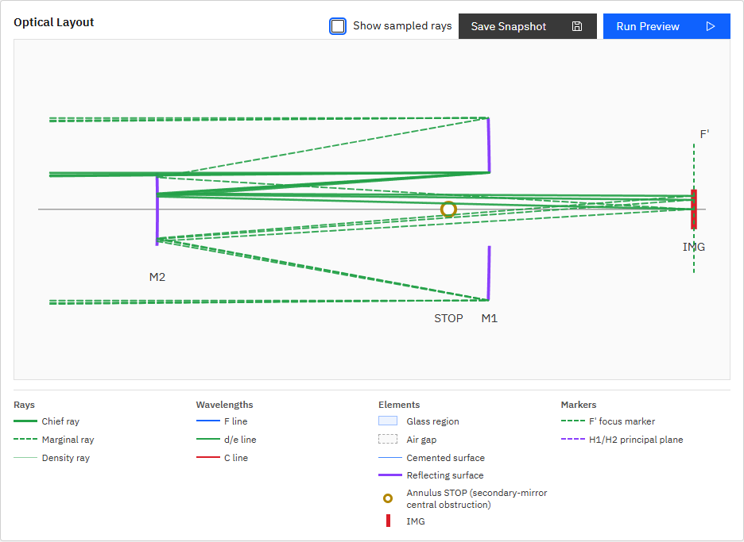

# R53 annulusサイズ数値検証・mirror遮光仕様確認 報告

## annulus輪とM2弧の実測

P005の定義値は次の通りである。

- annulus STOP: inner `40 mm`、outer `100 mm`
- M2: `semi_diameter_mm = 40`
- Layout View共通Yスケール: `0.92 px/mm`

したがって、annulusのinner半径とM2の描画半径は、どちらも`40 × 0.92 = 36.8 px`になるべきである。

### 修正前

実DOM/SVGから取得した値は次の通りだった。

| 対象 | 半径 | 直径 |
|---|---:|---:|
| 黄色いannulus輪 | `7 px` | `14 px` |
| M2弧のY描画範囲 | `36.800003 px` | `73.600006 px` |

両者は一致していなかった。M2は`semi_diameter_mm=40`を正しく表示していたが、annulus輪は視認用の固定上限`7 px`で描画され、物理inner半径を参照していなかった。



### 修正後

annulus輪半径を次の式で算出するよう修正した。

```text
annulus inner radius px
  = STOP visual outer radius px
    × inner_semi_diameter_mm / outer_semi_diameter_mm
  = 92 × 40 / 100
  = 36.8 px
```

実ブラウザでの再計測結果は次の通りだった。

| 対象 | 半径 | 直径 |
|---|---:|---:|
| 黄色いannulus輪 | `36.8 px` | `73.599998 px` |
| M2弧のY描画範囲 | `36.800003 px` | `73.600006 px` |

半径差は浮動小数点・SVG計測誤差を含めて`0.000003052 px`であり、数値上同一である。


## mirror自身の遮光仕様

正本`doc/engine_spec.md` 17.3節と`optics_engine/core.py::aperture_pass`を確認した。

### 外径側

`surface.aperture`を持たない面は、面ローカル半径`r = sqrt(y^2 + z^2)`について、`r <= surface.semi_diameter_mm`を通過条件とする。この分岐は`kind`を限定していないため、`kind: mirror`にも適用される。

mirror半径`4 mm`へ`r = 0, 3, 5 mm`の点を与える直接テストを追加し、結果`[True, True, False]`を確認した。したがって「mirror自体が、その有効径を超える光線を外径側で遮光する」という理解は正しい。

### 内径側

mirrorの`semi_diameter_mm`は外径制限であり、中心付近は通過扱いになる。後続するM2の物理径から前段光束の中央遮蔽を自動導出する処理は存在しない。

P005の中央遮蔽は、M2面自身ではなく、別途配置した次の専用面で実現している。

```json
{
  "id": "STOP",
  "kind": "aperture_stop",
  "aperture": {
    "shape": "annulus",
    "inner_semi_diameter_mm": 40,
    "outer_semi_diameter_mm": 100
  }
}
```

R49の②-a「実体を持つ後続面による内径側の固定遮蔽を自然に表現する」は、この制約を解消する将来拡張であり、現時点では未実装である。

## 仕様補足

`doc/engine_spec.md` 17.3節へ、面自身の`semi_diameter_mm`は外径側の遮光だけを扱い、中央遮蔽にはannulus面を別途配置すること、後続mirrorからの自動導出は未実装であることを一段落追記した。

## テスト

- 対象engineテスト: `2 passed in 1.77s`
- 対象UI E2E: `1 passed (4.8s)`
- `python -m pytest -q`: `87 passed, 1 skipped, 1 warning in 8.03s`
- `npm run ci`: 成功
- `npm run ui:e2e`: `28 passed (38.2s)`
- テストファイル: `tests/test_core_acceptance.py`
- テストファイル: `apps/workbench-ui/tests/e2e/analysis-conditions.spec.ts`
- 実装根拠: 本報告と同一のR53コミット（`fix(ui): scale P005 annulus marker to M2 (R53)`）

## プロセス整合

機能コミット後にAPI・UIを再起動し、`GET /v1/meta`の`build_info.git_commit`と当該コミットのHEADが一致することを確認して完了した。
