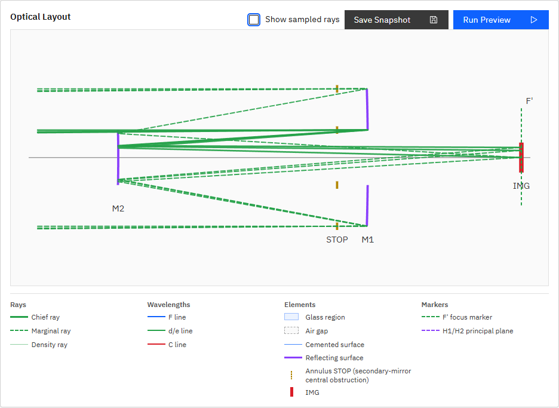

# R54 annulus STOPマーカー断面表現 修正報告

## 原因

R53までのLayout Viewは、P005のannulus STOPを次のSVG円として描いていた。

```tsx
<circle cx={sx} cy={sy} r={annulusInnerRadiusPx} />
```

半径`36.8 px`はinner `40 mm`とM2半径に正しく対応していたが、Layout ViewはX-Y断面図であるため、正面から見た円を混在させる表現は幾何学的に不正確だった。

## 修正内容

- annulusの正円を削除した。
- STOP面のX位置上に、inner境界`Y=±inner`とouter境界`Y=±outer`を示す短い縦線を4本描画した。
- 各境界線は高さ`10 px`とし、過剰な装飾や環状領域の塗りつぶしは行わない。
- inner/outerの物理スケールはR53の計算を維持した。
- 凡例のAnnulus STOPアイコンを正円から4本の断面境界記号へ変更した。
- 通常のcircle STOPは既存の面線とSTOP記号を維持した。

## 実ブラウザ計測

P005の実DOM/SVGで次を確認した。

- annulus円要素: `0`
- annulus境界線: `4`
- inner境界中心Y: `133.199997 px`, `206.800003 px`
- 光軸`Y=170 px`からinner境界まで: `36.800003 px`
- outer境界中心Y: `78 px`, `262 px`
- 光軸からouter境界まで: `92 px`
- 各境界線の高さ: `10 px`
- 凡例アイコン: amber色の4境界を表す4つのlinear-gradient

innerは`40 mm × 0.92 px/mm = 36.8 px`、outerは`100 mm`を共通表示上限へ収めた`92 px`であり、断面図上の位置は物理スケールと一致する。



## テスト

- 対象E2E: `1 passed (4.3s)`
- artifact TTL単独再実行: `1 passed, 1 warning in 0.81s`
- `python -m pytest -q`: `87 passed, 1 skipped, 1 warning in 6.96s`
- `npm run ci`: 成功
- `npm run ui:e2e`: `28 passed (41.9s)`
- テストファイル: `apps/workbench-ui/tests/e2e/analysis-conditions.spec.ts`
- 実装根拠: 本報告と同一のR54コミット（`fix(ui): render annulus stop as cross section (R54)`）

最初の全検証をpytestとUI CIで並列実行した際、artifact TTLテストが`ttl_seconds=0.02`を超えて1件失敗し、再試行時にはPlaywright用一時Viteサーバー`5177`が途中終了した。コードアサーションの失敗ではなく、順次再実行では上記の通り全テストがグリーンになった。テストの削除・skip・緩和は行っていない。

## プロセス整合

機能コミット後にAPI・UIを再起動し、`GET /v1/meta`の`build_info.git_commit`と当該コミットのHEADが一致することを確認して完了した。
