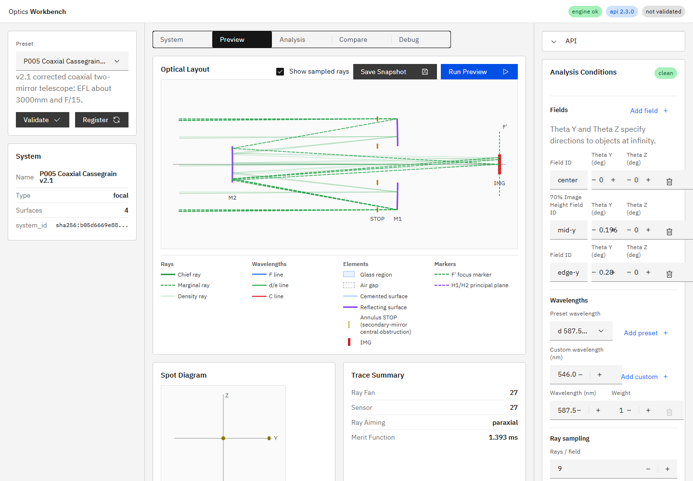

# R57 軸上chief ray／Annulus STOPマーカー調査・修正報告

## 結論

P005で上側だけに見えていた太い実線は、下側の光線が欠落したものではなく、annulusの中心サンプルを`+inner_semi_diameter_mm`へ写した光線を誤って`chief`と分類したものだった。

`doc/engine_spec.md` 16.2節はchief rayを開口絞り中心`(0, 0)`を通る実光線と定義する。P005はSTOPの半径`0-40 mm`が中央遮蔽なので、軸上chief rayはSTOP中心で`blocked`となり、透過するchief rayは存在しない。一方、軸上marginal rayはSTOP外縁`Y=+/-100 mm`を通る2本であり、上下対称に存在する。

## 修正内容

- Layout View用baseline生成で、annulusの場合もchiefのtargetをSTOP中心へ固定した。
- annulus chiefがSTOPで遮光された場合、既知の遮蔽を`aiming_failed`へ上書きせず、実traceの`blocked`を保持した。
- 通常のannulus pupil samplingは変更していない。
- P005の回帰テストを役割別に更新し、chief中心遮蔽とmarginal上下対称を固定した。

## 実データ

P005のrecommended field（center / mid-y / edge-y）、`587.56 nm`、`ray_aiming.mode=full`、`include_layout_baseline_rays=true`で確認した。各fieldで返却されたbaselineはchief 1本、marginal 2本の計3本である。

| field | role | status | STOP Y (mm) | path |
|---|---|---|---:|---|
| center | chief | blocked | 0 | STOP |
| center | marginal_lower | alive | -100 | STOP -> M1 -> M2 -> IMG |
| center | marginal_upper | alive | 100 | STOP -> M1 -> M2 -> IMG |
| mid-y | chief | blocked | 0 | STOP |
| mid-y | marginal_lower | alive | -100 | STOP -> M1 -> M2 -> IMG |
| mid-y | marginal_upper | blocked | 100 | STOP -> M1 |
| edge-y | chief | blocked | 0 | STOP |
| edge-y | marginal_lower | alive | -100 | STOP -> M1 -> M2 -> IMG |
| edge-y | marginal_upper | blocked | 100 | STOP -> M1 |

軸上2本のY座標は次の通りで、数値的にも対称である。

| role | STOP | M1 | M2 | IMG |
|---|---:|---:|---:|---:|
| marginal_lower | -100.000000 | -100.000000 | -34.947781 | 0.220140 |
| marginal_upper | 100.000000 | 100.000000 | 34.947781 | -0.220140 |

UIはpathが2点以上のbaselineだけを描画するため、STOPで終了するchief 3本は表示されず、marginal 6本がDOMに存在する。軸上の2本は破線として上下対称に描画された。

## Annulus STOP実測

実UIのP005 Layout View DOM/SVGを計測し、R54時点と一致することを確認した。

| 項目 | R54 | R57 | 判定 |
|---|---:|---:|---|
| annulus境界線 | 4本 | 4本 | 一致 |
| inner半径 | 36.8 px | 36.8 px | 一致 |
| outer半径 | 92 px | 92 px | 一致 |
| 各境界線の高さ | 10 px | 10 px | 一致 |

境界中心は光軸`Y=170 px`に対してinnerが`133.2 / 206.8 px`、outerが`78 / 262 px`だった。R54以降の退行はない。

## 視認性の提案

現在の4本線は幾何学的・数値的には正しいが、全画面スクリーンショットでは高さ`10 px`のため意味を読み取りにくい。次回対応候補として、境界線を`14-16 px`へ延長し、STOP選択時またはフォーカス時にinner/outerを示すToggletipを出す案が妥当である。常時ラベルや塗りつぶしを追加すると光線と重なるため推奨しない。本タスクでは表示変更を行っていない。

## 検証

- 対象pytest: `3 passed, 11 deselected, 1 warning in 1.80s`
- 全pytest: `87 passed, 1 skipped, 1 warning in 6.80s`
- `npm run ci`: 成功
- UI E2E: `28 passed (41.3s)`
- 実装根拠: `07358d91d79c8bd1853437f6df980cbbc3a9b76f`（短縮形: `07358d9`、`fix(engine): preserve annular chief-ray semantics (R57)`）

## プロセス整合

実装コミット後にAPIとUIを再起動した。確認時の実装HEADは`07358d91d79c8bd1853437f6df980cbbc3a9b76f`、`GET /v1/meta`の`build_info.git_commit`は`07358d9`で一致し、UIは`http://127.0.0.1:5173/`でHTTP 200を返した。

`build_info.git_dirty=true`の内訳は、本報告書、スクリーンショット、R57指示書、および未着手のR46指示書であり、実装コードと稼働プロセスの不一致ではない。
