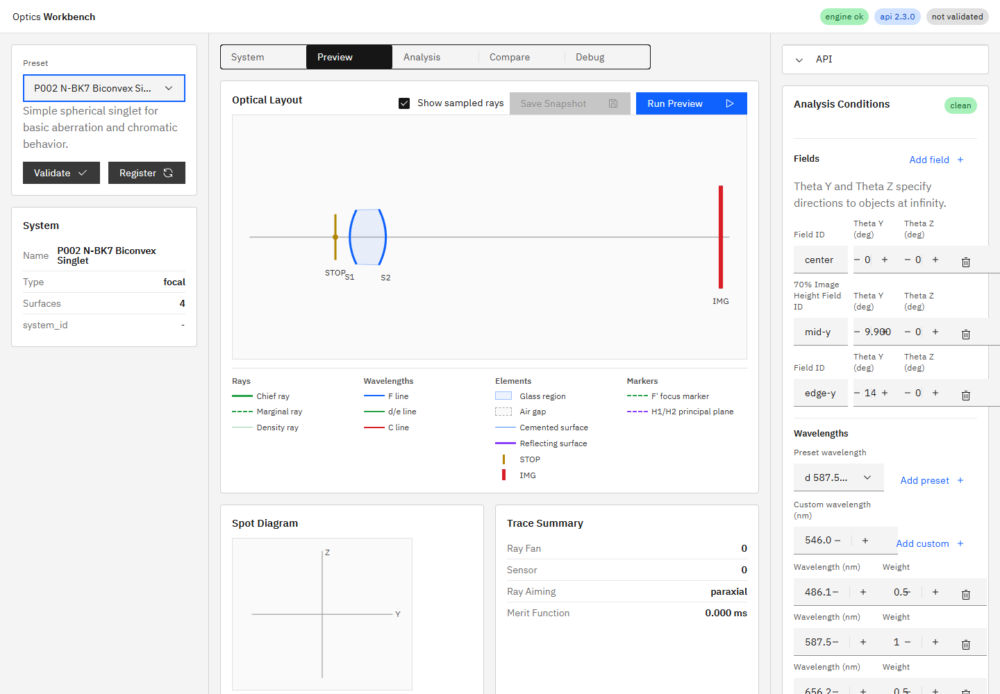
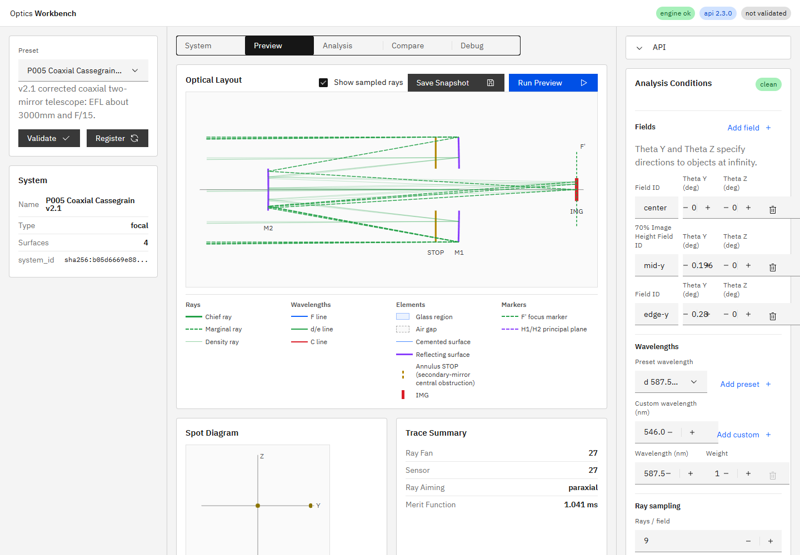

# R58 STOP断面表現統一 完了報告

## 現状確認

修正前は描画方式が異なっていた。

- circle STOP: `Y=-outer`から`+outer`までの連続した面線と中心dot
- annulus STOP: inner/outer境界に独立した高さ`10 px`のティック4本

circleは「開口区間に線がある」と読めた一方、annulusは透過するinner〜outer区間を直接表していなかった。

## 実装

circleとannulusを同じ`stop-aperture-marker` / `stop-aperture-segment`描画へ統一した。

- circle（inner=0）: `-outer〜0`と`0〜+outer`の2線分。視覚上は従来どおり連続した1本になる。
- annulus: `-outer〜-inner`と`+inner〜+outer`の2線分。
- circleの中心dotはSTOP位置の既存視認性を維持するため残した。
- 半径・表示スケール計算は変更していない。
- 凡例もcircleは連続線、annulusは中央gapを持つ上下2線分へ更新した。

円・annulusともinner/outerから同じ線分計算を行うため、将来の開口形状はY断面の透過区間へ変換できれば同じSVG表現を再利用できる。R49の新形状そのものは実装していない。

## 最低表示長

物理線分長`outer_px - inner_px`が`4 px`未満の場合のみ、物理区間の中心を保ったまま表示長を`4 px`へ拡張する。

`4 px`はSTOPのstroke幅`3 px`より長く、点ではなく線分として識別できる最小限の値である。通常の物理区間では拡張しない。DOMには物理長と表示長を別々に`data-stop-physical-length-px` / `data-stop-visual-length-px`として保持し、薄いannulusでも差を検証可能にした。

## DOM実測

光軸は`Y=170 px`である。

### P002 circle STOP

`semi_diameter_mm=8 mm`、表示半径`32 px`。

| sign | inner / outer | SVG Y区間 | 物理長 / 表示長 |
|---|---|---|---|
| -1 | 0 / 32 px | 138〜170 px | 32 / 32 px |
| +1 | 0 / 32 px | 170〜202 px | 32 / 32 px |

2線分は光軸上で連続し、中心dotも残っているため、circle STOPの見た目に意図しない回帰はない。

### P005 annulus STOP

`inner_semi_diameter_mm=40 mm`、`outer_semi_diameter_mm=100 mm`、表示半径はinner `36.8 px`、outer `92 px`。

| sign | inner / outer | SVG Y区間 | 物理長 / 表示長 |
|---|---|---|---|
| -1 | 36.8 / 92 px | 78〜133.2 px | 55.2 / 55.2 px |
| +1 | 36.8 / 92 px | 206.8〜262 px | 55.2 / 55.2 px |

線分は実際に透過するinner〜outer区間と一致する。

## 視覚判別

- STOP segment: amber `rgb(178, 134, 0)`、`3 px`実線
- P005 marginal ray: green `rgb(36, 161, 72)`、`1.55 px`、`6px 3px`破線

色、太さ、線種が異なり、STOP位置で重なっても判別できることを実画面で確認した。

## 検証

- 対象E2E初回: 浮動小数の厳密比較のみ1件失敗。DOM値`133.1999969482422`は期待値`133.2`と実質一致していたため、`toBeCloseTo`へ修正した。
- 対象E2E再実行: `1 passed (3.9s)`
- 全pytest: `87 passed, 1 skipped, 1 warning in 6.98s`
- `npm run ci`: 成功
- UI E2E: `28 passed`
- 実装根拠: `aa1aea7244ac50c8ea91cb9b2e7288a583ac131c`（短縮形: `aa1aea7`、`fix(ui): unify stop aperture segments (R58)`）

## プロセス整合

実装コミット後にAPIとUIを再起動した。確認時の実装HEADは`aa1aea7244ac50c8ea91cb9b2e7288a583ac131c`、`GET /v1/meta`の`build_info.git_commit`は`aa1aea7`で一致し、UIは`http://127.0.0.1:5173/`でHTTP 200を返した。

`build_info.git_dirty=true`の内訳は、本報告書、スクリーンショット、R58指示書、および未着手のR46指示書であり、実装コードと稼働プロセスの不一致ではない。
