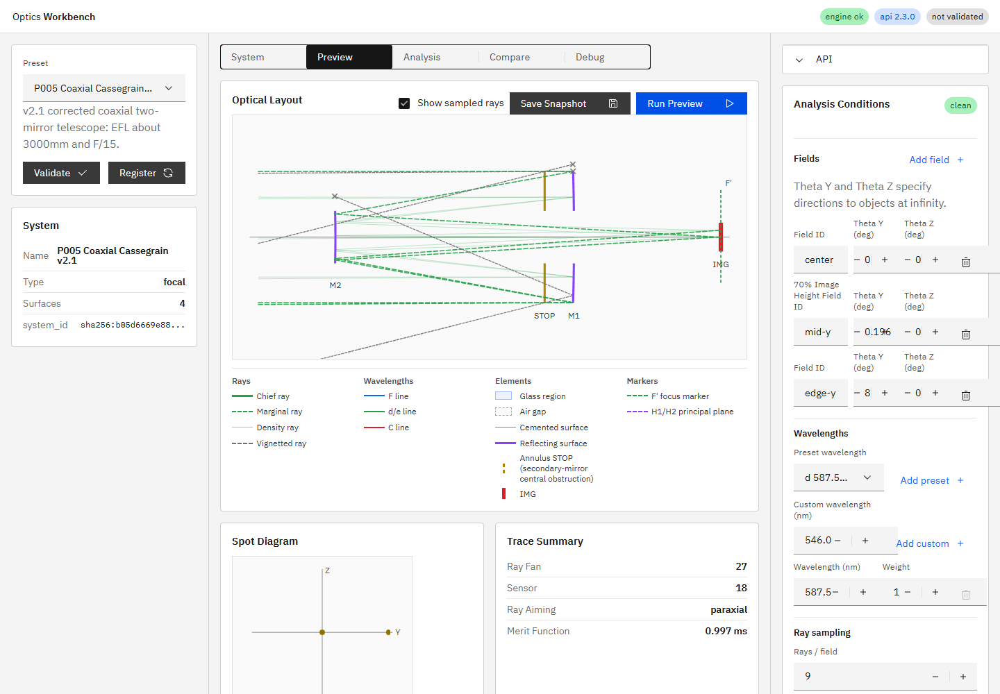

# R60 遮蔽光線の追跡・可視化 完了報告

## M2遮蔽の実データ

P005をrecommended fieldに加え、field角`0〜10 deg`、`full / paraxial / off`、`hexapolar / fan_y`、25 samplesで走査した。

- recommended field最大`0.28 deg`: baselineの遮蔽はM1終端のみ。
- `1 deg`, hexapolar, 25 samples: density 25本中23本alive、2本がM2でblocked。
- `2 deg`, hexapolar, 25 samples: 15本alive、10本がM2でblocked。
- `8 deg`: baselineの`marginal_lower`もM2でblocked。

`1 deg`の代表density rayは次の経路だった。

```text
STOP -> M1 -> M2
M2 local point 1: X=-0.859939, Y=35.371041, Z= 23.537648 mm
M2 local point 2: X=-0.859939, Y=35.371041, Z=-23.537648 mm
radial height: 42.474 mm
M2 semi_diameter_mm: 40 mm
```

M2局所半径が有効半径を超えるため、M2での`blocked`は仕様どおりである。aiming modeを変えても同じ条件で発生した。

## UI実装

baseline rayに限り、`status=blocked`をalive/aiming_failedから視覚的に区別した。

- blocked ray: gray `rgb(111, 111, 111)`、`1.35 px`、`3px 2px`短破線
- 遮蔽面の最終path点: 7×7 pxの`x`終端マーカー
- 凡例: `Vignetted ray` / `遮蔽光線`
- DOM属性: `data-baseline-status="blocked"`と`data-ray-end-marker="blocked"`

density layerは従来どおりaliveのみを代表選択し、blocked densityを常時表示する変更は行っていない。

## 実画面

P005のedge-yを`8 deg`としてPreviewを実行した。DOMにはblocked baseline 3本と終端マーカー3個が存在した。

| field index | role | 終端 | marker位置の意味 |
|---:|---|---|---|
| 1 | marginal_upper | M1 | recommended mid-yのM1外径遮蔽 |
| 2 | marginal_lower | M2 | 8 deg fieldのM2外径遮蔽 |
| 2 | marginal_upper | M1 | 8 deg fieldのM1外径遮蔽 |

alive rayは波長色、blocked rayはgray短破線と`x`で判別できる。



## 3Dから2Dへの投影限界

`doc/reports/issues_backlog.md`へ「3次元光線と2D Layout View開口断面の投影差を明示する」を追加した。X-Y投影ではZ成分を持つ光線のannulus半径判定を見た目だけで判断できないため、将来のToggletip、X-Z切替、選択光線のY/Z/radius表示を候補とした。

Issue化には`Create Issues From Backlog`ワークフローの手動起動が必要である。

## 検証

- 対象E2E: `1 passed (3.5s)`
- 全pytest: `87 passed, 1 skipped, 1 warning in 6.42s`
- `npm run ci`: 成功
- UI E2E: `28 passed (39.6s)`
- i18n:check: `ok (201 keys)`
- i18n:coverage / i18n:test: 成功
- 実装根拠: `f0efea7bcdc8667fb783591081435e340e7fb133`（短縮形: `f0efea7`、`feat(ui): distinguish vignetted baseline rays (R60)`）

## プロセス整合

実装コミット後にAPIとUIを再起動した。確認時の実装HEADは`f0efea7bcdc8667fb783591081435e340e7fb133`、`GET /v1/meta`の`build_info.git_commit`は`f0efea7`で一致し、UIは`http://127.0.0.1:5173/`でHTTP 200を返した。

`build_info.git_dirty=true`の内訳は、本報告書、スクリーンショット、R60指示書、および未着手のR46指示書であり、実装コードと稼働プロセスの不一致ではない。
