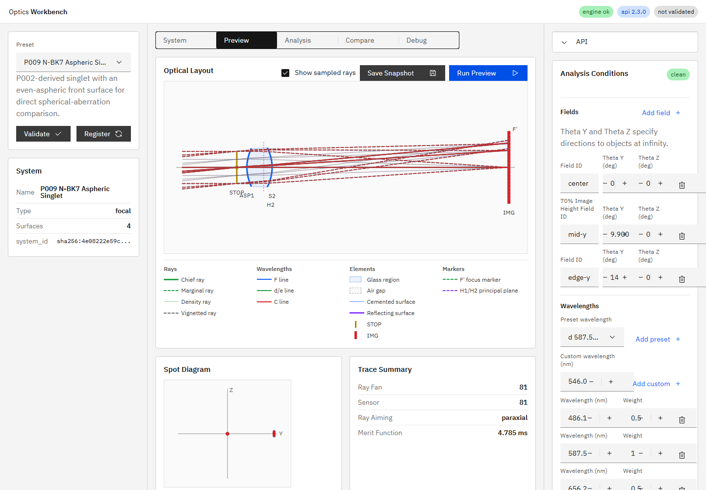

# R62 プリセット網羅性改善 完了報告

## 状態

R62の作業1〜3はすべて完了した。

1. P007を`doc/ui_spec.md`へ追加
2. 実屈折面によるafocalプリセットP008を追加
3. 正式な非球面プリセットP009を追加

`doc/ui_spec.md` 9.1節のプリセット数は現行実数`9`と一致し、9.4節にP007〜P009を既存形式で記載した。

## P009設計

P002と独立して選択できる比較プリセット方式を採用した。同一プリセット内の切替はsystem構造やsnapshot比較を複雑にするため採用せず、P002とP009を切り替えて同じ解析を実行できる構成とした。

- base: P002 N-BK7 singlet
- `ASP1`: `surface_type=aspherical_even`
- radius: `50 mm`（P002と同じ）
- conic: `-1.1792`
- A4: `-2.4992e-6`
- STOP半径: `8 mm`（P002と同じ）
- sensor間隔: `46.9248 mm`
- field / wavelength: P002と同じ

近軸powerは非球面高次項の影響を受けないため、P002と同じ`EFL=49.21298867869991 mm`、`F number=3.0758117924187443`を維持する。

## 球面収差比較

主波長`587.56 nm`、center field、81-ray hexapolar、full aimingで比較した。

| Preset | 面 | spot RMS |
|---|---|---:|
| P002 | spherical S1 | `0.04665818793319052 mm` |
| P009 | aspherical ASP1 | `0.0228093022785783 mm` |

P009はP002に対してspot RMSを約`51.1%`低減し、P002値の`0.489x`となった。推奨3 field × 3 wavelength × 25 samplesでは`225 alive / 225`で、各面の有効径による遮光はない。

## R62全体の根拠

| 作業 | 実装コミット | 報告 |
|---|---|---|
| 作業1 P007仕様整合 | `3dd94b86ed6b8d415e28b32a54b0961857e868c2` | `2026-07-13_r62_task1_p007_doc_alignment.md` |
| 作業2 P008実レンズafocal | `ee732573458397b9de1881e03a720631b82ec822` | `2026-07-13_r62_task2_real_achromatic_afocal.md` |
| 作業3 P009非球面 | `20fee3440bf04ba121ea164a25c9433d00d5bb91` | 本報告 |

## テスト

- P009対象・横断テスト: `3 passed, 13 deselected, 1 warning in 1.96s`
- 全pytest: `89 passed, 1 skipped, 1 warning in 7.31s`
- `npm run ci`: 成功
- UI E2E: `28 passed (38.9s)`
- 動的プリセットAPI smokeはP008/P009を自動的に対象化
- テストファイル: `tests/test_preset_api_smoke.py`、`apps/workbench-ui/tests/e2e/analysis-conditions.spec.ts`
- 作業3実装根拠: `20fee3440bf04ba121ea164a25c9433d00d5bb91`（短縮形: `20fee34`、`feat(preset): add aspheric singlet comparison (R62 task 3)`）

## プロセス整合

作業3実装コミット後にAPIとUIを再起動した。確認時の実装HEADは`20fee3440bf04ba121ea164a25c9433d00d5bb91`、`GET /v1/meta`の`build_info.git_commit`は`20fee34`で一致し、UIは`http://127.0.0.1:5173/`でHTTP 200を返した。

`build_info.git_dirty=true`の内訳は、本報告書、スクリーンショット、R62/R63/R46指示書であり、実装コードと稼働プロセスの不一致ではない。
