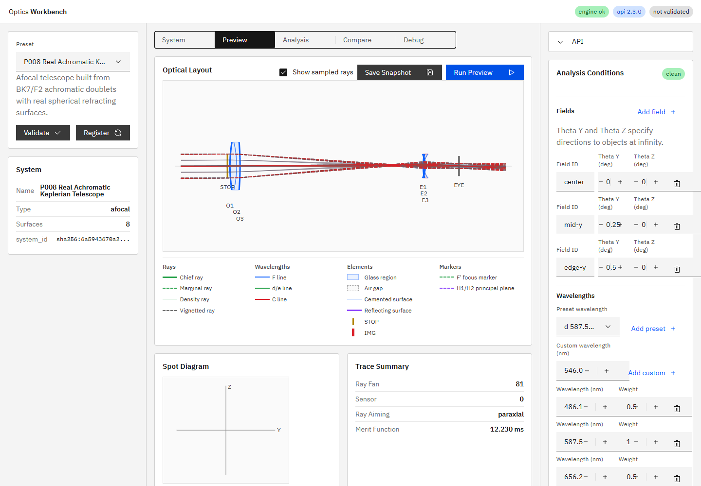

# R62作業2 実レンズ構成afocalプリセット 中間報告

## 状態

R62全体は`Partial`である。作業1と作業2を完了し、作業3「非球面正式プリセット」は未着手である。

## P008設計

現行最終番号P007をコードで確認し、新規番号をP008とした。P008はP003型アクロマートを対物とし、その1/5縮小・反転形を接眼に用いるKeplerian afocal系である。

- `system_type: afocal`
- powered surface: `refractive` 6面
- glass: `N-BK7` / `N-F2`
- `thin_lens`: 0面
- terminal: `EYE`（`eye_reference`）
- 主波長: `587.56 nm`
- field: `0 / 0.25 / 0.5 deg`
- 対物最終面O3から接眼先頭面E1まで: `108.51795245333561 mm`

面間隔は主波長の全系近軸powerが数値閾値内でゼロになる値として凍結した。入口半径は実レンズ収差と無遮光を両立する`6 mm`とした。

## 数値検証

| 項目 | 結果 |
|---|---:|
| angular magnification | `-4.999999999909559x` |
| exit pupil diameter | `2.400000000043412 mm` |
| eye relief | `20.0 mm` |
| 軸上25 samples residual divergence | `0.36818659544890275 D` |
| 軸上25 samples arrived | `25 / 25` |
| 3 field × 3 wavelength × 25 samples | `225 alive / 225` |
| path | 全光線が`STOP -> O1 -> O2 -> O3 -> E1 -> E2 -> E3 -> EYE` |

固定`10 deg`を全プリセットへ与える既存ストレステストでは`27 alive / 54 blocked`となる。P008の設計fieldは最大`0.5 deg`であり、推奨fieldでは全225本が無遮光である。

## エンジン対応

従来の`angular_magnification()`は2枚以上の`thin_lens`だけを扱い、実屈折面のみの系では`None`だった。実レンズ系では全powered surfaceを通る近軸角度変換のD成分を計算するよう拡張した。既存thin lens系P006は従来式を維持する。

## UI・仕様

- プリセット一覧へP008を追加し、自然順テストをP008まで拡張した。
- `doc/ui_spec.md` 9.1節を8プリセットへ更新した。
- 9.4節へP008の面テーブル、推奨field、数値期待値を追加した。
- 動的プリセット読み込みのAPI smokeがP008を自動的に対象とすることを確認した。

## テスト

- P008対象・横断テスト: `3 passed, 12 deselected, 1 warning in 2.09s`
- 全pytest: `88 passed, 1 skipped, 1 warning in 7.40s`
- 初回`npm run ci`: P008追加に対する固定プリセット順期待値の未更新で`1 failed, 27 passed`
- 修正後`npm run ci`: 成功
- UI E2E: `28 passed (39.5s)`
- i18n:check / coverage / test: 成功
- テストファイル: `tests/test_preset_api_smoke.py`、`apps/workbench-ui/tests/e2e/analysis-conditions.spec.ts`
- 実装根拠: `ee732573458397b9de1881e03a720631b82ec822`（短縮形: `ee73257`、`feat(preset): add real achromatic afocal telescope (R62 task 2)`）

## プロセス整合

実装コミット後にAPIとUIを再起動した。確認時の実装HEADは`ee732573458397b9de1881e03a720631b82ec822`、`GET /v1/meta`の`build_info.git_commit`は`ee73257`で一致し、UIは`http://127.0.0.1:5173/`でHTTP 200を返した。

R62指示書は作業3が残っているため`doc/work_orders/active/`に維持する。
