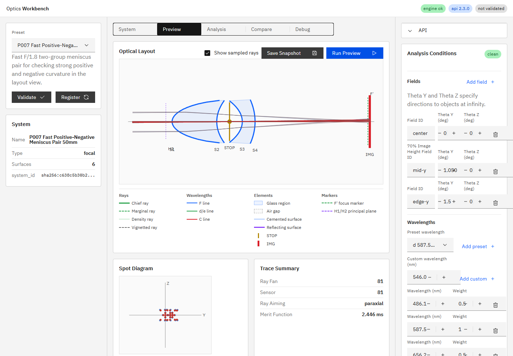

# R63 P007明るいF値プリセット回帰調査・修正報告

## 原因

P007初出コミット`9da98ec1e724428226210bb4eafea11bdf82749d`はS1半径`14 mm`で、Q5報告の近軸値を実際に再現した。

R28コミット`f36118de741fb4bcd1fa605be10ab74f72ab77ce`が、Layout Viewの物理形状破綻を解消するためS1半径だけを`14 -> 26 mm`へ変更した。この変更で正群powerが大幅に低下し、EFLとF numberが約11倍になった。R28ではLayout Viewとedge thicknessだけを検証し、近軸性能の再検証が抜けていた。

R29コミット`9046754c24d22814c4c73dd5b6e36985976bbf64`は有効径だけを縮小し、近軸値を変えていない。したがって数値乖離の起点はR28である。

## 履歴再計算

各コミット相当の面値を現行エンジンへ投入し、同じ`analyze_paraxial()`で再計算した。

| 時点 | S1 R / thickness / semiD | EFL | BFL | F number |
|---|---|---:|---:|---:|
| Q5 `9da98ec1` | `14 / 5 / 18` | `47.46348880880296` | `31.84367107722626` | `1.7978594245758697` |
| R28 `f36118de` | `26 / 5 / 18` | `519.6281203750518` | `452.04242770474303` | `19.682883347539843` |
| R29 `9046754c` | `26 / 5 / 16` | `519.6281203750518` | `452.04242770474303` | `19.682883347539843` |
| R63 `9cfcf71` | `15 / 10.5 / 14.5` | `47.953755611726336` | `26.948477258301352` | `1.816430136807816` |

Q5報告は報告ミスではなく、導入時データと一致していた。

## 単純差し戻しをしなかった理由

Q5値は`semiD=18 > |R|=14`で球面として成立せず、S1/S2のエッジ厚も負だった。R28の問題認識は正しく、半径だけを14へ戻すとLayout View破綻が再発する。

そこで明るい近軸目標と物理形状を同時に満たす最小再調整を行った。

- S1: `R=15 mm`, thickness=`10.5 mm`, semiD=`14.5 mm`
- S2: semiD=`14.5 mm`
- S4からIMG: `26.948477258301352 mm`
- STOP: 既存のsemiD=`13.2 mm`を維持
- S3/S4の曲率・材質は変更なし

共通半径`14.5 mm`でのS1/S2エッジ厚は`1.1190132933115944 mm`で正、かつ`S1 |R|=15 > semiD=14.5`である。

## 修正後検証

- EFL: `47.953755611726336 mm`
- BFL: `26.948477258301352 mm`
- F number: `1.816430136807816`
- recommended 3 field × 3 wavelength × 9 samples: `81 alive / 81`
- blocked: `0`
- Layout glass warning: `0`
- Layout baseline: `9`

## テスト

- P007近軸・エッジ厚・無遮光: `2 passed, 15 deselected in 1.22s`
- P007/Layout横断E2E: `3 passed (7.8s)`
- 全pytest: `90 passed, 1 skipped, 1 warning in 8.41s`
- `npm run ci`: 成功
- UI E2E: `28 passed (42.0s)`
- テストファイル: `tests/test_preset_api_smoke.py`、`apps/workbench-ui/tests/e2e/analysis-conditions.spec.ts`
- 実装根拠: `9cfcf71c81da66c5b9b4c3afa8db67a1260a9b5f`（短縮形: `9cfcf71`、`fix(preset): restore P007 fast optical target (R63)`）

## プロセス整合

実装コミット後にAPIとUIを再起動した。確認時の実装HEADは`9cfcf71c81da66c5b9b4c3afa8db67a1260a9b5f`、`GET /v1/meta`の`build_info.git_commit`は`9cfcf71`で一致し、UIは`http://127.0.0.1:5173/`でHTTP 200を返した。

`build_info.git_dirty=true`の内訳は、本報告書、スクリーンショット、R63/R46指示書であり、実装コードと稼働プロセスの不一致ではない。
