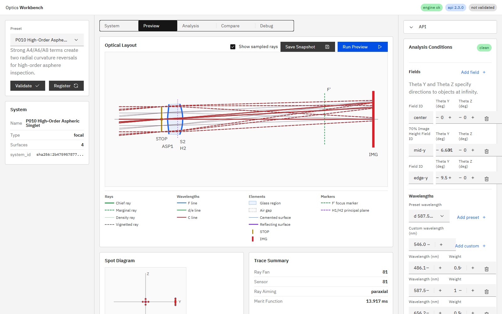

# R64 非球面係数表示と高次非球面プリセット

## 状態

**Done**。R64作業1の非球面係数表示と、作業2の高次非球面プリセットP010を実装・検証した。

## 作業1

P009のSystem Surface Tableでは、変更前は `surface_type = aspherical_even` のみ表示され、ASP1のconic・A4はDOMにも画面にも表示されていなかった。

Surface Tableへ `Asphere` / `非球面` 列を追加し、設定済みのconicとeven-asphere係数だけを次数順で表示するようにした。P009では次の表示を実画面で確認した。

```text
k=-1.1792, A4=-0.0000024992
```

詳細は `2026-07-13_r64_task1_asphere_coefficient_visibility.md` を参照。

## 作業2

コード上の最終プリセット番号がP009であることを確認し、次番のP010 `High-Order Aspheric Singlet Inflection Demo` を追加した。

ASP1の定義は次のとおり。

```text
R = 50 mm
k = -1
A4 = -1.0e-4 mm^-3
A6 = +5.0e-7 mm^-5
A8 = -5.0e-10 mm^-7
semi-diameter = 9.5 mm
```

最終空気間隔は軸上81-ray spotの走査結果から `63.175 mm` に固定した。

### 曲率反転

engineの `asphere_sag_and_slope` とslopeの中心差分からメリジオナル曲率を計算した。口径内に次の2つのゼロ交差が存在する。

| 反転 | 半径 | 符号変化 |
|---|---:|---|
| 1 | 4.794750 mm | 正 → 負 |
| 2 | 8.379266 mm | 負 → 正 |

代表点の数値は次のとおり。

| 半径 (mm) | sag (mm) | 曲率 (mm^-1) |
|---:|---:|---:|
| 4.0 | 0.136415232 | +0.0045253 |
| 5.0 | 0.195117188 | -0.0010625 |
| 8.0 | 0.353083392 | -0.0027000 |
| 8.5 | 0.375443982 | +0.0010407 |
| 9.5 | 0.422368674 | +0.0132934 |

したがって、変曲点の存在は目視ではなく曲率の符号反転で確認済みである。

### 光学検証

| 項目 | 結果 |
|---|---:|
| EFL | 49.212989 mm |
| BFL | 47.536217 mm |
| F number | 3.075812 |
| center / 587.56 nm / 81-ray spot RMS | 0.464633 mm |
| 3 field × 3 wavelength × 25 samples | alive 225 / blocked 0 |
| sensor Y範囲 | -0.655677 ～ 11.533921 mm |
| sensor Z範囲 | -0.716889 ～ 0.716889 mm |

全光線がIMGへ到達し、36 × 24 mmセンサー有効域内に収まった。P009の軸上spot RMS `0.0228093 mm` に対してP010は約20.4倍大きい。P010は収差補正プリセットではなく、複数の曲率反転を持つ強い高次非球面の形状・追跡確認用プリセットである。



## 仕様更新

- `doc/ui_spec.md` 9.4へP010の面データ、推奨field、曲率反転、近軸量、実光線期待値を追加した。
- 9.1の内蔵プリセット数9件と、実コード上のプリセット数が一致した。
- 12.1へ作業1の非球面係数表示列を追加した。

## テスト

- `python -m pytest -q`: `91 passed, 1 skipped, 1 warning in 9.00s`
- `npm run ci`: 成功
- Playwright E2E: `29 passed (43.0s)`
- P010直接回帰: `1 passed, 17 deselected in 0.72s`
- i18n: `i18n:check ok (201 keys)`、coverage/testとも成功

主な直接テストは `tests/test_preset_api_smoke.py::test_p010_high_order_asphere_has_two_curvature_reversals_and_full_throughput` と `apps/workbench-ui/tests/e2e/analysis-conditions.spec.ts` の自然順テストである。

## 実装根拠

- 作業1実装コミット: `9cc7f60b87a12ae301e1012e8c59a521a9f78ed4`
- 作業2実装コミット: `960b95500143f39a4448dfc3cc67d81230f903ec`

作業2実装コミット直後にAPIとUIを再起動した。`GET /v1/meta` の `build_info.git_commit` は `960b955`、確認対象HEADは `960b95500143f39a4448dfc3cc67d81230f903ec` で一致し、UIはHTTP 200を返した。

`build_info.git_dirty = true` は、人間が配置した未追跡のR46/R64指示書と本報告用スクリーンショットが存在したためである。
