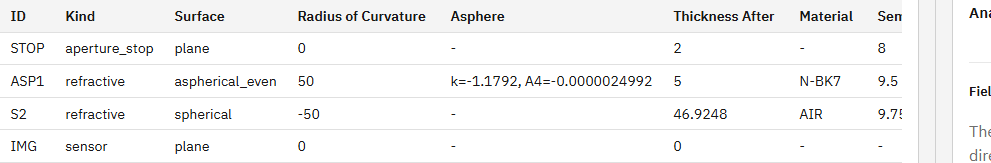

# R64 作業1: 非球面係数のUI表示

## 状態

**Partial**。R64の作業1のみ完了し、作業2（高次非球面プリセットの新設）には未着手である。このため、指示書は `doc/work_orders/active/` に残している。

## 確認結果

変更前のP009 System Surface Tableには `Surface = aspherical_even` までは表示されていたが、ASP1の `conic = -1.1792` と `A4 = -0.0000024992` はDOM・画面のどちらにも表示されていなかった。

## 修正内容

- Surface Tableに `Asphere` / `非球面` 列を追加した。
- 設定済みのconic定数を `k=<value>`、even-asphere係数を `A4=<value>, A6=<value>...` の形式で次数順に表示するようにした。
- 未設定の係数は省略し、非球面パラメータがない面は `-` と表示するようにした。
- `doc/ui_spec.md` 12.1に実際の表示仕様を追記した。
- P009のASP1と通常球面S2を固定するPlaywright E2Eテストを追加した。

P009の実画面ではASP1に次の値が表示されることを確認した。

```text
k=-1.1792, A4=-0.0000024992
```



## 根拠

- 実装コミット: `9cc7f60b87a12ae301e1012e8c59a521a9f78ed4`
- 直接テスト: `apps/workbench-ui/tests/e2e/analysis-conditions.spec.ts`
- R64対象E2E: `1 passed (3.9s)`
- UI CI: `npm run ci` 成功、`29 passed (45.4s)`
- エンジン回帰: `90 passed, 1 skipped, 1 warning in 27.51s`
- i18n: `i18n:check` は `ok (201 keys)`、coverage/testとも成功
- UI build: 成功

## 実環境確認

実装コミット直後にAPIとUIを再起動した。`GET /v1/meta` の `build_info.git_commit` は `9cc7f60`、確認対象HEADは `9cc7f60b87a12ae301e1012e8c59a521a9f78ed4` で一致し、UIはHTTP 200を返した。

`build_info.git_dirty = true` は、未追跡のR46/R64指示書および本報告用スクリーンショットが存在するためである。

## 残作業

R64作業2の高次非球面プリセット新設、数値検証、仕様更新、回帰テスト、スクリーンショット取得は未着手である。次の明示指示を受けるまで進めない。
