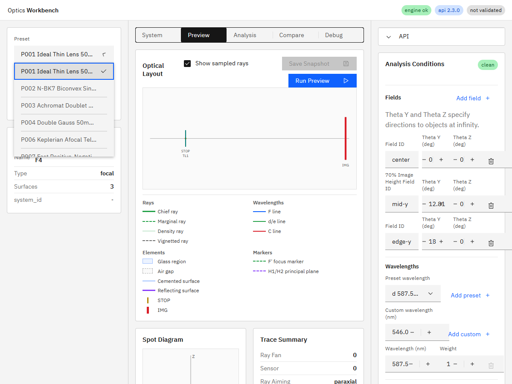
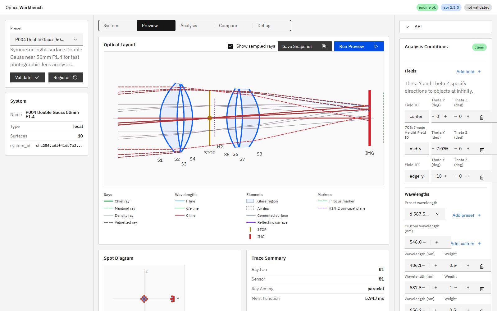
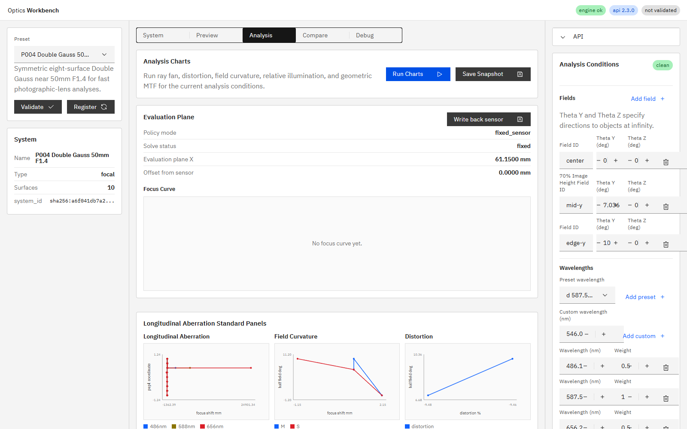

# R66 P005非表示・有効径再点検・P004 Double Gauss

## 状態

**Done**。作業1〜3を順に独立コミットし、全回帰と実ブラウザ確認を完了した。

## 作業1: P005非表示

`Preset.visible?: boolean`を追加し、P005だけ`visible: false`とした。通常UIは可視プリセットだけを列挙する一方、`presets`配列内のP005定義は保持している。

P005専用UI回帰は`?fixture=all-presets`で引き続き実行し、annulus編集、ミラーLayout、反射光線、遮光表示のテストを削除していない。Python側のP005回帰10件も成功した。

通常DOMのプリセットIDは次の9件で、P005が存在しないことを確認した。

```text
P001, P002, P003, P004, P006, P007, P008, P009, P010
```



## 作業2: 有効径再点検

各プリセットの推奨center/mid/edge field、全波長、full aimingについて、非絞り面を一時的に開放し、81-ray `fan_y` / `fan_z` / `hexapolar`のalive光線が各面へ到達する最大半径を測定した。設定値は原則として最大到達半径へ約10〜12%の余裕を加え、0.25 mm単位へ丸めた。

### 変更面

| Preset | Surface | 変更前 (mm) | 最大光線高 (mm) | 変更後 (mm) | 変更後余裕 |
|---|---|---:|---:|---:|---:|
| P007 | S3 | 14.25 | 10.195813 | 11.50 | 12.79% |
| P007 | S4 | 15.00 | 9.076399 | 10.25 | 12.93% |
| P008 | O1 | 12.00 | 6.015623 | 6.75 | 12.21% |
| P008 | O2 | 12.00 | 5.926349 | 6.50 | 9.68% |
| P008 | O3 | 12.00 | 5.888510 | 6.50 | 10.39% |
| P008 | E1 | 6.00 | 2.180358 | 2.50 | 14.66% |
| P008 | E2 | 6.00 | 2.186687 | 2.50 | 14.33% |
| P008 | E3 | 6.00 | 2.196571 | 2.50 | 13.82% |

### 維持面

- P001 TL1は6.250 mmに対して7.000 mm、12.0%で適正。
- P002 S1/S2は8.688/9.022 mmに対して9.50/9.75 mm。約8〜9%で過剰ではない。
- P003は`fan_y`限界高10.419/10.520/10.714 mmに対して11.50/11.75/12.00 mmでR29値を維持。
- P007 S1は14.234 mmに対して14.50 mm。余裕は1.87%だがR=15 mmの強曲率面であり、物理半径を超える拡大を避けて維持。S2は13.120 mmに対して14.50 mmで10.52%。
- P009 ASP1/S2は8.683/9.031 mmに対して9.50/9.75 mmで過剰ではない。
- P010 ASP1/S2は8.397/8.759 mmに対して9.50/9.75 mmで11〜13%。
- P005はannulus STOP、M1主鏡径、M2副鏡径が瞳・中央遮蔽条件そのものなので維持。
- P006はSTOP/OBJ/EYEPIECE/EYEが入口瞳・眼瞳条件を構成するため維持。

変更後も近軸値は不変。P007推奨9-rayは`alive 81`、P008推奨25-rayは`alive 225`。既存10 deg横断条件のP008 `alive 27 / blocked 54`も不変で、意図しない遮光追加はない。

## 作業3: P004 Double Gauss 50mm F1.4

仕様書の旧値をそのまま計算するとEFL `-55.457822 mm`、BFL `-68.655470 mm`、F/`3.080990`で負レンズ系となり、50 mm F1.4要求を満たさなかった。

対称8面構成を維持して曲率を再設計し、P004として正式実装した。

```text
R: +58, +200, -190, -75, STOP, +75, +190, -200, -58 mm
STOP semiD: 17.75 mm
final air gap: 32.15 mm
```

### 数値結果

| 項目 | 結果 |
|---|---:|
| EFL | 49.977712 mm |
| BFL | 36.888832 mm |
| F number | 1.407823 |
| center / 587.56 nm / 81-ray spot RMS | 0.483460 mm |
| 3 field × 3 wavelength × 9 samples | alive 81 |
| 3 field × 3 wavelength × 25 samples | alive 219 / aiming_failed 6 / blocked 0 |

F1.4目標はF/1.4078として達成した。25 samplesの6本は周辺fieldのfull aiming収束失敗であり、開口遮光ではない。

4レンズのedge thicknessは順に`1.879314 / 0.526005 / 1.045866 / 2.827910 mm`で、すべて正。P004の各semiDも開放面で実測した最大光線高へ約10〜12%の余裕を加えて設定した。



実ブラウザの`Run Charts`でspot、MTF、Distortion、Field Curvatureを含む解析パネルが表示されることを確認した。



## 仕様更新

- `doc/ui_spec.md` 9.1を「内蔵10個／通常表示9個」へ更新。
- P005節へ通常UI非表示と定義・回帰維持を明記。
- P007/P008のsemiDを実コードと同期。
- P004節を実装済み処方、推奨field、EFL/BFL/F値、edge thickness、throughputへ全面更新。

## テスト

- `python -m pytest -q`: `93 passed, 1 skipped, 1 warning in 9.86s`
- `npm run ci`: 成功
- Playwright E2E: `30 passed (42.3s)`
- i18n: `i18n:check ok (201 keys)`、coverage/test成功
- P005対象UI: `7 passed`
- P005 Python回帰: `10 passed, 8 deselected`
- P004直接Python回帰: `2 passed, 18 deselected`
- P004対象UI: `3 passed`

## 実装根拠

- 作業1: `eece806361094d8879f5fce92e242a2b602e01c0`
- 作業2: `9ade45eb75acba19a6cbab49daa23534d70a4287`
- 作業3: `5e5160b7a99ddfbafa1b5ba61a451c754c6073c7`

作業3コミット直後にAPI/UIを再起動した。`GET /v1/meta`の`build_info.git_commit`は`5e5160b`、確認対象HEADは`5e5160b7a99ddfbafa1b5ba61a451c754c6073c7`で一致し、UIはHTTP 200を返した。

`build_info.git_dirty = true`は、人間が配置した未追跡のR46/R66指示書と本報告用スクリーンショットが存在したためである。
