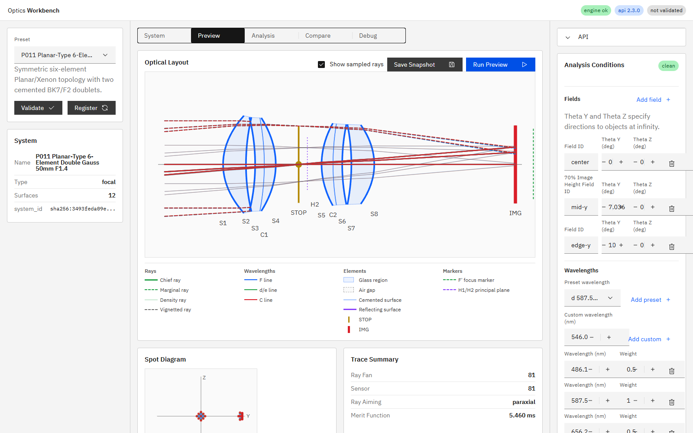
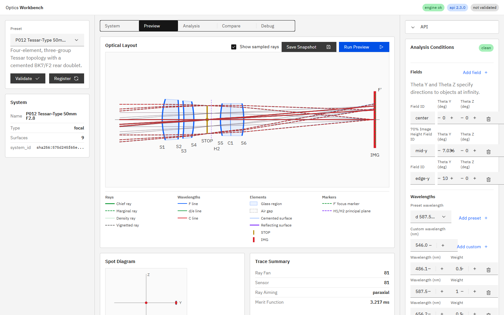

# R67 Planar型ダブルガウスとTessar型プリセット

## 状態

**Done**。作業AのP011と作業BのP012を順に独立コミットし、数値設計、全面の正edge thickness、有効径、実光線、解析UIを検証した。R66のP004は変更していない。

## 作業A: P011 Planar/Xenon型 50mm F1.4

実装前の最大番号がP010であることをコードから確認し、P011を採番した。

構成は外側BK7メニスカス単玉2枚、内側BK7/N-F2接合ダブレット2組、中央STOPの対称6枚4群・10屈折面である。

### 近軸・実光線

| 項目 | 結果 |
|---|---:|
| EFL | 49.983193 mm |
| BFL | 35.362983 mm |
| F number | 1.407977 |
| best-focus最終空気間隔 | 30.8 mm |
| center / 587.56 nm / 81-ray spot RMS | 0.465423 mm |
| 3 field × 3 wavelength × 9 samples | alive 81 |
| 3 field × 3 wavelength × 25 samples | alive 213 / aiming_failed 12 / blocked 0 |

50 mm F1.4目標はEFL 49.983 mm、F/1.408として達成した。25 samplesの12本は周辺fieldのfull aiming収束失敗で、開口遮光ではない。

P004単玉4枚版の軸上spot RMS `0.483460 mm`に対し、P011は約3.7%小さい。

### edge thickness

| Element | edge thickness (mm) |
|---|---:|
| 外側前BK7 | 1.953613 |
| 前接合BK7 | 2.255406 |
| 前接合N-F2 | 0.317240 |
| 後接合N-F2 | 0.851981 |
| 後接合BK7 | 2.188720 |
| 外側後BK7 | 2.888348 |

6枚すべて正で、最小値は`0.317240 mm`である。

### 有効径

推奨3 field・全3波長について非絞り面を開放し、81-ray `hexapolar` / `fan_y` / `fan_z`のalive光線最大半径を測定した。

| Surface | 最大光線高 (mm) | semiD (mm) | 余裕 |
|---|---:|---:|---:|
| S1 | 20.104598 | 22.50 | 11.91% |
| S2 | 19.543036 | 21.75 | 11.29% |
| S3 | 19.537421 | 21.75 | 11.32% |
| C1 | 19.395703 | 21.50 | 10.85% |
| S4 | 19.356346 | 21.50 | 11.07% |
| S5 | 17.022941 | 19.00 | 11.61% |
| C2 | 16.894012 | 18.75 | 10.99% |
| S6 | 16.645984 | 18.50 | 11.14% |
| S7 | 16.569913 | 18.50 | 11.65% |
| S8 | 16.379835 | 18.25 | 11.42% |

## 作業B: P012 Tessar型 50mm F2.8

P011の次番としてP012を採番した。構成は前群の空気間隔単玉2枚、STOP、後群N-F2/N-BK7接合ダブレットの4枚3群・7屈折面である。

### 近軸・実光線

| 項目 | 結果 |
|---|---:|
| EFL | 49.982493 mm |
| BFL | 40.222392 mm |
| F number | 2.800140 |
| best-focus最終空気間隔 | 39.4 mm |
| center / 587.56 nm / 81-ray spot RMS | 0.036863 mm |
| 3 field × 3 wavelength × 9 samples | alive 81 |
| 3 field × 3 wavelength × 25 samples | alive 225 |
| 3 field × 3 wavelength × 81 samples | alive 729 |

50 mm F2.8目標はEFL 49.982 mm、F/2.80014として達成し、全条件でblocked 0・aiming_failed 0だった。

### edge thickness

| Element | edge thickness (mm) |
|---|---:|
| 前群BK7 | 3.911464 |
| 前群N-F2 | 2.601994 |
| 後接合N-F2 | 2.631674 |
| 後接合BK7 | 3.317041 |

4枚すべて正で、最小値は`2.601994 mm`である。

### 有効径

| Surface | 最大光線高 (mm) | semiD (mm) | 余裕 |
|---|---:|---:|---:|
| S1 | 11.771816 | 13.00 | 10.43% |
| S2 | 11.122310 | 12.50 | 12.39% |
| S3 | 10.732832 | 12.00 | 11.81% |
| S4 | 10.348159 | 11.50 | 11.13% |
| S5 | 9.108329 | 10.25 | 12.53% |
| C1 | 9.159654 | 10.25 | 11.90% |
| S6 | 9.235576 | 10.25 | 10.98% |

## UI・仕様

- `doc/ui_spec.md` 9.1を内蔵12個／通常表示11個へ更新した。
- 9.4へP011/P012の処方、推奨field、近軸値、spot、edge thickness、throughputを追加した。
- 自然順リストをP012まで拡張した。
- 英語・日本語のプリセット名と要約を追加した。
- 実ブラウザで両プリセットのspot、MTF、Distortion、Field Curvature表示を確認した。

## テスト

- `python -m pytest -q`: `95 passed, 1 skipped, 1 warning in 10.59s`
- `npm run ci`: 成功
- Playwright E2E: `32 passed (41.5s)`
- i18n: `i18n:check ok (201 keys)`、coverage/test成功
- P011直接回帰: `2 passed, 19 deselected`
- P012直接回帰: `2 passed, 20 deselected`

## 実装根拠

- 作業A: `92c88b4c43e19096644c9e9214eb67980cf4bfed`
- 作業B: `7a8a004c2b4fb52d3c29a21e43bd2663296f3ac9`

作業Bコミット直後にAPI/UIを再起動した。`GET /v1/meta`の`build_info.git_commit`は`7a8a004`、確認対象HEADは`7a8a004c2b4fb52d3c29a21e43bd2663296f3ac9`で一致し、UIはHTTP 200を返した。

`build_info.git_dirty = true`は、人間が配置した未追跡のR46/R66/R67指示書と本報告用スクリーンショットが存在したためである。
