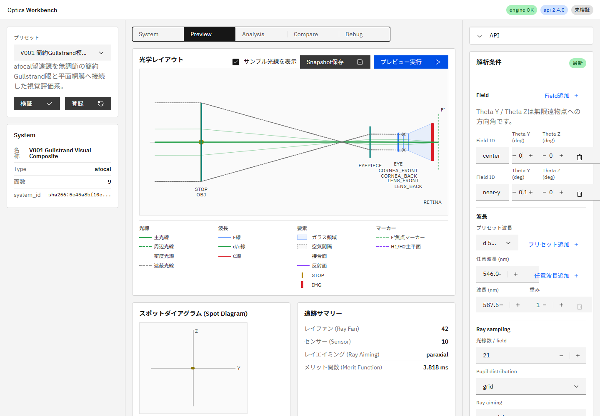
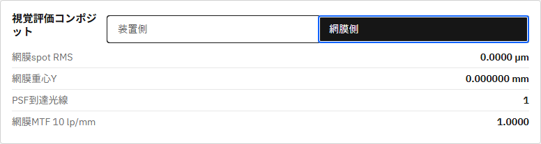

# R69 視覚評価コンポジット実装 完了報告

## 状態

R69作業1〜5は完了した。簡約Gullstrand模型眼をafocal装置へ接続し、同一traceから装置側`instrument`評価と網膜側`retinal`評価を分離して取得できる。

## 作業別コミット

| 作業 | 内容 | 実装コミット |
|---|---|---|
| 1 | エンジン仕様v2.4、境界・結果schema・初期制限 | `1f7aed9` |
| 2 | モデル、validation、境界compile、`at_exit_pupil`配置、分析API | `d9b6b27` |
| 3 | 簡約Gullstrand内部preset、中心・近軸field golden test | `dd0a684` |
| 4 | API schema v2.4、`/v1/meta`、V001、UI切替、i18n、UI仕様v0.4 | `e2cde35` |
| 5 | P006/P008の変更前後ビット同一回帰 | `af5395b` |
| 4 follow-up | 実MTF値表示、新validation codeのja/en supplement | `e02277a` |

作業1の個別報告は`2026-07-13_r69_task1_visual_composite_spec.md`に記録済みである。

## エンジン実装

- `OpticalSystem.visual_evaluation`へ`instrument_only` / `instrument_and_retinal`を追加した。
- `CompiledSystem.eye_reference_index`で装置区間と模型眼区間の境界を保持する。
- `at_exit_pupil`は開口面の近軸伝達行列`B/D`から射出瞳像位置を求め、境界と後続模型眼面をコンパイル時に移動する。
- `fixed_offset`は直前のinstrument面を基準に解決する。視覚評価コンポジットではoffset必須とした。
- 角倍率・射出瞳・アイレリーフは`eye_reference`より前だけで計算し、模型眼の角膜・水晶体を混入させない。
- `/v1/analysis/visual-composite`は装置側角度spot/MTF、射出瞳と、網膜spot/PSF/MTFを別フィールドで返す。
- validation code 6件を`/v1/meta`列挙とja/en supplementへ追加した。

## 簡約Gullstrand眼

587.56 nm、4 mm瞳、無調節、平面網膜の初期presetを`gullstrand_visual_composite_demo()`として追加した。

| 面 | R (mm) | 厚み (mm) | 後方屈折率 |
|---|---:|---:|---:|
| 角膜前面 | +7.70 | 0.50 | 1.376 |
| 角膜後面 | +6.80 | 3.10 | 1.336 |
| 水晶体前面 | +10.0 | 3.60 | 1.4085 |
| 水晶体後面 | -6.00 | 17.187 | 1.336 |

21 rays、center fieldのgolden値は、射出瞳位置`144.0 mm`、角倍率`-5.0`、アイレリーフ`24.0 mm`、網膜RMS半径`0.022811937099695253 mm`である。0.1 deg fieldでは装置側角度重心`-0.49998781584508495 deg`、網膜Y重心`-0.14743004040829139 mm`、網膜RMS半径`0.022924334291296058 mm`となった。

## UI・API

- API/result schemaを`2.4.0`へ更新した。
- capabilitiesへ`instrument_and_retinal`、`gullstrand_simplified_relaxed`、平面網膜を追加した。
- P001〜P012とは別枠の`V001`を追加した。
- AnalysisタブへCarbon ContentSwitcherによる装置側/網膜側切替を追加した。
- 装置側は角度spot RMS、射出瞳径、アイレリーフ、PSF到達光線、10 cycles/degree MTFを表示する。
- 網膜側はspot RMS、重心Y、PSF到達光線、10 lp/mm MTFを表示する。
- 模型眼面の長いsurface IDは段違い表示し、Layout View上の重なりを解消した。

## P006/P008回帰

R69開始前`749fc6a`と最終実装を同一のcenter field、21 grid rays、paraxial aiming、587.56 nmで実行した。以下は変更前と変更後でビット同一だった。

| Preset | 指標 | 変更前 | 変更後 |
|---|---|---:|---:|
| P006 | angular_magnification | -5.0 | -5.0 |
| P006 | exit_pupil_diameter_mm | 10.0 | 10.0 |
| P006 | eye_relief_mm | 20.0 | 20.0 |
| P006 | arrived_count | 5 | 5 |
| P006 | angular_rms_deg | 3.722743809616492e-15 | 3.722743809616492e-15 |
| P006 | residual_divergence_diopter | 6.497413668604473e-14 | 6.497413668604473e-14 |
| P006 | MTF 10 cycles/degree | 1.0 | 1.0 |
| P008 | angular_magnification | -4.999999999909559 | -4.999999999909559 |
| P008 | exit_pupil_diameter_mm | 2.400000000043412 | 2.400000000043412 |
| P008 | eye_relief_mm | 20.0 | 20.0 |
| P008 | arrived_count | 21 | 21 |
| P008 | angular_rms_deg | 0.014371311382372567 | 0.014371311382372567 |
| P008 | residual_divergence_diopter | 0.2508267067119125 | 0.2508267067119125 |
| P008 | MTF 10 cycles/degree | 0.8131422715654928 | 0.8131422715654928 |

`tests/test_preset_api_smoke.py::test_r69_keeps_p006_p008_afocal_metrics_bit_identical`で固定した。

## 検証結果

- エンジン全体: `104 passed, 1 skipped, 1 warning`
- R69直接回帰: `tests/test_r69_visual_composite.py`
- Gullstrand golden: `tests/golden/test_gullstrand_visual_composite.py`
- UI全CI: build、i18n check/coverage/test、SVG、chart、Playwright `33 passed`
- 最終MTF表示後: `npm run ui:build`成功、`i18n:check ok (214 keys)`、`i18n:coverage ok`、visual composite E2E `1 passed`
- 実環境: API/UIを再起動し、`GET /v1/meta`の`build_info.git_commit=e02277a`と当時のHEAD `e02277a`が一致した。`api_schema_version=2.4.0`、UI HTTP `200`を確認した。
- `build_info.git_dirty=true`は、本報告・スクリーンショット・人間配置の未追跡active指示書を含む作業ツリー状態による。

## 初期制限

- 網膜は平面近似。Gullstrand処方の曲面網膜`R=-17.2 mm`は未対応。
- 587.56 nm単色、4 mm固定瞳、無調節のみ。
- 眼分散、GRIN水晶体、個人差、眼球偏心・傾斜は未対応。
- 任意system chainingではなく、単一面列内の視覚評価境界1つに限定する。

未対応項目はcapabilitiesへ列挙していない。
