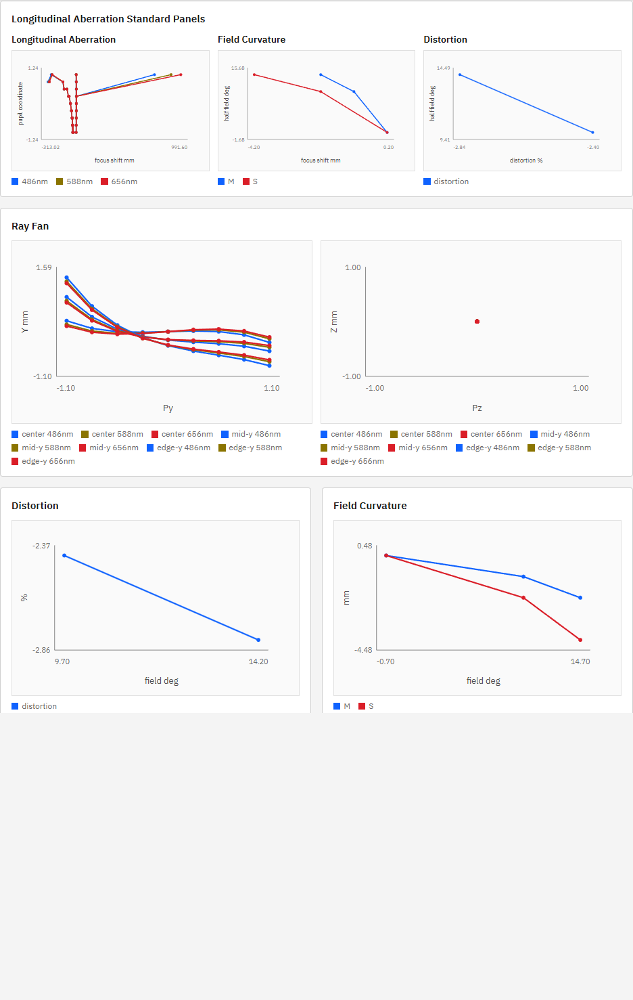

# R70 収差図・MTF表示UI 現状棚卸し

## 結論

調査対象コミットは `cbf9530`。`GET /v1/meta` の `build_info.git_commit` も `cbf9530` で一致した。

| 対象 | 分類 | 結論 |
|---|---|---|
| Ray Fan | Partial | UIとAPIは実装済み。P002では実描画を確認したが、P007/P011では一部 `aiming_failed` があり、P007の実UIは5分以内に完了しなかった。 |
| Longitudinal Aberration | Partial | UIとAPIは実装済み。P002で3波長の重ね描画を確認したが、P007/P011の一部光線は `aiming_failed`。仕様記載の最適化operandは未実装。 |
| Field Curvature | 実装済み・動作確認 | `/v1/analysis/field-curvature` と `/v1/analysis/ms-image-surface` をUIが結合し、M/S曲線を描画する。専用View仕様節はない。 |
| Distortion | 実装済み・動作確認 | `/v1/analysis/distortion` の `% distortion` 対field角を描画する。専用View仕様節はない。 |
| MTF Chart | Partial | geometric M/S表示とevaluation plane連携は実装済み。white/monochromatic切替とgeometric/diffraction切替はUI未接続。 |

## 実UI・DOM確認

### P002

実UI `http://127.0.0.1:5173/?lng=en` でP002を選択し、AnalysisのRun Chartsを実行した。モックは使用していない。

- standard panels: SVG 3、circle 89、polyline 6。legendは `486nm / 588nm / 656nm / M / S / distortion`。
- Ray Fan: SVG 2、circle 162、polyline 18。3 field x 3 wavelengthのlegendをY/Zそれぞれ確認。
- Distortion: circle 2、polyline 1。
- Field Curvature: circle 6、polyline 2、legend `M / S`。
- Relative Illumination: circle 3、polyline 1。
- MTF: circle 10、polyline 2、legend `M / S`。
- いずれもDOM上のempty表示はfalse。

### P007・P009

- P007: 実UI Run Chartsは300秒で完了せずタイムアウト。API単体ではray fan/longitudinal各189点中153点が`alive`、36点が`aiming_failed`。
- P009: 実UI Run Chartsは180秒で完了せずタイムアウト。API単体ではray fan/longitudinal各189点がすべて`alive`。
- タイムアウト前にチャートgridが現れなかったため、成功したと誤認させるスクリーンショットは保存していない。

## API実データ

稼働中APIへUI同等条件（3 fields、3 wavelengths、21 samples、`full` aiming）で直接リクエストした。

| preset | ray fan | longitudinal | distortion | field curvature | M/S surface | MTF |
|---|---:|---:|---:|---:|---:|---:|
| P002 | 189/189 alive | 189/189 alive | 3 rows | 3 rows | 3 rows | 5 points |
| P003 | 189/189 alive | 189/189 alive | 3 rows | 3 rows | 3 rows | 5 points |
| P007 | 153/189 alive | 153/189 alive | 3 rows | 3 rows | 3 rows | 5 points |
| P009 | 189/189 alive | 189/189 alive | 3 rows | 3 rows | 3 rows | 5 points |
| P010 | 189/189 alive | 189/189 alive | 3 rows | 3 rows | 3 rows | 5 points |
| P011 | 168/189 alive | 168/189 alive | 3 rows | 3 rows | 3 rows | 5 points |

代表値として、P002 edge-y 656.27 nmのray fanは`transverse_error_y_mm=-0.6942984318254624`、distortionは`-2.8151529466834067 %`、M/S focus shiftは`-2 / -4 mm`。P009 edge-yのdistortionは`-2.022702267873664 %`で、非零データを確認した。

## 実装接続状況

- Ray Fan: `optics_engine/aberrations.py::analyze_ray_fan`、`POST /v1/analysis/ray-fan`、`runChartAnalyses()`、`seriesFromRayFan()`が接続済み。
- Longitudinal: `analyze_longitudinal_aberration`、`POST /v1/analysis/longitudinal-aberration`、`seriesFromLongitudinal()`が接続済み。
- Field Curvature: `field-curvature`のbest focusと`ms-image-surface`のM/S値をfield IDで結合している。
- Distortion: `POST /v1/analysis/distortion`からstandard panelと通常panelの双方へ接続済み。
- MTF: UIは`POST /v1/analysis/mtf`のみを呼び、`diffraction_included: false`を固定表示する。`POST /v1/analysis/white-mtf`はエンジン実装済みだがUI未接続。`capabilities.diffraction_psf=false`のためdiffraction includedはエンジンも未対応。
- evaluation plane: UIから各解析へ`image_plane_policy`を送り、応答metadataを表示するため接続済み。
- `ray_fan_error` / `longitudinal_aberration`: `doc/engine_spec.md`のoperand表にはあるが、コード検索ではmerit/optimizer operand実装が存在しない。解析APIの実装とは別の未実装項目である。
- 仕様が言及する`ray_fan.py`は存在せず、現実装は`optics_engine/aberrations.py`にある。

## UI仕様17章の不足

17章には17.1共通、17.2 Optical Layout、17.3 Ray Path、17.4 Spot、17.5 MTF、17.6 PSFのみがある。次の専用節が不足している。

- Ray Fan View
- Longitudinal Aberration View
- Field Curvature / M-S Image Surface View
- Distortion View

## ギャップと規模

| 優先 | ギャップ | 規模 | 理由 |
|---:|---|---|---|
| 1 | P007/P009でRun Chartsが実用時間内に完了しない | 大 | 7解析の同時実行、full aiming、個別解析の再traceを横断して計測・分離する必要がある。 |
| 2 | 17章の4専用View仕様が欠落 | 小 | 現行DOM/APIを基準に表示軸、series、empty/error状態を仕様化できる。 |
| 3 | white/monochromatic MTF切替 | 中 | white MTF APIはあるが、条件UI、型、クライアント接続、legendが必要。 |
| 4 | P007/P011の`aiming_failed`可視化 | 中 | 有効点のみ描画する現在仕様に、失敗数・警告表示とテストが必要。 |
| 5 | `ray_fan_error` / `longitudinal_aberration` operand | 中 | merit evaluatorへの実装、params、テストが必要。 |
| 6 | diffraction included切替 | 大 | `capabilities.diffraction_psf=false`であり、回折PSF/MTFのエンジン実装から必要。 |

優先順位案は、まずRun Chartsを解析単位で実行・計測できる構成に分け、P007/P009の待ち時間を解消すること。その後に17章を現実装へ合わせ、white MTFをUI接続する。

## 検証結果

- `npm.cmd run ui:e2e -- --grep "P002 and P003 analysis charts"`: `1 passed (3.6s)`
- `python -m pytest -q tests/test_engine_v2_1.py tests/test_phase6_psf_mtf_illumination.py`: `23 passed, 1 skipped, 1 warning in 1.52s`
- 実API: P002/P003/P007/P009/P010/P011の6 endpoint群はすべてHTTP 200。
- 実UI: P002はDOM・スクリーンショットで確認。P007は300秒、P009は180秒で未完了。

本タスクではUI・エンジン・正本仕様の変更は行っていない。
