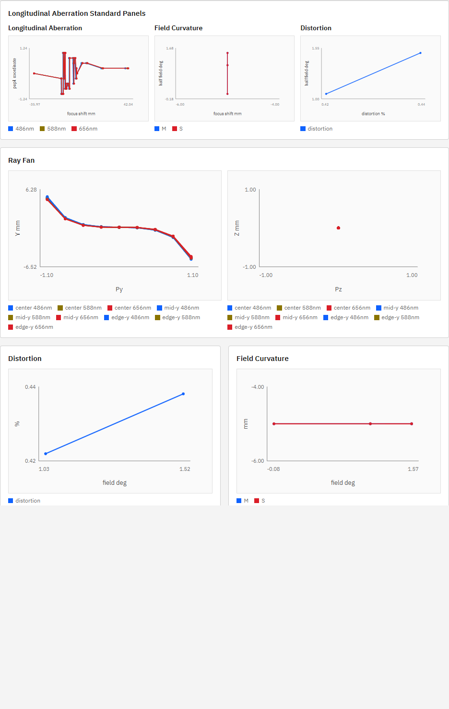
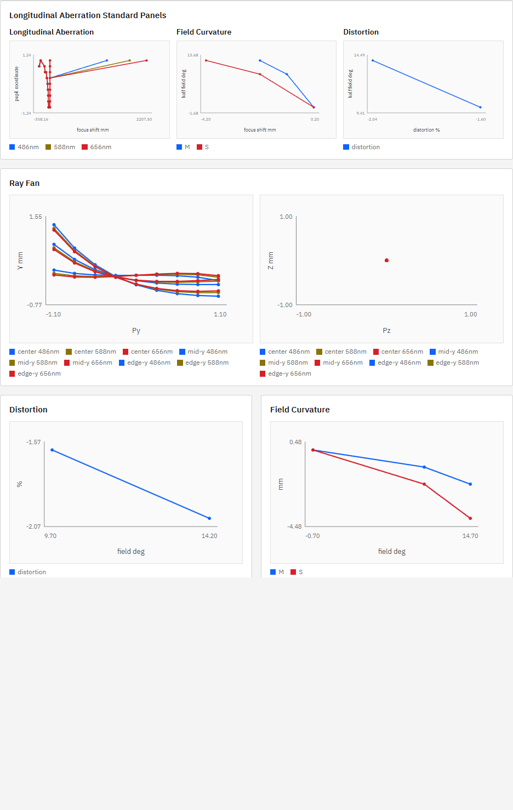

# R71 作業1 Run Chartsタイムアウト原因調査

## 結論

対象コミット `89bf0b5`（実コードは `cbf9530`）で再計測した結果、P007/P009のRun Chartsタイムアウトは再現しなかった。正しいプリセット名を使った実UIでは、P007が`1078 ms`、P009が`582 ms`で完了し、30秒目標を十分満たした。

R70で報告した300秒/180秒タイムアウトの支配的要因は製品コードではなく、検証スクリプトのプリセット表示名誤指定と、例外時にPlaywright browserをcloseしなかったことだった。

- 誤: `P007 Fast Double Gauss 50mm Demo`
- 正: `P007 Fast Positive-Negative Meniscus Pair 50mm Demo`
- 誤: `P009 Even Asphere Singlet Demo`
- 正: `P009 N-BK7 Aspheric Singlet 50mm Demo`

存在しないoptionを待ってPlaywrightが失敗した後もbrowser child processがevent loopを保持し、外側のshell timeoutだけが300秒/180秒で発火した。Run ChartsのAPI処理時間ではなかった。

## 実UI計測

実UI `http://127.0.0.1:5173/?lng=en`、実API `http://127.0.0.1:8000`を使用した。各preset選択時にUIが設定する条件は`9 rays / grid / paraxial / fixed_sensor`であり、R71背景にある`full` aimingではない。

| endpoint | P007 | P009 |
|---|---:|---:|
| `/v1/analysis/ray-fan` | 222 ms | 114 ms |
| `/v1/analysis/longitudinal-aberration` | 238 ms | 96 ms |
| `/v1/analysis/distortion` | 93 ms | 77 ms |
| `/v1/analysis/field-curvature` | 384 ms | 230 ms |
| `/v1/analysis/ms-image-surface` | 431 ms | 265 ms |
| `/v1/analysis/relative-illumination` | 282 ms | 155 ms |
| `/v1/analysis/mtf` | 299 ms | 159 ms |
| **Run Charts全体** | **1078 ms** | **582 ms** |

全endpointはHTTP 200。両presetともDOMは`6 sections / 9 SVG / 272 circles / 30 polylines / empty 0`だった。

## 単独・順次API計測

UIと同じrequest条件で7 endpointを順次実行した。

- P007: 合計`377.9 ms`、個別最大は`ms-image-surface 105.5 ms`。
- P009: 合計`365.0 ms`、個別最大は`ms-image-surface 153.0 ms`。

並列時はCPU処理の競合で個別時間が伸びるが、全体は1.1秒以内でありタイムアウト要因ではない。

## コード確認

- `apps/workbench-ui/src/api/engine.ts::runChartAnalyses()`は7 endpointを`Promise.all`で並列実行している。直列実行ではない。
- Run Chartsが呼ぶのはray fan、longitudinal、distortion、field curvature、M/S image surface、relative illumination、MTFの7種。spot endpointは呼ばない。
- ray fan、longitudinal、relative illumination、MTF等は各endpoint内で独立にtraceする。field curvatureとM/S image surfaceも独立計算であり、endpoint間のtrace共有はない。
- 重複計算は存在するが、現行の既定UI条件では実測1.1秒以内であり、今回のタイムアウトの支配的要因ではない。
- P007の`aiming_failed`はR70の別条件（`21 rays / fan_y / full`）で得た値。現行Run Charts既定の`paraxial`条件と混同していた。

## R70・R71記述との不一致

R70報告書の「P007は300秒、P009は180秒で未完了」は検証ハーネス由来であり、製品の実測値として無効。R71指示書の背景にある「UIはfull aiming」「spot関連もRun Chartsに含む」という前提も現行コードと一致しない。

過去報告書および指示書は監査記録として本作業では書き換えず、本報告を訂正記録とする。

## 作業2への判断

タイムアウト修正は不要。既に目標30秒以内を大幅に達成しており、根拠のないキャッシュ共有や実行方式変更は回帰リスクだけを増やす。

R71作業2へ進む前に、人間の確認が必要である。進める場合も製品修正ではなく、正しいプリセット名・`try/finally`でのbrowser close・30秒上限を持つ実UI性能回帰テストの追加へ作業内容を変更するのが妥当。

## 根拠

- 実装基準コミット: `cbf9530`
- R70報告コミット: `89bf0b5`
- 実API: 全14リクエストHTTP 200
- 実DOM: P007/P009とも`empty 0`
- コード: `apps/workbench-ui/src/api/engine.ts`、`apps/workbench-ui/src/ui/App.tsx`、`optics_engine/api/main.py`

本作業では製品コード・正本仕様・R71指示書を変更していない。
