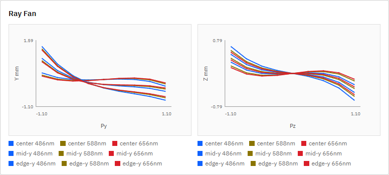
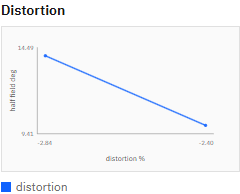

# R72 作業2 グラフのデータ点サイズ修正 完了報告

## 状態

Done。R72作業1は`doc/reports/2026-07-13_r72_task1_analysis_panel_review.md`で完了済みであり、本報告をもってR72作業2も完了した。

## 実装根拠

- 実装コミット: `3f59b111cc064e723ee960628339ecf60f3c4765`
- コミットメッセージ: `fix(ui): scale analysis markers by density (R72 task 2)`
- 変更ファイル:
  - `apps/workbench-ui/src/ui/App.tsx`
  - `apps/workbench-ui/tests/e2e/analysis-conditions.spec.ts`

## 修正内容

Analysis chartとSpot Diagramで共通の`markerAppearance(pointCount)`を使用し、表示点数に応じてマーカー半径と不透明度を段階調整するようにした。

| 表示点数 | 半径 | opacity |
|---:|---:|---:|
| 0-6 | 2.7 | 0.85 |
| 7-24 | 2.2 | 0.78 |
| 25-60 | 1.7 | 0.68 |
| 61以上 | 1.3 | 0.58 |

各SVGに`data-point-count`、`data-marker-radius`、`data-marker-opacity`を追加し、実DOMとE2Eから適用状態を確認できるようにした。系列、座標、circle数、光学計算結果は変更していない。

## 実UI確認

実APIと`http://127.0.0.1:5173/?lng=en`を使用し、P002で`Run Charts`を実行した。修正前の比較基準は`doc/reports/screenshots/2026-07-13_r72_task1_analysis_panels_after_2.png`である。

| パネル | circle数 | 修正前半径 | 修正後半径 | 修正後opacity | 結果 |
|---|---:|---:|---:|---:|---|
| Ray Fan Y | 81 | 2.7 | 1.3 | 0.58 | 密集点の重なりが軽減され、曲線を追いやすくなった |
| Distortion | 2 | 2.7 | 2.7 | 0.85 | 少数点の判別性を維持した |

密集パネル:

少数点パネル:

## 回帰テスト

- `npm run ci`: `36 passed`
  - `ui:build`成功
  - `i18n:check ok (214 keys)`
  - `i18n:coverage ok`
  - `i18n:test ok`
  - `svg-export-readback ok`
  - `chart-theme:test ok`
  - Playwright E2E `36 passed (42.2s)`
- `python -m pytest -q`: `104 passed, 1 skipped, 1 warning in 10.24s`

`apps/workbench-ui/tests/e2e/analysis-conditions.spec.ts`では、Ray Fan、少数点Distortion、Spot Diagramについて点数区分に対応する半径・opacityを直接検証している。既存のcircle数検証も維持しており、DOM上のデータ点数に変更がないことを確認した。

## 稼働プロセス確認

実装コミット後にエンジンAPIとUI開発サーバーを再起動した。確認時の実装HEADは`3f59b11`、`GET /v1/meta`の`build_info.git_commit`は`3f59b11`で一致し、UIはHTTP 200を返した。`build_info.git_dirty=true`は、本報告書、スクリーンショット、active内の未追跡指示書を含む作業ツリー全体の状態による。

## 結論

密集パネルではマーカーを縮小・半透明化し、少数点パネルでは従来サイズを維持した。変更は描画属性に限定され、近軸値、実光線追跡、解析データの数値的意味には影響していない。
