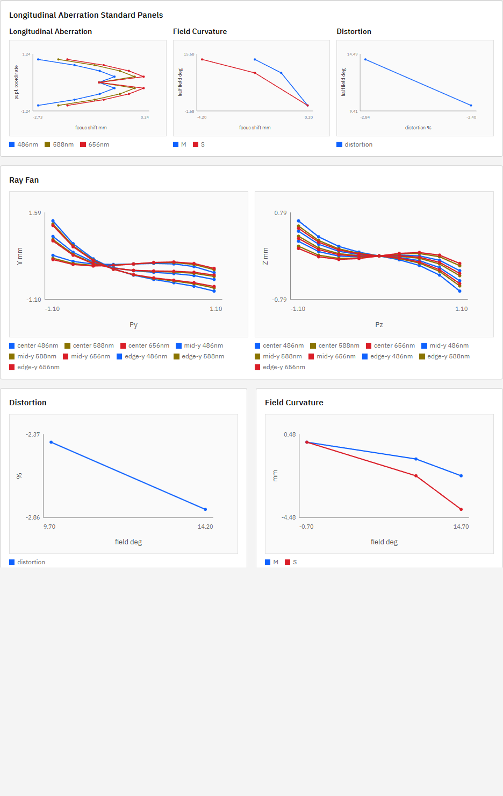
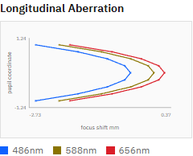
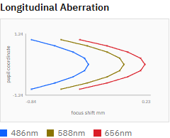

# R73 作業1 縦収差図の形状異常調査・修正 完了報告

## 状態

Done。P002/P003の縦収差中央点にセンサー位置が誤代入されるエンジン不具合を実データで特定し、波長別近軸焦点を用いるよう修正した。R73作業2〜6は未着手であり、指示書は`doc/work_orders/active/`に残している。

## 実装根拠

- 実装コミット: `1afa3a99cd59a3918bcef40315f5fcda6416b8cc`
- コミットメッセージ: `fix(engine): correct axial longitudinal focus (R73 task 1)`
- 変更ファイル:
  - `optics_engine/aberrations.py`
  - `tests/test_engine_v2_1.py`

## 原因

軸上・瞳中心の光線は光軸そのものであり、光軸との交点を一意に定められない。旧実装はこの場合だけ`focus_x_y_mm`と`focus_x_z_mm`へセンサーX位置を代入していた。

| preset | 主波長近軸焦点 mm | センサーX mm | 旧中心点の全波長共通error mm |
|---|---:|---:|---:|
| P002 | 54.536216783 | 53.500000000 | -1.036216783 |
| P003 | 97.931627046 | 103.500000000 | +5.568372954 |

この1点だけが隣接する実光線の焦点位置から外れ、中央のkinkを作っていた。UIの軸反転、field混入、波長group化、瞳順sortには本件の原因はなかった。APIの点列順は各波長で`-1.00`から`+1.00`、正負瞳の焦点値はビット精度で対称だった。

修正後は、軸上・瞳中心サンプルに限り、波長ごとの近軸像位置を物理的な`h -> 0`極限として採用する。非中心fanの直交成分へセンサー位置を補う誤ったfallbackも除去した。

## 基準面

実装の縦収差ゼロ基準は、主波長587.56 nmの`paraxial_image_position_mm`である。API metadataへ以下を明示した。

- `reference_kind: primary_wavelength_paraxial_focus`
- `reference_wavelength_nm: 587.56`
- `reference_x_mm`: 主波長の近軸像位置

`doc/engine_spec.md` 21.1節は縦収差を「瞳高に対する焦点位置の前後ずれ」と定義する一方、ゼロ基準面までは規定していない。`doc/ui_spec.md`もP003でgraph表示可能とするのみで、基準面は未規定だった。現実装の主波長近軸焦点基準は単色球面収差と複数波長の軸上色収差を同じ図で読む目的に整合する。仕様への明文化はR73作業2で扱い、本作業では正本仕様を変更していない。

## 修正後実データ

値は`longitudinal_error_y_mm = focus_x_y_mm - reference_x_mm`。瞳座標は正規化pupil coordinateである。

### P002

`reference_x_mm=54.536216783`。

| pupil_y | 486.13 nm | 587.56 nm | 656.27 nm |
|---:|---:|---:|---:|
| -1.00 | -2.591017197 | -2.075842010 | -1.843398775 |
| -0.75 | -1.662834560 | -1.148623486 | -0.916588487 |
| -0.50 | -1.018430268 | -0.504711432 | -0.272881353 |
| -0.25 | -0.638828337 | -0.125333672 | +0.106404880 |
| 0.00 | -0.513431136 | 0.000000000 | +0.231712988 |
| +0.25 | -0.638828337 | -0.125333672 | +0.106404880 |
| +0.50 | -1.018430268 | -0.504711432 | -0.272881353 |
| +0.75 | -1.662834560 | -1.148623486 | -0.916588487 |
| +1.00 | -2.591017197 | -2.075842010 | -1.843398775 |

主波長は中心`0.000000000 mm`からマージナル`-2.075842010 mm`へ滑らかに増大する。486.13/656.27 nmの中心offsetは主波長基準に対する軸上色収差であり、異常値ではない。

### P003

`reference_x_mm=97.931627046`。

| pupil_y | 486.13 nm | 587.56 nm | 656.27 nm |
|---:|---:|---:|---:|
| -1.00 | -0.793254753 | -0.539914854 | -0.379602769 |
| -0.75 | -0.591631987 | -0.314957598 | -0.145810546 |
| -0.50 | -0.435598917 | -0.143259736 | +0.031823094 |
| -0.25 | -0.337649920 | -0.036279705 | +0.142227126 |
| 0.00 | -0.304322285 | 0.000000000 | +0.179626393 |
| +0.25 | -0.337649920 | -0.036279705 | +0.142227126 |
| +0.50 | -0.435598917 | -0.143259736 | +0.031823094 |
| +0.75 | -0.591631987 | -0.314957598 | -0.145810546 |
| +1.00 | -0.793254753 | -0.539914854 | -0.379602769 |

P003主波長も中心`0.000000000 mm`からマージナル`-0.539914854 mm`へ滑らかに増大する。中心の波長間focus spanはP002の`0.745144124 mm`に対してP003は`0.483948677 mm`で、アクロマートの色補正傾向と整合する。

## 独立近軸検証

101点fanを実光線追跡し、中心点を除いた`0 < |pupil_y| <= 0.1`の`focus_x`を`pupil_y^2`で外挿した。外挿値と波長別近軸計算との差は次の通り。

| preset | 486.13 nm | 587.56 nm | 656.27 nm |
|---|---:|---:|---:|
| P002 | +0.000918 µm | +0.000909 µm | +0.000905 µm |
| P003 | -0.000538 µm | -0.000492 µm | -0.000474 µm |

すべて`0.001 µm`未満であり、中心点へ波長別近軸焦点を用いる修正が実光線の`h -> 0`極限と一致することを確認した。

## スクリーンショット

修正前P002はR72作業1後の画像で、中央に3系列の不連続な折れが残っている。

修正後P002:

修正後P003:

実DOMでは両presetとも`27 circles / 3 polylines`で、点数・series数は修正前から不変である。

## テスト

- 対象pytest: `2 passed, 19 deselected`
- 全pytest: `105 passed, 1 skipped, 1 warning in 10.38s`
- `npm run ci`: success
  - `i18n:check ok (214 keys)`
  - `i18n:coverage ok`
  - `i18n:test ok`
  - `svg-export-readback ok`
  - `chart-theme:test ok`
  - Playwright E2E `36 passed (45.5s)`

追加テスト`test_longitudinal_aberration_uses_wavelength_paraxial_focus_for_axial_sample`は、P002/P003の波長別中心焦点、正負瞳対称性、主波長の単調な収差増加、P003の色収差span縮小を直接検証する。

## 稼働プロセス

実装コミット後にAPI/UIを再起動した。確認時の実装HEADは`1afa3a9`、`GET /v1/meta`の`build_info.git_commit`は`1afa3a9`で一致し、UIはHTTP 200を返した。`build_info.git_dirty=true`は、本報告書、スクリーンショット、active内の未追跡指示書を含む作業ツリー全体の状態による。
