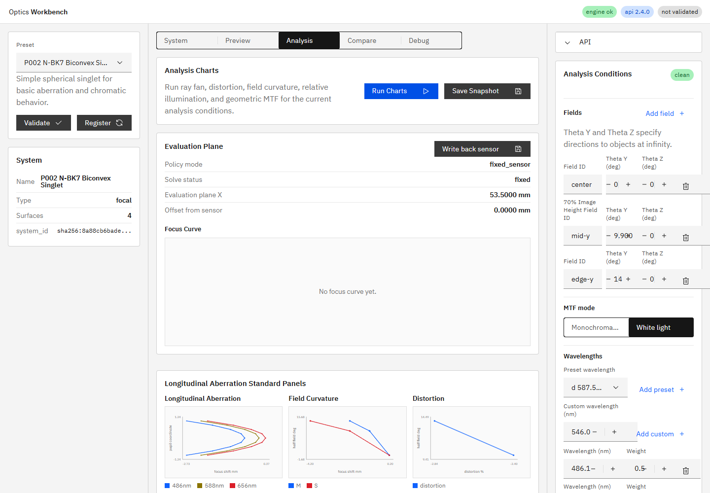

# R73 作業3 White / monochromatic MTF切替

## 状態

**Done**

- 実装コミット: `f943c59143eada507b0539af417fb1cce11351f1`
- 直接テスト: `apps/workbench-ui/tests/e2e/analysis-conditions.spec.ts`
- 全UI検証: `npm run ci` -> `37 passed`
- エンジン検証: `python -m pytest -q` -> `105 passed, 1 skipped, 1 warning`

## 実装内容

- Analysis ConditionsへCarbon `ContentSwitcher`による`Monochromatic` / `White light`切替を追加した。
- `Monochromatic`は`POST /v1/analysis/mtf`、`White light`は`POST /v1/analysis/white-mtf`へfieldごとに接続した。
- UIの`WavelengthSample[]`を、white MTF APIが受け取る`{ wavelength_nm: weight }`形式へ変換した。同一波長が複数ある場合はウェイトを合算する。
- 解析結果へ`mode`と白色光の正規化済み`wavelength_weights`を保持し、白色光の凡例へ`white`を付けた。
- 結果パネルに実行モード、`lp/mm`、波長ウェイト利用、`Diffraction included: false`を明示した。
- snapshotの解析条件へ`mtf_mode`を保存するようにした。
- 右ペインで`Monochromatic`が省略されないよう、対象の切替ボタンだけ横余白を調整した。
- `doc/ui_spec.md` 17.5を、実装済みのエンドポイント・切替・凡例・単位・回折未対応表示に合わせて更新した。

## API・E2E確認

追加E2EではP002の3 fieldについて次を直接確認した。

- White light選択時に`/v1/analysis/white-mtf`へ3要求送信する。
- `wavelength_weights`は配列ではなく、`486.13: 0.5`、`587.56: 1`、`656.27: 0.5`のマップとして送信する。
- 白色光の6系列凡例（3 field x M/S）が`white <field> M/S`として表示される。
- Monochromaticへ戻すと`/v1/analysis/mtf`へ3要求送信し、既存の`center M`等の凡例へ戻る。
- MTFチャートは両モードとも30点を描画する。

## 実画面確認

最終再起動後、実APIと実UIを使い、P002でWhite lightを選択してRun Chartsを実行した。白色光注記と30点のMTF描画を確認した。切替文字列は`clientWidth=132 / scrollWidth=132`、内部テキストは`clientWidth=100 / scrollWidth=100`で、省略・オーバーフローなし。

## 実行プロセス

- 確認対象コードコミット: `f943c59143eada507b0539af417fb1cce11351f1`
- `GET /v1/meta`の`build_info.git_commit`: `f943c59`
- 最新HEADとの一致: 一致
- UI `http://127.0.0.1:5173/`: HTTP `200`
- `build_info.git_dirty`: `true`。確認時点の未コミット内訳は本報告スクリーンショットと、人間配置の`doc/work_orders/active/`未追跡指示書であり、実装コード差分ではない。

## 制限

両モードとも現行エンジンの幾何MTFを表示する。回折込みPSF/MTFはR73作業6の設計調査対象であり、本作業では実装していない。
