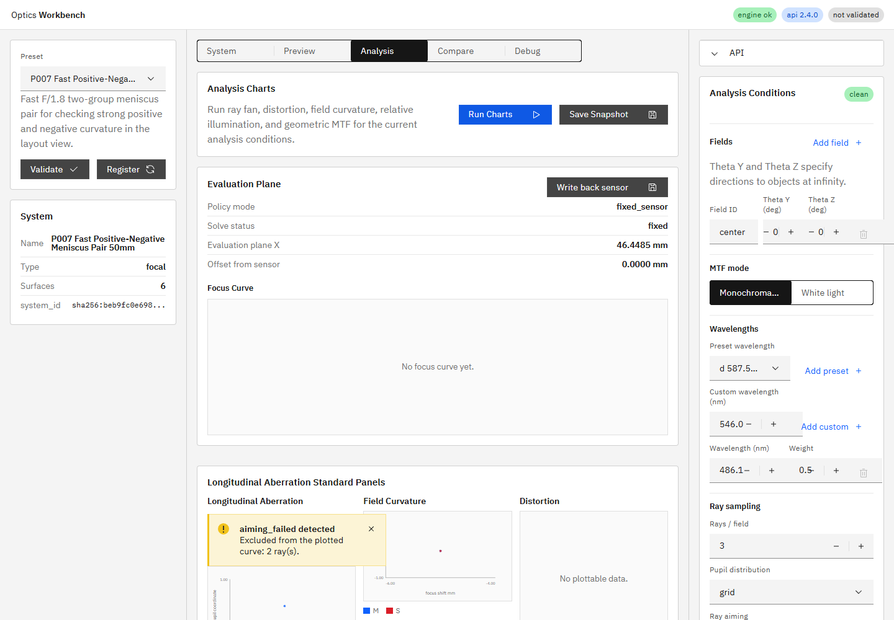

# R73 作業4 aiming_failedの可視化

## 状態

**Done with noted limitation**

- 実装コミット: `e32a9e9c2ab793d881b2499385dd312a8af42419`
- 直接テスト: `apps/workbench-ui/tests/e2e/analysis-conditions.spec.ts`
- 全UI検証: `npm run ci` -> `38 passed`
- エンジン検証: `python -m pytest -q` -> `105 passed, 1 skipped, 1 warning`

## 実装内容

- Ray Fan panelで`fan_y`と`fan_z`の`status=aiming_failed`点数を別々に集計し、1点以上ある場合だけCarbon warningを表示するようにした。
- Longitudinal Aberration panelで`status=aiming_failed`点数を集計し、1点以上ある場合だけCarbon warningを表示するようにした。
- `aiming_failed`点は従来どおり正常seriesへ混入させず、警告により「全点成功」と誤認しない表示にした。
- エンジン識別子`aiming_failed`、`fan_y`、`fan_z`は翻訳せず、周辺文だけ日英i18nリソースへ追加した。
- エンジンAPIは既に各pointへ`status`を保持していたため、レスポンスschemaの変更は行っていない。

## E2E確認

モックAPIを使用したP007・full aimingテストで次を固定した。

- Longitudinal Aberration: `aiming_failed=3`、正常描画点`6`
- Ray Fan `fan_y`: `aiming_failed=9`、正常描画点`18`
- Ray Fan `fan_z`: `aiming_failed=9`、正常描画点`18`
- 失敗点数の警告が両panelに表示される。

## 実API・実画面確認

最終再起動後の実APIと実UIを使用し、P007を計算量を抑えた`1 field / 1 wavelength / 3 rays / full aiming`でRun Chartsした。

| panel | aiming_failed | 正常描画点 |
|---|---:|---:|
| Longitudinal Aberration | 2 | 1 |
| Ray Fan fan_y | 2 | 1 |
| Ray Fan fan_z | 2 | 1 |

UI警告の集計値と、`status=alive`だけを描画したチャート点数が一致した。

## 実行プロセス

- 確認対象コードコミット: `e32a9e9c2ab793d881b2499385dd312a8af42419`
- `GET /v1/meta`の`build_info.git_commit`: `e32a9e9`
- 確認対象コードコミットとの一致: 一致
- UI `http://127.0.0.1:5173/`: HTTP `200`
- `build_info.git_dirty`: `true`。確認時点の未コミット内訳は本報告スクリーンショットと、人間配置の`doc/work_orders/active/`未追跡指示書であり、実装コード差分ではない。

## 注記した制限

P007の既定`3 field / 3 wavelengths / 9 rays / full aiming`で実UI Run Chartsを試したところ、120秒以内に完了しなかった。R70・R71で既に記録された、通常運用の既定`paraxial`とは異なる高コスト条件の性能制約が再現したもの。本作業4は`aiming_failed`可視化が対象のため性能実装には範囲を広げず、実データ確認は同じP007・full aimingの最小条件で完了した。
