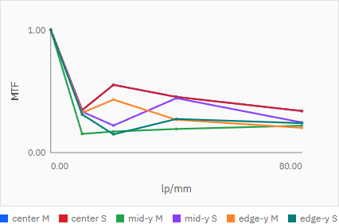
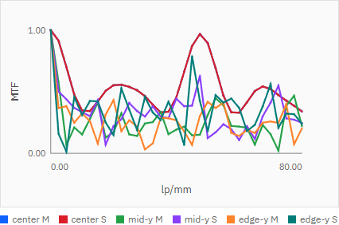

# R78 幾何MTFグラフ周波数サンプリング密度向上 完了報告

## 状態

**Done**

幾何MTFチャートの周波数サンプリングを、0〜80 lp/mmの5点から2.5 lp/mm刻みの33点へ増やした。monochromatic / whiteの両モードで同じ配列を使用し、既存の主要周波数`0 / 10 / 20 / 40 / 80`とその計算値を保持している。

実装根拠コミット:

- `744d6195a1c930873d25e0ca7f2eee31de90e371`（`feat(ui): densify geometric MTF frequency sampling (R78)`）

## 変更内容

- `apps/workbench-ui/src/api/engine.ts`
  - `DEFAULT_MTF_FREQUENCIES_LP_PER_MM`を追加した。
  - 配列は`0, 2.5, 5, ... 77.5, 80`の33点。
  - `runChartAnalyses`の既定値としてmono/white共通で使用する。
- `apps/workbench-ui/src/ui/App.tsx`
  - MTFリクエストへ同じ33点配列を渡す。
- `apps/workbench-ui/tests/e2e/analysis-conditions.spec.ts`
  - mono/white各3 fieldが33点配列を送ることを固定した。
  - M/S 2系列を含むDOM点数を`30`から`198`へ更新した。
  - Ray Fanのfield数と点数が変わらないことを既存テストと併せて確認した。

MTF計算式、最大周波数、field sampling、Ray Fan、Spot Diagram、近軸計算、実光線追跡には変更を加えていない。

## 実データ比較

P002を実APIへ登録し、同一リクエストを5点版と33点版で実行した。主要5周波数に対応するpoint objectを倍精度値のままJSON比較した結果は次のとおり。

```text
mono_major_equal: true
white_major_equal: true
```

33点版の主要値（表示は小数6桁へ丸め）:

| lp/mm | mono M | mono S | mono radial | white M | white S | white radial |
|---:|---:|---:|---:|---:|---:|---:|
| 0 | 1.000000 | 1.000000 | 1.000000 | 1.000000 | 1.000000 | 1.000000 |
| 10 | 0.346153 | 0.346153 | 0.052177 | 0.402447 | 0.402447 | 0.103100 |
| 20 | 0.551844 | 0.551844 | 0.473204 | 0.645094 | 0.645094 | 0.549590 |
| 40 | 0.453732 | 0.453732 | 0.312575 | 0.525529 | 0.525529 | 0.302614 |
| 80 | 0.338873 | 0.338873 | 0.282775 | 0.364725 | 0.364725 | 0.286213 |

## 性能

同じP002、3 fields、実API、同一ブラウザ操作でRun Charts全体を比較した。

| 条件 | MTF周波数/field | DOM点数 | Run Charts |
|---|---:|---:|---:|
| before | 5 | 30 | 1386.5 ms |
| after | 33 | 198 | 1409.8 ms |

増加は23.3 ms（約1.7%）。after再測定は1392.0 msだった。単独APIの参考値はmono 33点`9.7 ms`、white 33点`13.4 ms`であり、R71の30秒性能ガードに十分な余裕がある。実際の性能E2EでもP007 `4.1s`、P009 `3.4s`で通過した。

## スクリーンショット

変更前は各系列が5点の折れ線だった。



変更後は同じ0〜80 lp/mm範囲を33点で描画し、系列の周波数変化を詳細に確認できる。



両画像は実APIと実UIを使用し、P002のmonochromatic MTFを同じ表示範囲で取得した。

## テスト結果

```text
npm run ci
39 passed (48.6s)
i18n:check ok (221 keys)
i18n:coverage ok
i18n:test ok
svg-export-readback ok
chart-theme:test ok
```

```text
python -m pytest -q
115 passed, 1 skipped, 1 warning in 24.88s
```

対象E2Eの単独実行も`2 passed (7.5s)`。既存テストの削除・skip追加は行っていない。

## 再起動確認

実装コミット後にエンジンAPIとUI開発サーバーを再起動した。本報告コミット直前時点で次を確認済み。

```text
HEAD: 744d6195a1c930873d25e0ca7f2eee31de90e371
ShortHEAD: 744d619
build_info.git_commit: 744d619
CommitMatch: true
API/UI relevant process count: 2
UI status: 200
```

`build_info.git_dirty: true`は、R78完了報告作成前の指示書・報告書と、同期により再配置された既存の未追跡work orderを含む作業ツリー全体の状態による。
