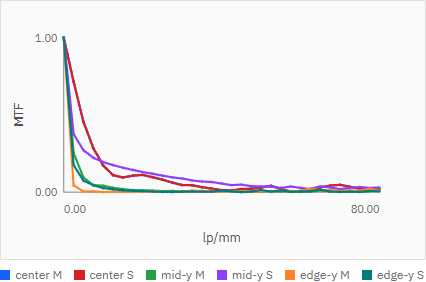
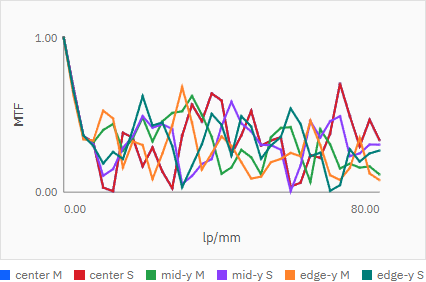
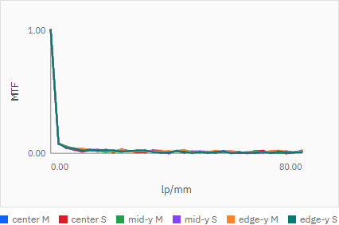

# R79 幾何MTFの異常波形 調査・修正完了報告

## 状態

**Done with noted physical limitation**

P002で見えていた大きな振動と高域での不自然な回復は、UI共有samplingの`9 rays/field`をMTFへそのまま使っていたことが主因だった。MTF専用samplingを仕様20.2節の推奨範囲下限である`4096 rays/field`へ分離し、P002/P007とも異常な高域回復を大幅に抑制した。

実装根拠コミット:

- `b655a3ad4ed0a21348b923354f6a286714525827`（`fix(mtf): use dense dedicated ray sampling (R79)`）

## 現状調査

### 実装方式

現行`analyze_geometric_mtf`は、幾何PSFの2Dヒストグラムを作ってFFTする実装ではない。センサー到達点を重心基準へ移し、各周波数で複素指数平均を求める経験的特性関数方式である。

```text
MTF_y(f) = abs(mean(exp(-2 pi i f y)))
MTF_z(f) = abs(mean(exp(-2 pi i f z)))
```

これはray-hit点群で表現した経験的PSFを直接フーリエ変換することに相当し、ヒストグラムのbinning誤差を導入しない。したがってMTFにはPSF grid size / pixel sizeという内部パラメーターは存在しない。

修正前のAPI metadataには評価面情報しかなく、この実装方式、ray数、到達数、grid非使用を確認できなかった。

### sampling経路

修正前のUIは、Analysis条件の共有値を全解析リクエストへ渡していた。既定値は次のとおり。

```json
{
  "samples_per_field": 9,
  "pupil_distribution": "grid",
  "ray_aiming": { "mode": "paraxial" }
}
```

`runChartAnalyses`はこのsamplingをfieldごとのmono/white MTF APIにもそのまま渡していた。MTF専用の内部既定値は存在しなかった。

## 複数ray数の実測

P002 center、3 wavelengths、33 frequencies、同一評価面で`9 / 100 / 1000 / 4096 / 10000 / 100000 rays/field`を比較した。

| rays/field | 20〜80 lp/mm最大radial MTF | 正の回復量合計 | 曲線粗さ | API時間 |
|---:|---:|---:|---:|---:|
| 9 | 0.827678 | 2.054048 | 3.908387 | 52.1 ms |
| 100 | 0.293091 | 0.600230 | 2.110186 | 18.0 ms |
| 1000 | 0.175069 | 0.379790 | 1.335548 | 74.6 ms |
| 4096 | 0.155566 | 0.217638 | 0.838260 | 234.2 ms |
| 10000 | 0.151594 | 0.210138 | 0.864045 | 623.5 ms |
| 100000 | 0.152067 | 0.214986 | 0.861921 | 7087.4 ms |

4096本で10000/100000本とほぼ同じ形状へ収束した。9本では67.5 lp/mm付近で`0.827678`まで回復していたが、4096本では高域最大が`0.155566`まで低下した。

1波長の自動回帰テストでは、4096本と10000本の全33点radial MTF最大差が`0.03`未満であることを固定した。

### 結論

異常な大振幅の山谷と高域回復は、少数の離散ray-hitをフーリエ変換したsampling artifactだった。4096本でも低振幅の波打ちは残るが、有限支持を持つ収差込み幾何PSFのフーリエ変換にはzero crossingとside lobeがあり得るため、曲線を後処理で単調化していない。回折MTFは本タスクの対象外である。

## 修正内容

- UIのMTF専用samplingを`4096 / grid / paraxial`として共有9本から分離した。
- monochromatic / whiteの全fieldへ同じ専用samplingを適用した。
- 周波数配列はR78の33点を維持した。
- Ray Fan、Spot、Relative Illumination等のsamplingは変更していない。
- `GeometricMTFResult` / `WhiteMTFResult`へmetadataを追加した。

MTF metadataは次を返す。

```text
method: empirical_characteristic_function
psf_representation: geometric_ray_hit_point_cloud
psf_grid_size: null
samples_per_field
pupil_distribution
ray_aiming_mode
traced_ray_count
arrived_count
wavelength_count
diffraction_included: false
```

white MTFはこれに`combined_weighted_point_count`を加える。APIのmono/white両エンドポイントを直接テストした。

## White MTF

P002 centerの実測:

| rays/field | 正の回復量合計 | 曲線粗さ | API時間 |
|---:|---:|---:|---:|
| 1000 | 0.351814 | 1.218110 | 878.4 ms |
| 4096 | 0.184105 | 0.796367 | 2162.5 ms |

whiteでも4096本化により振動が低下し、30秒以内に十分収まった。

## P007比較

3 fieldsの`20〜80 lp/mm最大radial MTF`は次のように低下した。

| field順 | 9 rays | 4096 rays | 正の回復量 9 → 4096 |
|---:|---:|---:|---:|
| 1 | 0.665270 | 0.040186 | 2.259120 → 0.087154 |
| 2 | 0.449944 | 0.030764 | 1.663012 → 0.094231 |
| 3 | 0.532903 | 0.022474 | 1.962104 → 0.071740 |

## スクリーンショット

### P002

9 rays/fieldでは大きな振動と高域回復が見える。


4096 rays/fieldでは主要な減衰形状が安定し、高域の異常回復が抑制された。



### P007





## 性能

- P002実UI Run Charts: `1992.3 ms`
- P007実UI比較: `3434.5 ms`
- R71性能E2E P007: `5.8s`
- R71性能E2E P009: `4.7s`
- 性能ガード: `30s`

R78の33周波数と4096 rays/fieldを併用しても許容時間内だった。

## 近軸・光線追跡への影響

P002の近軸値を修正後に直接確認した。

```text
EFL: 49.21298867869991 mm
BFL: 47.53621678328241 mm
F-number: 3.0758117924187443
paraxial image position: 54.53621678328241 mm
```

変更はMTF用samplingとMTF結果metadataに限定され、近軸計算式、面交差、屈折、ray trace、MTF計算式自体は変更していない。全pytestで既存値の回帰がないことを確認した。

## テスト結果

```text
npm run ci
39 passed (50.1s)
i18n:check ok (221 keys)
i18n:coverage ok
i18n:test ok
svg-export-readback ok
chart-theme:test ok
```

```text
python -m pytest -q
117 passed, 1 skipped, 1 warning in 11.42s
```

R79対象E2Eの再実行は`2 passed (5.0s)`。既存テストの削除・skip追加は行っていない。

## 再起動確認

実装コミット後にAPI/UIを再起動し、本報告コミット直前時点で次を確認済み。

```text
HEAD: b655a3ad4ed0a21348b923354f6a286714525827
ShortHEAD: b655a3a
build_info.git_commit: b655a3a
CommitMatch: true
API ready: true
UI status: 200
```

`build_info.git_dirty: true`は、R79報告書・指示書と、同期により再配置された既存の未追跡work orderを含む作業ツリー全体の状態による。
