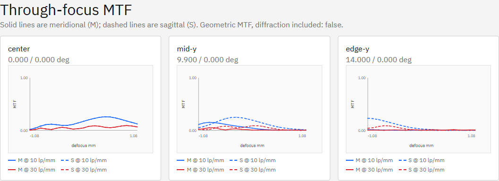
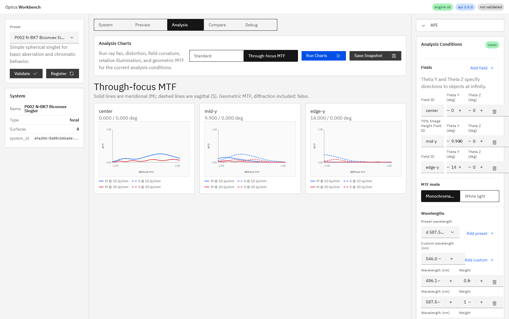

# R92 Through-focus MTF Chart 完了報告

## 結論

状態: **Done**

機能コミット: `4cc3c89` (`feat(optics): add through-focus MTF charts (R92)`)

P002の推奨3 fieldについて、10/30 lp/mmのメリディオナル（M）・サジタル（S）を21 defocus点で表示する専用APIとAnalysis Viewを実装した。エンジン正本`doc/engine_spec.md`、UI正本`doc/ui_spec.md`も同コミットで更新した。

## 調査と設計

- 既存`analyze_geometric_mtf`は10/30 lp/mmを計算でき、`image_plane.py`には最終光線を移動評価面へ投影する処理があった。
- defocus点ごとの全系再トレースは行わず、field・波長をまとめて1回追跡し、各評価面では最終位置・方向から交点だけを再計算する方式にした。
- M方向はfieldベクトル`(theta_y_deg, theta_z_deg)`と平行、S方向は面内直交方向とした。軸上ではM=Y、S=Zである。
- 既定片側範囲は固定±0.1 mmではなく、`abs(paraxial_focus_offset_mm) + 4 * (2 * primary_wavelength_mm * f_number^2)`とした。P002では±`1.080686 mm`となる。
- 標準Run Chartsへ先取り計算を加えると既存P007/P009性能ガードが30秒を超えたため、Through-focus View選択時だけ専用APIを呼ぶ遅延実行へ分離した。修正後はP007 `7.5 s`、P009は30秒以内で再通過した。

## 実装内容

- `analyze_through_focus_mtf(...)`と`POST /v1/analysis/mtf/through-focus`を追加した。
- リクエストは`frequencies_lp_per_mm`（既定10/30）、`defocus_range_mm`、`defocus_points`（既定21）、`depth_of_focus_multiplier`（既定4）を受け取る。
- 応答は`field_id × frequency_lp_per_mm × defocus_mm`の点列と、`mtf_meridional` / `mtf_sagittal`、範囲根拠・F値・波長・光線数metadataを返す。
- `/v1/meta`のcapabilitiesへ、実動作する`through_focus_mtf: true`を追加した。
- UIはAnalysisタブ内に`Standard` / `Through-focus MTF`切替を追加した。focal系のみ表示し、プリセット変更時はStandardへ戻す。
- fieldごとに独立パネルを表示し、Y軸0〜1、周波数を色、M/Sを実線・破線で区別した。文言はja/en i18nリソースへ追加した。

## 整合性確認

- `tests/test_phase6_psf_mtf_illumination.py`で、defocus 0のM/Sが同一条件の通常MTF 10/30 lp/mmと一致することを直接固定した。
- `theta_z_deg`方向のfieldを90度回転した場合もM/S値が対応する回帰テストを追加した。
- P002軸上10 lp/mmはdefocus 0で`0.172552`、`+0.432274 mm`で`0.258677`のピークとなり、山形を確認した。
- 実画面DOMは3パネル、各84描画点（21点×2周波数×M/S）、X範囲±`1.080686 mm`だった。

## ベンチマーク

履歴: `bench_results/20260714_233558_r92_through_focus_mtf.json`

| 項目 | 結果 |
|---|---:|
| Preset / field / 波長 | P002 / 3 field / 3波長 |
| Sampling | 4096 rays/field / 36,864 traced rays |
| Sweep | 21 defocus点 / 10・30 lp/mm / M・S |
| 応答点数 | 126 response points |
| 経過時間 | `0.581107 s` |
| 目標 | `< 30 s`（達成） |

R92としては初回ベースラインのため前回値はない。今後の比較基準を上記JSONに保存した。

## テスト結果

- `python -m pytest -q`: `185 passed, 1 skipped, 1 warning in 15.92s`
- `npm run ci`: build / i18n / export / chart / Playwrightを完走し、E2Eは`40 passed`
- R92対象Python: `37 passed, 1 skipped`
- R92対象E2E: `1 passed`

主な回帰テスト: `tests/test_phase6_psf_mtf_illumination.py`、`tests/test_engine_v2_1.py`、`apps/workbench-ui/tests/e2e/analysis-conditions.spec.ts`。

## 実環境確認

機能コミット直後にAPI/UIを再起動し、次を確認した。

- HEAD: `4cc3c89`
- `GET /v1/meta` → `build_info.git_commit: 4cc3c89`
- UI: `http://127.0.0.1:5173/` → HTTP 200
- `build_info.git_dirty: true`は未追跡のactive指示書・本報告用ファイルを含む作業ツリー状態による。

## スクリーンショット

P002実API結果の山形と3 fieldパネル:

Analysisタブ全体のパネル構成:

SHA-256:

- `_1.png`: `EA991D6CD3BBDD6087F6CBE5AE3692C16F38F8082C91B7774952994E63C6DF27`
- `_2.png`: `4C53CB0016CE00E1FE3ECA717D051881823C290D5F101D74BAC94F76141B69FC`

## 既知の前提

本機能は幾何MTFであり回折は含まない。応答metadataとUIの双方に`diffraction_included: false`相当を明示している。これはR92および正本仕様で定めた初期スコープどおりである。
