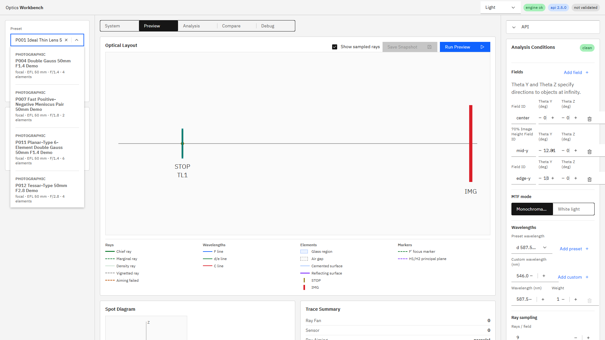
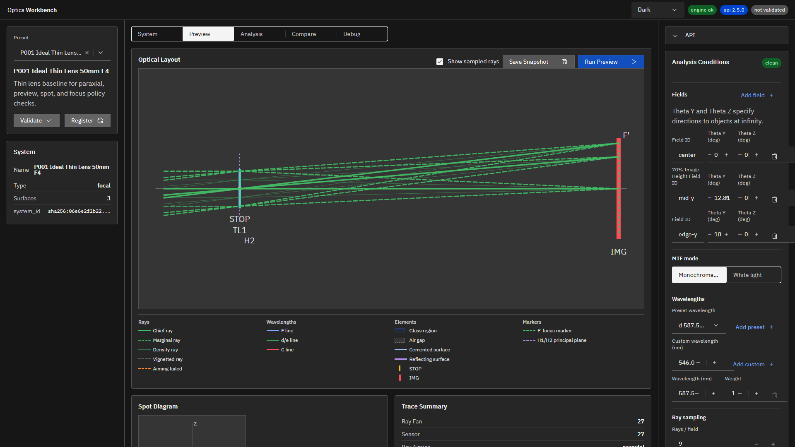

# R100：UI Phase 1 プリセット検索・右ペインcontext化・テーマ基盤 実装報告

## 状態

**Done**

機能実装コミットは `a91f74be2bb758d58713ddf467ae60d13629e3b0`（`feat(ui): add contextual themes and preset search (R100)`）。本報告書コミットの直前時点でエンジンAPIとUI開発サーバーを再起動し、`GET /v1/meta`の`build_info.git_commit`が機能コミット短縮値`a91f74b`と一致することを確認済み。UI `http://127.0.0.1:5173/`はHTTP 200を返した。

## 実装内容

### プリセット選択

- Carbon `Dropdown`を検索可能な`ComboBox`へ置換した。
- ID、日英名称、日英summary、system type、EFL、F number、element count、asphere、focus groupを検索対象にした。
- preset側の`catalog.category` metadataにより`Photographic / Simple & Educational / Telescope & Afocal / Visual / Fixtures`へ分類し、カテゴリ順・カテゴリ内ID順で表示した。
- 各候補に短い属性を表示し、選択中の正式名はComboBox外にも折り返し表示した。
- Arrow key、Enter、Escを含むkeyboard操作をE2Eで固定した。
- P005の通常時非表示と`?fixture=all-presets`経路は維持した。

### 右ペインcontext化

- API・言語・validation・chart exportは、全画面から到達できる低頻度Accordionとして維持した。
- Analysis ConditionsはPreview/Analysisだけ、Image Plane PolicyはAnalysisだけに表示した。
- Group Motion / Aperture / Decenter TiltはPreviewの`Runtime controls`内へまとめた。既存control IDとrequest挙動は維持した。
- 3列レイアウトと上部ContentSwitcherの構造は変更していない。

1920×1080における右ペインの`scrollHeight - clientHeight`実測値は次のとおり。

| 画面 | R99 before | R100 after | 削減率 |
|---|---:|---:|---:|
| System | 2379 px | 0 px | 100.0% |
| Preview | 2387 px | 465 px | 80.5% |
| Analysis | 2387 px | 918 px | 61.5% |
| Compare | 2387 px | 0 px | 100.0% |
| Debug | 2387 px | 0 px | 100.0% |

### テーマ基盤

- App rootをCarbon `Theme`で囲み、light=`g10`、dark=`g100`とした。
- Headerへ`System / Light / Dark` selectorを追加した。System時だけ`prefers-color-scheme`を監視し、選択値はlocalStorageへ保存する。
- `styles.css`と`App.tsx`の画面色をsemantic tokenへ置換し、Layout/Chart/marker/legendをlight/dark共通トークンで描画するようにした。
- `chartTheme.ts`へlight/dark paletteとCSS variable経由のseries paletteを追加した。F/d/e/Cの波長色相は維持し、テーマごとに明度・彩度だけを変える。
- `exportSvg.ts`は変更せず、印刷向けlight固定SVG exportを維持した。
- E2Eで本文contrast 4.5:1以上、波長線contrast 3:1以上、波長色の識別、テーマ選択のreload後保持を検証した。

## テスト

- `npm run ci`: build / i18n:check / i18n:coverage / i18n:test / SVG export / chart theme / Playwrightすべて成功、Playwrightは`46 passed`。
- `npm run ui:build:pseudo`: 成功。
- `apps/workbench-ui/tests/e2e/analysis-conditions.spec.ts`: preset検索・カテゴリ・keyboard・ja/en/pseudo長文、右ペインscroll、theme・contrast・永続化、既存runtime controlを検証。
- `apps/workbench-ui/tests/e2e/run-charts-performance.spec.ts`: 実APIのP011 Preview、P007/P009 Run Chartsを含めて成功。
- `apps/workbench-ui/scripts/chart-theme-tests.mjs`: light/dark paletteとF/d/e/C識別を検証。

## 画面確認

light themeのプリセット候補。カテゴリ、正式名、属性がクリップされず表示されることを確認した。

dark themeのPreview。Layout、光線、legend、Carbon controls、右ペインを実API応答後に確認した。

## スコープ境界

R100指示書でPhase 2以降とされた左Accordion navigation、Surface live split、Analysis chart picker、snapshot自動移行は実装していない。今回のPhase 1完了条件には含まれない。

`build_info.git_dirty`は`true`だった。内訳は本報告書・スクリーンショット・R100 active指示書、およびR100対象外の未追跡指示書であり、機能コミットの追跡ファイル差分ではない。
