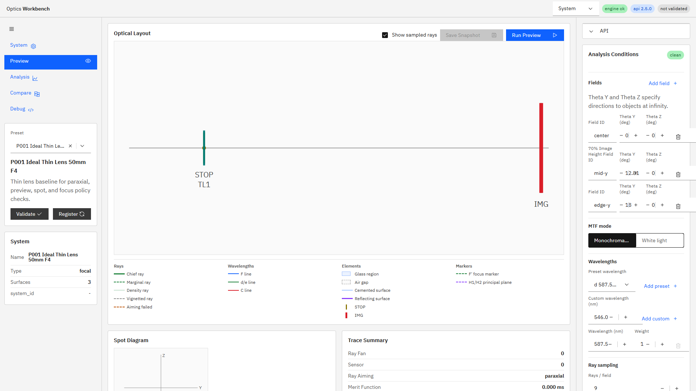
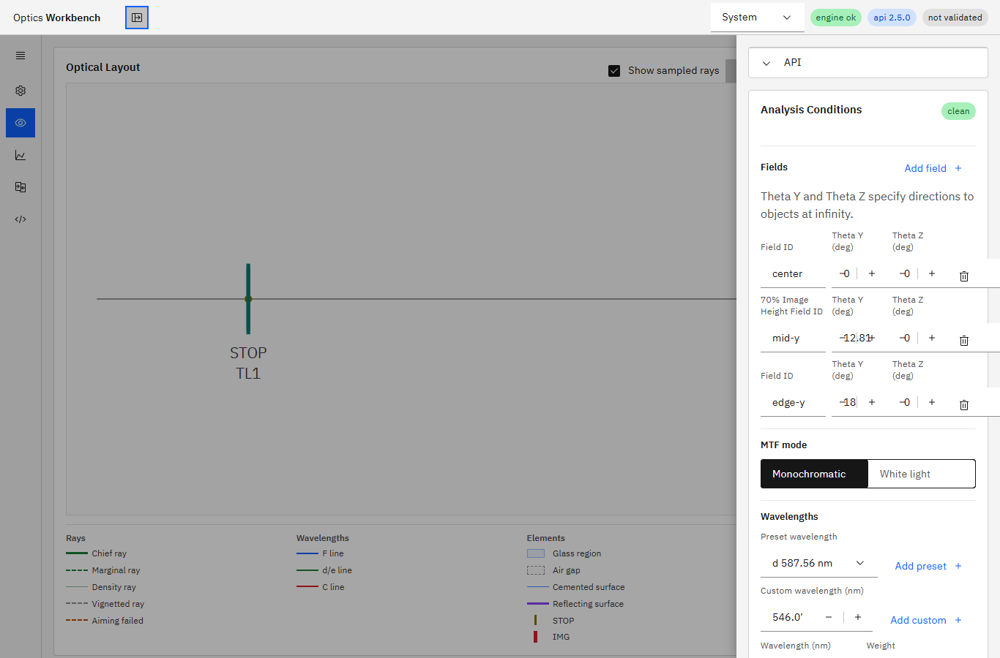

# R101 UI Phase 2 ナビゲーションシェル 完了報告

## 結果

R101を **Done** とする。状態・mutation分離を先行コミットに分けた上で、中央上部の画面切替を左ナビゲーションシェルへ移し、幅に応じた既定開閉、開閉状態の永続化、右Contextパネルの固定表示／drawer切替を実装した。

## 実装コミット

| 区分 | コミット | 内容 |
| --- | --- | --- |
| 状態分離 | `4d9da366bae23e5e4fdc7b54170a54cbeda8483f` | `App.tsx`直下のWorkbench stateとReact Query mutationを`useWorkbenchController.ts`へ分離 |
| Navigation shell | `532e90760262c1a7589916800919ffdbe29d4cfc` | 左navigation shell、icon rail、永続化、右Context drawer、i18n、E2E |

1タスク内で指示された先行リファクタとshell実装を、目的別の2コミットに分離した。既存の数値結果、request payload、snapshotデータ構造は変更していない。

## 実装内容

- System / Preview / Analysis / Compare / Debugを左側の開閉可能なnavigation shellへ移した。
- expandedは`280px`、collapsedは`56px`のicon railとした。5画面はどちらの状態でも同じview keyへ遷移する。
- 初回既定値は`1440px`以上でexpanded、`1439px`以下でcollapsedとし、ユーザー操作後は`localStorage`の`optics-workbench-navigation-expanded`へ保存する。
- 右Contextパネルは`1367px`以上で固定、`1366px`以下で幅`360px`以下のoverlay drawerとした。drawer開閉で中央Layout/Chartの寸法を変えない。
- Header utility、R100のpreset検索、右Context、light/dark themeを維持した。
- navigationとdrawerの表示文字列をja/enのi18n resourceへ追加した。
- Playwright既定viewportを1920x1080へ明示し、従来の固定Context表示を前提とするテストを安定化した。

「Accordion形式」は、個別項目の内容を多段展開するCarbon Accordionではなく、shell全体をhamburgerでexpanded/collapsedにする一段の開閉ナビゲーションとして実装した。R101で要求されたicon rail、5画面遷移、永続化を満たし、画面内に不要な入れ子Accordionは追加していない。

## `App.tsx`整理結果

R99の計測値と同じ単純出現数基準で比較した。

| 指標 | R99時点 | R101後 | 差分 |
| --- | ---: | ---: | ---: |
| 行数 | 3,675 | 3,825 | +150 |
| named function | 93 | 94 | +1 |
| `useState`出現 | 43 | 2 | -41 |
| `useMutation`出現 | 8 | 0 | -8 |

新規`useWorkbenchController.ts`は162行で、`useState` 20出現、`useMutation` 7出現である。行数とnamed functionはnavigation shellの描画追加により減っていないが、レイアウト変更時に巻き込みやすかったWorkbench state/mutationは`App.tsx`から分離できた。残る`useState` 2件は子パネル固有のローカル状態である。

## テスト

機能コミット`532e90760262c1a7589916800919ffdbe29d4cfc`に対して次を実行した。

```text
npm run ci
49 passed (1.2m)
```

`ui:build`、`i18n:check`（247 keys）、`i18n:coverage`、`i18n:test`、`svg:export:test`、`chart:test`、`ui:e2e`はすべて成功した。追加E2Eで以下を直接固定した。

- 1920 / 1440 / 1439 / 1367 / 1366pxのnavigation既定状態とContext mode
- collapsed状態のreload後永続化と5画面への到達
- navigation開閉後のChart寸法安定
- 1366px drawer開閉前後のLayout寸法一致
- R100のpreset検索、右ペインscroll、theme切替の回帰なし

```text
npm run ui:build:pseudo
Exit code: 0
```

## 実ブラウザ確認

Edge headlessで実際の`http://127.0.0.1:5173/`を表示し、次を確認した。

- 1920x1080: `data-navigation-expanded=true`、`data-context-mode=fixed`
- 1366x900: `data-navigation-expanded=false`、`data-context-mode=drawer`
- drawer open時: `aria-hidden=false`、矩形`x=1006, width=360, height=852`
- いずれもworkbench矩形はviewport全体と一致し、表示重なり・文字切れ・中央領域の不整合は見られなかった。





## プロセス整合

機能・コードに実質変更があった最後のコミット`532e90760262c1a7589916800919ffdbe29d4cfc`でAPIとUIを再起動した。本報告コミットの直前時点で、`GET /v1/meta`の`build_info.git_commit`は`532e907`、対象HEADは`532e90760262c1a7589916800919ffdbe29d4cfc`で一致し、UIはHTTP 200を返した。

`build_info.git_dirty=true`は、本報告・スクリーンショット・人間が配置した未追跡active指示書を含む作業ツリー状態による。

## スコープ

R101指定どおり、Phase 3のsurface live split、Analysis chart picker、snapshot自動遷移には着手していない。リモートへのpushも実施していない。
