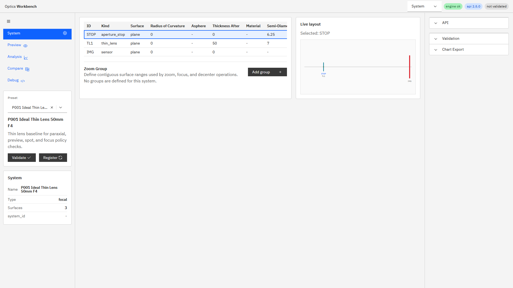
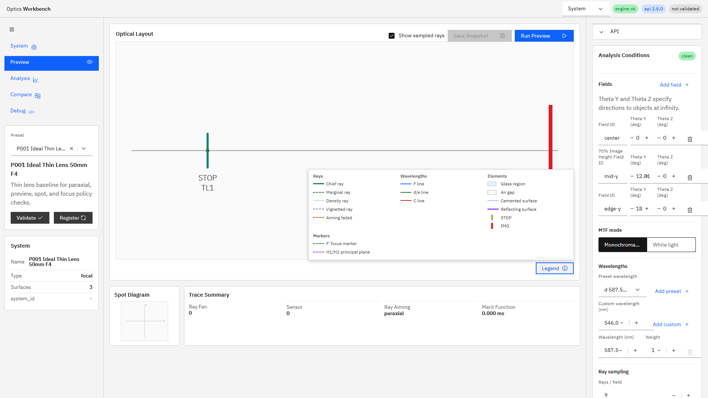
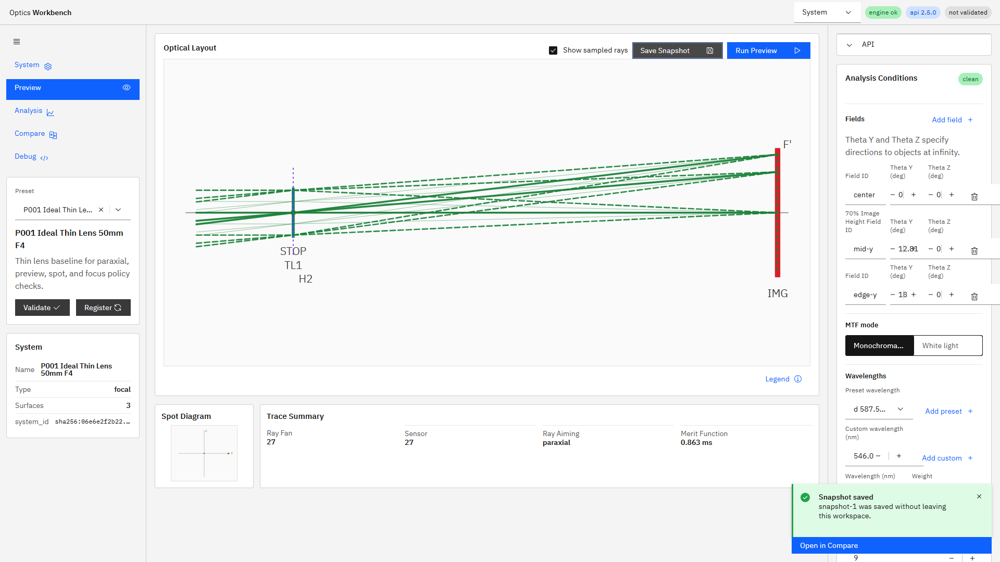

# R103 UI Phase 3（同一画面workspace）完了報告

## 規模見積もり

着手時見積もりは`1.0〜1.5人日`とした。内訳は、System workspaceとmini-layout再利用`0.4人日`、Preview compact化と凡例`0.3人日`、Snapshot導線`0.2人日`、E2E・実ブラウザ確認`0.3人日`である。

## 結果

R103は完了した。実装コミットは`017af59`、凡例安定化コミットは`af6f311`である。R104の履歴修復により旧R103コミット`9c0e02c`は`017af59`へ置き換わった。

- ヘッダー右上の`System`は旧画面切替の残骸ではなく、テーマ選択用の意図されたUIであるため維持した。
- Systemビューへ既存`LayoutView`を再利用したlive mini-layoutを追加し、surface/group選択と対応面のhighlightを連動させた。
- surface編集後は既存系と同じ`70 ms` debounceでpreviewを更新し、Systemビューから遷移せず結果を反映する。
- Previewの常設凡例を開閉式popoverへ変更し、spot/trace summaryを第一viewport内のcompact result stripへ配置した。
- Snapshot保存後のCompare自動遷移を廃止し、現在画面を保ったtoastと`Open in Compare` actionへ変更した。
- 数値結果、preview request payload、snapshotデータ構造は変更していない。

## テスト

- `python -m pytest -q tests/test_r102_evaluate_trace_sharing.py`: `4 passed in 0.55s`
- `python -m pytest -q`: `194 passed, 1 skipped, 1 warning in 22.35s`
- `npm run ci`: Pass。Playwright E2Eは`52 passed (1.3m)`で、R103追加3件を含む。
- `npm run ui:build:pseudo`: Pass。

R103の直接E2Eは`apps/workbench-ui/tests/e2e/analysis-conditions.spec.ts`の以下3件で固定した。

- `R103 System workspace links row selection and debounced preview to the live mini layout`
- `R103 layout legend overlays without resizing the layout and result strip stays compact`
- `R103 snapshot save stays in place and toast action opens Compare`

## 実環境確認

エンジンAPIとUI開発サーバーを再起動し、機能・コード変更の最終コミット`af6f311659ab913b0c5cabfb3d6883b468ad0f5d`に対して、`GET /v1/meta`の`build_info.git_commit=af6f311`が一致することを確認した。APIとUIはいずれもHTTP `200`だった。`build_info.git_dirty=true`は未追跡の指示書・報告用画像によるもので、trackedコード差分はない。

1920x1080のEdgeで以下を確認した。凡例画像はEdge headlessのGPU合成による黒欠けを避けるため`--disable-gpu`で取得し、画像を目視確認した。

1. Systemビューのsurface tableとlive mini-layout。選択面がmini-layoutへ反映される。

   

2. Previewの凡例popoverとcompact result strip。凡例を開いてもlayout寸法は変化しない。

   

3. Snapshot保存後もPreviewに留まり、toastからCompareを明示的に開ける。

   

## スコープ

R99 Phase 4のchart picker、2〜4 panel workspace、Through-focus MTF統合、およびPhase 5のresponsive・アクセシビリティ仕上げには着手していない。これらはR103の完了範囲外である。
