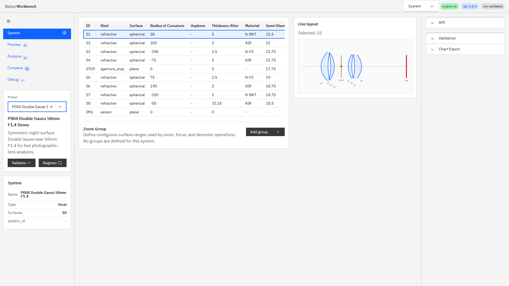
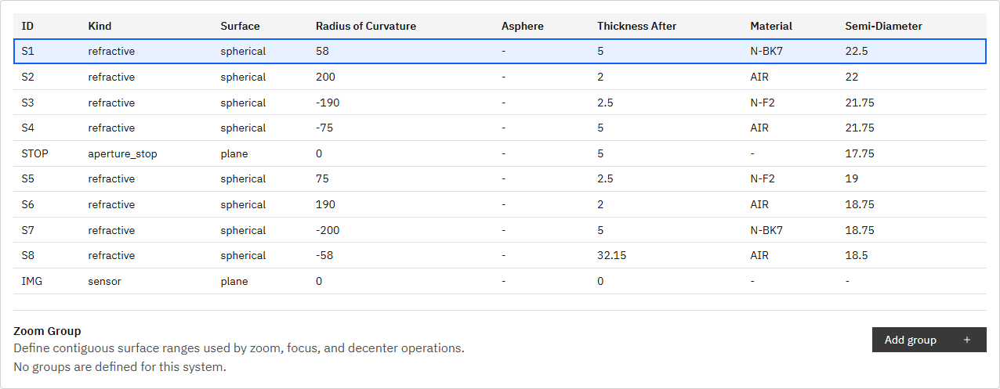
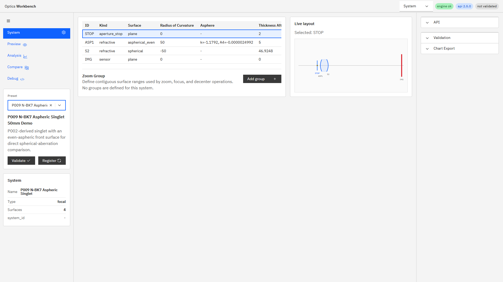
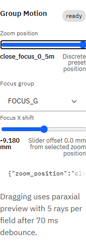

# R105/R106 System諸元表とnamed position UI 調査・設計報告

## 規模見積もり

- 着手前見積もり: 0.6〜0.9人日
- 対象: コードread、1920×1080 Edge実測、既存テスト確認、R105/R106設計案、backlog登録
- 本タスクでは製品コード、テスト、仕様書を変更していない。

## 結論

- R105: Surface Tableは8列あるが、R103の常設mini-layoutにより表表示幅が760 pxまで縮み、P004でも最後の1列、P009では最後の3列が完全表示できない。通常surfaceのセルはすべて読み取り専用であり、編集できるのはannulus STOPのSemi-Diameterだけである。
- R106: named `zoom_positions`はsystem定義・エンジン実行・Preview切替まで実装済み。ただし一覧・登録・更新UIはなく、Snapshotにも選択中runtime configurationが保存されない。OISは一時スライダーだけでnamed position化できない。
- 推奨: System画面は全幅諸元表を基本にしてmini-layoutを明示切替とし、選択surfaceは専用inspectorで編集する。named positionは`system.zoom_positions`を正本とするPosition Managerで管理し、Runtime controlsから現在値を保存できるようにする。

# R105: Surface Table

## 1. 表示域の実測

実測条件はEdge、1920×1080、UI `http://127.0.0.1:5173/`、英語表示。`.table-shell`の`clientWidth`/`scrollWidth`と各`th`の矩形を取得した。

| 条件 | editor幅 | mini-layout幅 | table表示幅 | table必要幅 | 横overflow | 完全表示列 |
|---|---:|---:|---:|---:|---:|---:|
| P004、現行split | 794.3 px | 465.6 px | 760 px | 802 px | 42 px | 7/8 |
| P004、mini-layout非表示 | 1276 px | 0 px | 1242 px | 1242 px | 0 px | 8/8 |
| P009、現行split | 794.3 px | 465.6 px | 760 px | 990 px | 230 px | 5/8 |
| P009、mini-layout非表示 | 1276 px | 0 px | 1242 px | 1242 px | 0 px | 8/8 |

現行splitのP004ではID、Kind、Surface、Radius、Asphere、Thickness、Materialの7列が完全表示され、Semi-Diameterは123.2 px中81.7 pxだけ見える。P009ではID〜Asphereの5列が完全表示、Thicknessは126.1 px中97.5 px、MaterialとSemi-Diameterは0 pxで完全に画面外となる。P009は`k=-1.1792, A4=-0.0000024992`によりAsphere列が222.6 pxへ広がる。

mini-layoutを非表示にするとeditorは481.7 px（60.6%）広がり、P004/P009とも8列を横スクロールなしで表示できた。比較はブラウザ内で一時的に`.system-mini-layout { display: none }`と1列gridを適用したもので、製品コード変更ではない。

### スクリーンショット

P004現行split。Semi-Diameter見出しが右端で切れる。

P004のmini-layout非表示比較。8列を一望できる。

P009現行split。Asphere列の後ろでThicknessが切れ、Material/Semi-Diameterは見えない。

## 2. 編集可否

実装根拠は`apps/workbench-ui/src/ui/App.tsx`の`surfaceColumns`と`SurfaceTable`である。

| 列 | 通常surface編集UI | 例外 | 変更反映 |
|---|---|---|---|
| ID | なし | なし | 読み取り専用 |
| Kind | なし | なし | 読み取り専用 |
| Surface | なし | なし | 読み取り専用 |
| Radius | なし | なし | 読み取り専用 |
| Asphere | なし | なし | 読み取り専用。conic/A4等は文字列表示のみ |
| Thickness After | なし | なし | 読み取り専用 |
| Material | なし | なし | 読み取り専用 |
| Semi-Diameter | なし | annulus STOPのみouter/inner `NumberInput` | system dirty化後、70 ms debounceでpreview。必要時に自動validate/register |

Surface行のクリック/Enter/Spaceは選択とmini-layout highlightだけを行う。行は`cursor: pointer`だが、選択後にsurface inspectorや編集フォームは出ない。P004/P009のような通常レンズ系では表内に入力要素が1つもないため、人間の「編集できない」という認識が正しい。

Group PanelはID/name/from/toを編集でき、annulus編集と同じく70 ms debounce previewを使うが、これはsurface諸元編集ではない。

## 3. R103記述との食い違い

`doc/reports/2026-07-15_r103_ui_phase3_same_screen_workspace.md`の「surface編集後は70 ms debounce」は一般surface編集を実装したように読める。しかし直接E2EはP005の`#surface-STOP-annulus-inner`を変更しており、実装もannulus半径だけである。表現が対象範囲を省略したため、実態より広い完了主張になっていたことが食い違いの原因である。

## 4. 改善案

| 案 | 内容 | 規模 | 評価 |
|---|---|---|---|
| A. 表示改善のみ | sticky ID、横scroll影、列priority、mini-layout収納ボタン | 小 | 一望性は改善するが通常surfaceは編集できないまま |
| B. 全幅表＋surface inspector | `Table / Split`切替を設けTableを既定化。行選択時はoverlay/drawerまたは下段inspectorで諸元編集。mini-layoutは明示的に開く | 中 | 一望性と編集を両立し、日常作業向き |
| C. 全セルinline editor | 8列を直接入力/select化し、AsphereやMaterialも表内編集 | 大 | 高密度だが横幅、誤操作、複合値、validation表示が複雑 |

**推奨はB**。固定のmini-layout列を外せば実測上8列が収まり、表を入力部品でさらに横長にせず編集を提供できる。選択surfaceのinspectorではKindに応じてRadius、conic/A4、Thickness、Material、Semi-Diameterを表示し、編集可能領域を入力枠とdirty表示で明示する。ID/Kind変更は参照整合性への影響が大きいためAdvanced扱いにする。

R4のRaw JSON/YAML editorは、bulk edit、未知拡張、materials、複雑なasphere/variable定義を扱うAdvanced入口とする。日常の単面編集をR4へ押し込まず、inspectorと役割分担する。

# R106: named zoom/focus/OIS position

## 1. エンジン棚卸し

### 定義・適用・検証

- `doc/engine_spec.md` 10.2節は`zoom_positions[].id`、`focal_length_nominal_mm`、group別`shift_x_mm`をsystem内に定義する。
- `optics_engine.models.ZoomPosition` / `GroupPosition`が受理する。実装上はXだけでなくY/Z shiftも保持できる。
- `group_shifts_from_configuration()`が`configuration.zoom_position`を検索してruntime layoutへ適用し、その後の`configuration.group_positions`で同じgroupを上書きし、`decenters`を加算する。
- `validate_system()`はpositionが未知groupを参照すると`unknown_zoom_group`、`validate_configuration()`は未知positionを`unknown_zoom_position`として返す。移動後のnegative air gap等も検証する。
- 既存テスト`tests/test_phase4_groups_configuration.py`はpositionによる群X移動と近軸像位置変化を固定している。

### `/v1` endpoint参照状況

| 状態 | endpoint群 |
|---|---|
| 対応 | `analysis/paraxial`、`trace/forward`、`trace/reverse`、`analysis/spot`、`ray-fan`、`longitudinal-aberration`、`distortion`、`field-curvature`、`ms-image-surface`、`psf`、`mtf`、`mtf/through-focus`、`relative-illumination`、`white-psf`、`white-mtf`、`optics/evaluate`、`optics/evaluate-batch`、`visual-instrument`、`visual-composite`、`angular-mtf`、`solve/best-focus`、`solve/paraxial-image-distance`、`education/preview` |
| 部分対応 | `analysis/chromatic-aberration`はimage-plane policy解決にはconfigurationを使うが、chromatic解析本体には渡さない。`binocular-alignment`は右系の`right_configuration`のみ |
| 非対応 | `analysis/exit-pupil`、`analysis/eye-box`、`analysis/telescope` |
| 対象外 | system validate/register、artifact、material index、health/meta |

非対応/部分対応は仕様10.3節の「各解析エンドポイントは構成適用後に検査」と不整合なため、backlogへ登録した。

## 2. UI棚卸し

- System画面: Group Panelでgroupの追加・ID/name/from/to編集は可能。
- Preview画面: Runtime controls内のGroup Motionに、`zoom_positions`配列順のrange sliderがある。現在ID、focus group、基準positionからの±5 mm X offset、送信configuration JSONを表示し、70 ms debounce previewを行う。
- named positionの一覧表、各group shiftの確認、追加、複製、更新、削除、並び替えはない。
- Decenter/Tilt PanelはOIS候補groupのY/Z shiftとtiltを一時変更できるが、named positionへ保存できない。
- preset変更時は最初の`zoom_positions[0]`へresetされる。
- Snapshotはsystem clone内にposition定義を含むが、選択中`runtimeConfiguration`をanalysis条件へ保存しない。結果条件の再現性が不足する。

P013で`close_focus_0_5m`へ切り替えると、UIは`zoom_position=close_focus_0_5m`、`FOCUS_G.shift_x_mm=-9.18`を表示・送信した。

## 3. プリセット棚卸し

| Preset | groups | zoom_positions | 備考 |
|---|---|---|---|
| P003 | `FOCUS_G`、`OIS_G` | `infinity`=0 mm、`close_focus`=+2 mm（ともにFOCUS_Gのみ） | OIS groupはあるがnamed OIS位置はない |
| P013 | `FOCUS_G` | `infinity`=0 mm、`close_focus_0_5m`=-9.18 mm | metadataに0.5 m物距離。225-ray両position回帰あり |
| その他 | systemごとにgroup有無 | named positionなし | Runtime controlsはgroupの一時shiftだけの場合がある |

## 4. 設計案

| 案 | 正本とUI | エンジン変更 | 規模 | 評価 |
|---|---|---|---|---|
| A. セッションbookmark | UI状態だけに名前を付ける | 不要 | 小 | 速いがexport、再現、R5/R6へ接続できない |
| B. system Position Manager | `system.zoom_positions`を正本にし、Systemで一覧/編集、Runtime controlsで切替・現在値保存 | 基本MVPは不要。label/kind/trajectory metadata追加時のみ仕様・model拡張 | 中 | 現行資産を活用し永続性と将来接続を両立 |
| C. 汎用multi-configuration entity | zoom/focus/OIS/tilt/iris/fieldを新`configurations` schemaで統合 | 必須、schema migrationあり | 大 | 最も一般的だがR5/R6詳細仕様より先に抽象化しすぎる |

**推奨はB**。

### 推奨フロー

1. System画面へPosition Managerを追加し、position ID、nominal focal length、group別X/Y/Z shiftを表形式で確認・編集する。
2. PreviewのGroup Motionは既存切替を維持し、position選択をrange sliderだけでなくIDが見えるSelect/stepperへする。
3. 「現在値をpositionとして保存」でIDを入力し、現在のgroup X/Y/Z shiftをsystemへ書き戻す。保存後はsystem dirty、validate/register対象とする。
4. 保存済みpositionと一時offsetを視覚的に分け、一時値があれば`modified`表示と「更新」「別名保存」「破棄」を出す。
5. Snapshotへ`configuration`とposition IDを保存し、Compare/export/importで復元する。
6. tilt/roll/irisは現行`zoom_positions`では表現できないため、MVPでは保存不可を明示する。必要性が確定した時点で案Cのconfiguration schemaを仕様化する。

### R5/R6との整合

- R5 multi-configuration評価には、Position Managerが発行する安定したposition ID列をそのまま渡す。UIセッションIDは使わない。
- 各positionのsystem hashと正規化configurationをSnapshot/最適化requestへ保持し、同名positionの内容変更を検出できるようにする。
- R6ズーム軌跡では配列順を暗黙の物理軸と決め打ちせず、将来`trajectory_order`または連続parameterを仕様化する。MVPのPosition Managerは順序を保存し、nominal focal lengthを失わない。
- 最適化結果をposition定義へ書き戻す操作は明示的にし、Previewの一時slider操作と分離する。

## backlog登録

`doc/reports/issues_backlog.md`へ以下を追加した。Issue化には`Create Issues From Backlog`ワークフローの手動起動が必要である。

- `全解析エンドポイントへconfiguration適用と検証を統一する`
- `named position管理UIとsnapshotへのruntime configuration保存を追加する`

既存の`最適化APIにmulti-configuration（複数zoom_position/フォーカス位置）評価を追加する`とは重複させず、今回の項目はendpoint整合とUI永続化に限定した。

## 検証根拠

- コード: `apps/workbench-ui/src/ui/App.tsx`、`optics_engine/models.py`、`optics_engine/configuration.py`、`optics_engine/api/main.py`、`apps/workbench-ui/src/domain/presets.ts`
- 仕様: `doc/engine_spec.md` 10.2、10.3節
- 既存テスト: `tests/test_phase4_groups_configuration.py`、`tests/test_preset_api_smoke.py`
- 実行結果: `30 passed, 1 warning in 15.85s`
- ブラウザ: Edge 1920×1080、P004/P009/P013
- `python scripts/pii_scan.py`: 終了1。既存の`AGENTS.md`、R55同期script、過去報告等の絶対パスを検出した。今回追加したR105/R106報告書・画像・backlog項目は検出一覧に含まれない。
- 調査タスクのため`npm run ci`、全pytest、プロセス再起動は実施していない。製品コードに変更はない。
