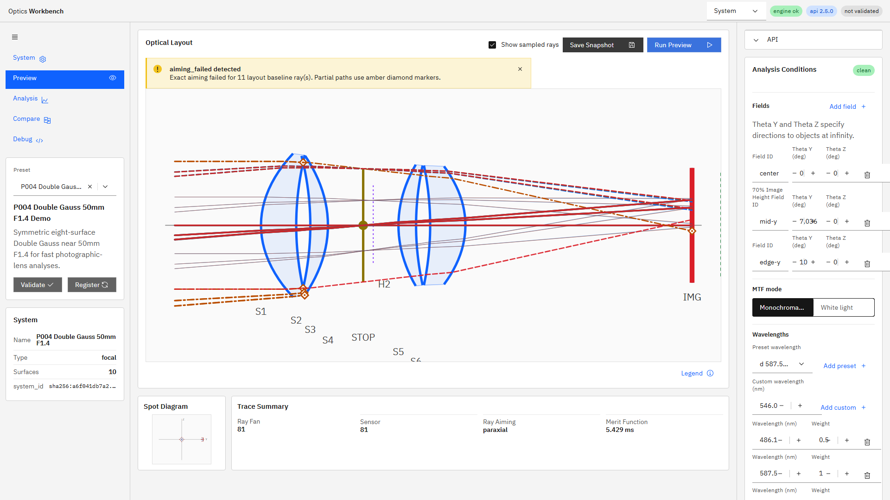
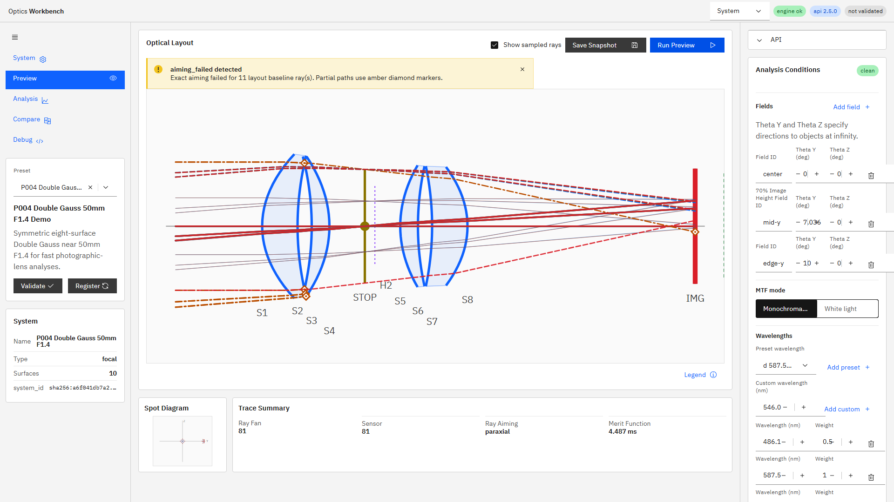
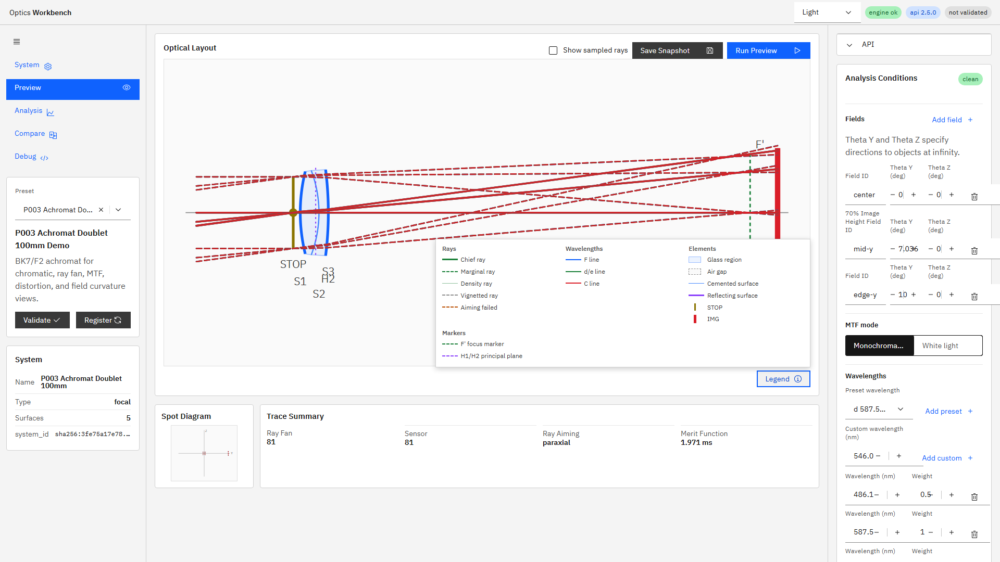
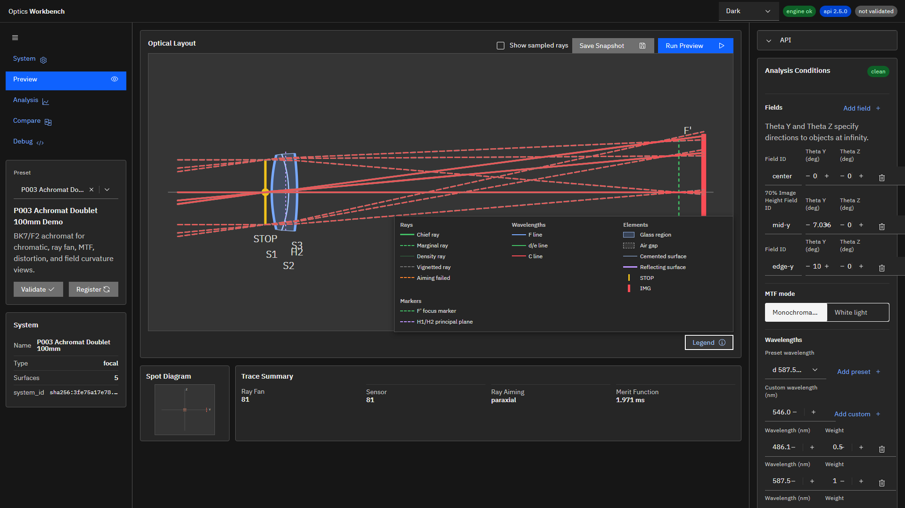
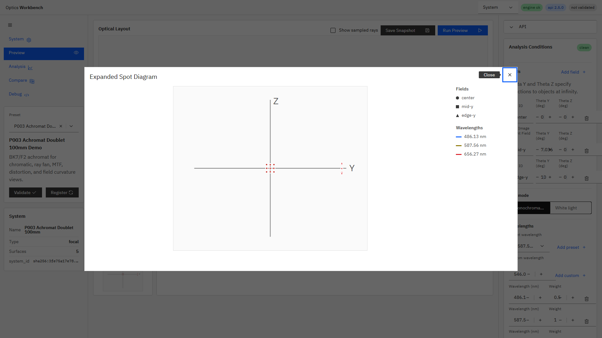

# R114＋R107/R109/R110 UI修正バッチ 完了報告

## 規模見積もり

着手前の全体見積もりは`1.5〜2.2人日`とした。内訳はR114 `0.5〜0.8人日`、R107 `0.2人日`、R109 `0.3〜0.5人日`、R110 `0.5〜0.7人日`である。

## 結果

4タスクを指示順に直列実行し、すべて完了した。エンジン/API、数値結果、request payload、snapshotデータ構造は変更していない。

| タスク | 機能コミット | 追補コミット | 状態 |
|---|---|---|---|
| R114 | `1c21655` | - | 完了 |
| R107 | `1d948c2` | `0f5e05c` | 完了 |
| R109 | `75c5755` | - | 完了 |
| R110 | `1f70590` | `9a65ab4` | 完了 |

追補は全CIで判明した既存E2E前提の更新である。R104ルールに従い`git commit --amend`は使わず、新規コミットとして記録した。

## R114 面ラベルの累積ずれ

### 原因

P004でRun Previewを10回繰り返したところ、同一surfaceの座標は初回と10回目で完全一致した。再描画状態が蓄積するバグではなかった。一方、近接面ごとに`labelRow`を無制限加算しており、面列方向に`S1=282`、`S2=293`、最終的に`S8=370`まで単調に下降していた。SVG `viewBox`下端`340`を越えるため、後半ラベルが欠けていた。

R28bは解析マーカーがXスケールへ混入した回帰、R41は固定Y倍率と面間隔表示の問題であり、R114はどちらとも異なるラベル衝突回避アルゴリズムの問題だった。

### 修正

- 近接面ラベルを、最終使用X座標に基づく3行の安定した衝突回避へ変更した。
- `data-label-row`と`data-label-y`を追加し、DOMから座標を直接検証可能にした。
- P004で10回再描画後も座標が同一、行番号が`0〜2`、最大Yが`340`未満であることをE2Eで固定した。

修正前:



修正後:



## R107 density ray既定非表示

- `showDensityRays`の初期値を`false`へ変更した。
- chief/marginal baseline rayは既定表示を維持した。
- PreviewとSystem live mini-layoutの両方でdensity rayが既定`0`になることをE2Eで確認した。
- density抽出・対称性を検証する既存テストは明示的にチェックをオンにし、従来の検証を維持した。
- 既定オンを暗黙に仮定していたray path helperは、marginal baselineを明示選択するよう追補した。

## R109 ダークモードの材料視認性

- `--ow-glass-fill`、`--ow-glass-stroke`、`--ow-air-fill`、`--ow-air-stroke`、`--ow-cemented-stroke`をsemantic tokenとして追加した。
- ライト値は従来のcomputed styleと同一に保った。
- ダークではglass fillを`rgba(120, 169, 255, 0.22)`、strokeを`rgba(166, 200, 255, 0.78)`へ強め、airとcemented surfaceも専用tokenで区別した。
- computed styleをライト/ダーク双方でE2E固定した。

R100 visual QAで漏れた原因は、テーマ基盤の本文・波長色contrastは検証していたが、Layout Viewのglass fill/strokeがライト用`rgba(...)`直書きのまま残っており、材料塗り分けを直接確認するテストがなかったためである。

ライト:



ダーク:



## R110 spot diagram拡大表示

compact result stripは維持し、Carbon `Modal`による拡大表示を追加した。Modalを選んだ理由は、中央Layoutの文書フロー外に表示でき、Layout寸法を変えず、標準のフォーカス管理とClose操作を利用できるためである。

- compact headingへ`Maximize`アイコンボタンを追加した。
- 拡大SVGは`620 px`幅を確保した。
- fieldは円・四角・三角、波長は既存の波長色で区別した。
- field IDと波長`nm`の凡例を表示した。
- ja/en/pseudo向けに3キーを追加し、既存`spot-svg` IDとexport経路は維持した。
- 開閉前後でLayoutの矩形が不変であること、field/wavelength凡例各3件と3種マーカーをE2Eで固定した。



## テスト

- R114直接E2E: `1 passed`。10回再描画を含む。
- R107関連E2E: `2 passed`、追補対象`6 passed`。
- R109テーマE2E: `2 passed`。
- R110直接E2E: `1 passed`、描画待機後の三反復`3 passed`。
- `npm run ci`: Pass。
  - `i18n:check ok (257 keys)`
  - `i18n:coverage ok`
  - `i18n:test ok`
  - `svg-export-readback ok`
  - `chart-theme:test ok`
  - Playwright: `55 passed (1.4m)`
- `npm run ui:build:pseudo`: Pass、`1019 modules transformed`。

最初の全CIでは`48 passed / 7 failed`だった。6件はR107のdensity既定オンを仮定した共通helper、1件はR110がpreview描画完了前にLayout位置を測る競合だった。テストを削除・skipせず、前提を明示化して再実行し、最終的に全件greenとした。

## 実環境反映

機能・コード変更の最終コミット`9a65ab4d8392926c8b4e67b1a8581dc25451a904`でAPI/UIを再起動し、次を確認した。

```text
HEAD: 9a65ab4d8392926c8b4e67b1a8581dc25451a904
GET /v1/meta build_info.git_commit: 9a65ab4
API status: 200
UI status: 200
```

`build_info.git_dirty=true`は同期で再配置された未追跡work order群と、本報告書作成前の指示書によるものである。trackedコード差分はない。pushは実施していない。
