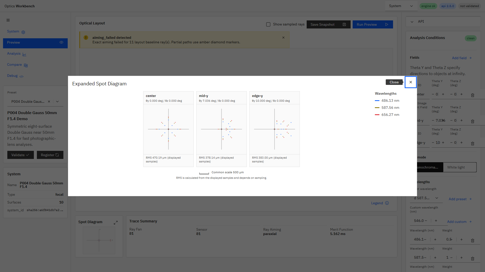

# R115 スポットダイアグラムのfield別分割パネル表示 完了報告

## 規模見積もり

- 着手前見積もり: 0.5〜0.8人日
- 対象: UI実装、i18n、E2E、P004実データ確認、スクリーンショット、プロセス再起動とbuild_info確認

## 結果

状態: **Done**

- 拡大モーダルを、`evaluated_fields`のfield数に一致する分割パネル表示へ変更した。
- 各パネルは正常なbaseline `chief` rayの像面終点を局所原点とする。基準波長587.56 nmに最も近い正常なchief rayを優先する。
- chief rayを取得できないfieldでは表示点群の重心を原点とし、パネル内にフォールバック注記を表示する。
- 全fieldのchief ray原点からの最大広がりを使い、1-2-5系列から共通スケールバーを自動選択する。パネルごとの個別スケールは使用しない。
- field IDと`theta_y_deg` / `theta_z_deg`を各パネル見出しへ表示した。
- RMSスポット半径を表示点群の重心まわりでUI側算出し、µm単位で注記した。
- 波長色は既存の`wavelengthColor()`を再利用した。
- fieldはパネル見出しで識別できるため、分割後に冗長かつ誤認要因となるfield別マーカー形状と形状凡例を廃止し、全点をcircleへ統一した。波長凡例は維持した。
- compact strip、`spot-svg` ID、120点表示上限、export経路、request payload、エンジン/APIは変更していない。

## RMS定義上の制限

RMS値は追加API呼び出しを行わず、現在のtrace responseでセンサーへ到達した表示点群から算出している。エンジンの`rms_spot_radius` metricと異なり、UI Previewの`ray_sampling.samples_per_field`、波長構成、到達光線に依存するため、モーダル内に「表示点群から算出したサンプリング依存値」と明記した。

## 検証

- 機能コミット: `54ae5fc` (`feat(ui): split expanded spot by field (R115)`)
- E2E: `apps/workbench-ui/tests/e2e/analysis-conditions.spec.ts`
  - fieldパネル数とfield数の一致
  - 共通スケールバーの存在
  - 全fieldのRMS注記
  - 全fieldのスポット点
  - 波長凡例
  - モーダル開閉前後のLayout寸法不変
- `npm run ci`: `55 passed (1.8m)`、`i18n:check ok (262 keys)`、coverage/unit/export/chart検証成功
- `npm run ui:build:pseudo`: 成功
- P004実データ: 3 field、各27到達点、共通スケール500 µmを確認
- 再起動後UI: `http://127.0.0.1:5173/` -> HTTP 200
- 再起動後`/v1/meta`: `build_info.git_commit=54ae5fc`
- 確認時HEAD: `54ae5fc`
- 一致結果: `build_info.git_commit`と機能コミットHEADは一致
- `build_info.git_dirty=true`は、同期で再配置された未追跡の完了済みactive指示書群およびR115文書作業による。機能コミットの不一致ではない。

## スクリーンショット

P004 Double Gauss 50mm F1.4 Demo、拡大モーダル、field別3パネル:

