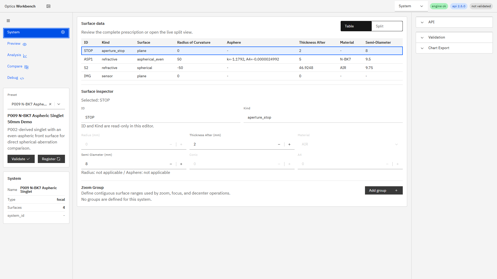
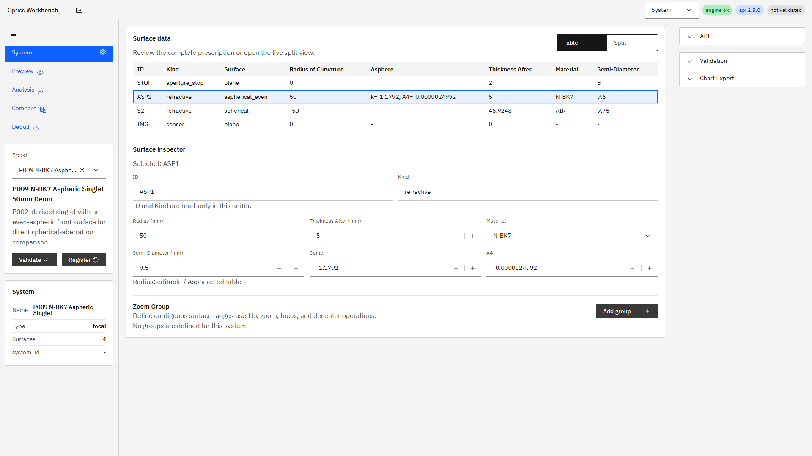
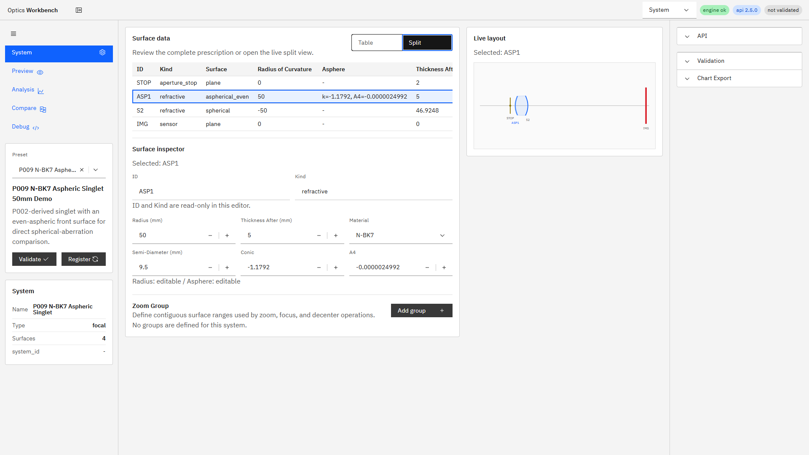

# R120 System諸元表の全幅化とsurface inspector 実装報告

## 着手前見積もり

- 規模: 中
- 想定時間: 4〜6時間
- 対象: UIレイアウト、surface編集、i18n、E2E、実ブラウザ確認
- 非対象: エンジン/API、正本仕様、snapshot schema

## 結果

R120は完了した。機能実装の根拠コミットは`54da79e`（`feat(ui): add full-width surface inspector (R120)`）。

- System画面へ`Table / Split`切替を追加し、初期値を`Table`とした。
- 切替状態を`optics-workbench-system-view`としてlocalStorageへ保存する。
- Tableではmini-layoutを外して8列のSurface Tableを全幅表示する。
- 行選択で下段のSurface Inspectorを更新し、適用可能な面諸元を編集できる。
- ID/Kindは読み取り専用とし、その旨をinspectorに表示する。
- Materialは現在の`system.materials`に定義されたIDだけをSelectへ列挙し、自由入力を許さない。
- 変更は既存のsystem dirty化と70 ms debounce previewへ接続した。
- 非正のSemi-Diameterとannulusの`outer <= inner`は、`invalid_semi_diameter`の構造化issueとしてinspector内に表示し、処方へ反映しない。
- 既存annulus STOP inline編集とGroup Panel編集は維持した。

## 対応範囲

### 編集可能項目と面kind

| 項目 | `refractive` | `mirror` | `thin_lens` | `aperture_stop` | `mechanical_aperture` | `sensor` / `eye_reference` / `dummy` |
|---|---|---|---|---|---|---|
| Radius | `surface_type != plane`で編集可 | `surface_type != plane`で編集可 | 対象外 | 対象外 | 対象外 | 対象外 |
| conic / A4等 | `aspherical_even`で編集可 | `aspherical_even`で編集可 | 対象外 | 対象外 | 対象外 | 対象外 |
| Thickness After | 終端面以外で編集可 | 終端面以外で編集可 | 終端面以外で編集可 | 終端面以外で編集可 | 終端面以外で編集可 | 終端面以外のみ編集可 |
| Material | `system.materials`から選択 | 対象外 | 対象外 | 対象外 | 対象外 | 対象外 |
| Semi-Diameter | 編集可 | 編集可 | 編集可 | 編集可 | 編集可 | 対象外 |
| ID / Kind | 読み取り専用 | 読み取り専用 | 読み取り専用 | 読み取り専用 | 読み取り専用 | 読み取り専用 |

非球面係数は既存キーを数値順に表示し、最低限`A4`を表示する。P010のように`A6`/`A8`を持つ面も同じinspectorで編集対象になる。VariableNumberのSemi-Diameterはbindingを置き換えず、`default`値だけを更新する。

### 表示範囲

P009、Edge、1920×1080、Tableビューで`.table-shell`を実測した。

| clientWidth | scrollWidth | 完全表示列 | 横overflow |
|---:|---:|---:|---:|
| 1242 px | 1242 px | 8/8 | 0 px |

Splitビューでは従来どおりmini-layoutを併置するため、長いAsphere値を持つP009では表を横scrollできる。これはTableで全列を一望し、Splitで処方と形状を同時確認する役割分担である。

## スクリーンショット

全幅Tableビュー。P009の8列を横scrollなしで表示する。

ASP1を選択したSurface Inspector。Radius、Thickness、Material、Semi-Diameter、conic、A4を表示する。

Splitビュー。選択面とmini-layoutのhighlightを同時表示する。

PNGはすべて`RGB 1920x1080`。Edge/Playwrightで実アプリを操作して保存した。

## テスト

- R120直接E2E: `1 passed (3.3s)`
- `npm run ci`: `57 passed (1.4m)`。`ui:build`、`i18n:check`（`281 keys`）、`i18n:coverage`、`i18n:test`、SVG/chart testを含む。
- `npm run ui:build:pseudo`: 成功。
- `git diff --check`: 問題なし。

直接E2Eは次を固定した。

1. P009のTable既定と8列完全表示、横overflowなし。
2. InspectorからRadius、Thickness、Material、Semi-Diameter、conic、A4を編集し、debounce後のregister処方へ全値が反映されること。
3. 非正Semi-Diameterで`invalid_semi_diameter`を表示すること。
4. Splitへ切り替えるとmini-layoutが表示され、reload後も切替状態が復元されること。

全CI初回は、R103由来の2テストがmini-layout常時表示を前提として失敗した。新しいTable既定に合わせて両テストをSplitへ明示切替するよう更新し、再実行で`57 passed`を確認した。テストの削除・skipは行っていない。

## 実行環境との一致

機能コミット直後にAPI/UIを再起動した。

- 機能コミットHEAD: `54da79e`
- `GET /v1/meta build_info.git_commit`: `54da79e`
- UI `http://127.0.0.1:5173/`: HTTP 200
- `build_info.git_dirty=true`: 本コミット後に追加した報告用スクリーンショット等が未コミットであるため。機能コミットの一致自体は確認済み。

本報告書とスクリーンショットのコミットはドキュメントのみであり、上記機能一致確認をやり直す対象ではない。

## 制限

- ID/Kind編集は参照整合性への影響が大きいため未対応。
- Materialの「カタログ」は現行UI/APIに独立した全材質一覧endpointがないため、systemの材質indexである`system.materials`を使用した。系へ未定義の材質を追加する操作はAdvanced/Raw編集の対象である。
- Radiusを変えても`surface_type`は自動変更しない。plane面のRadius入力は無効化している。
- センサー寸法、thin lensの`focal_length_mm`、annulus内半径は本inspectorのMVP対象外。annulus内半径は既存Surface Table inline editorで引き続き編集できる。
