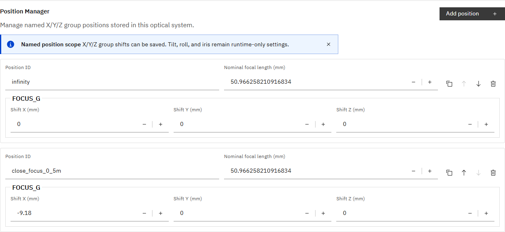
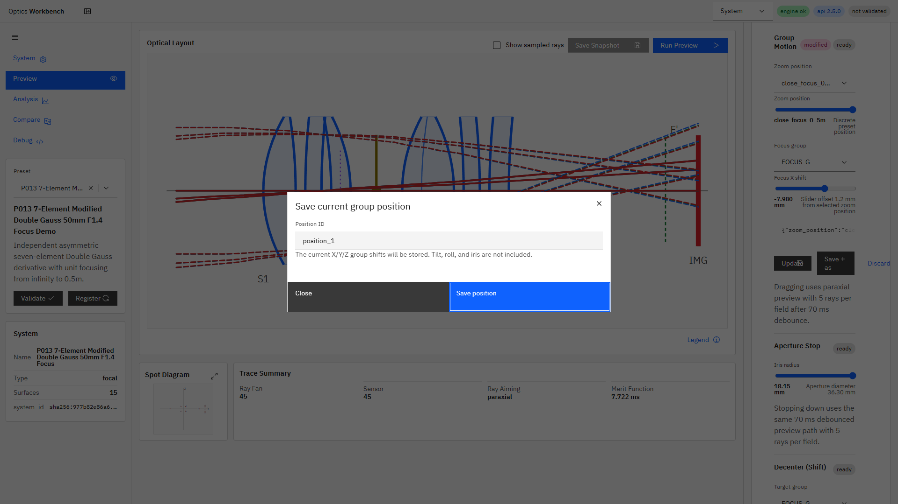
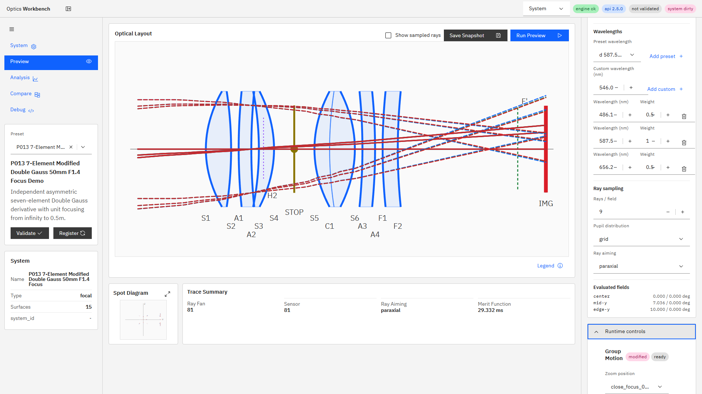

# R121 Position Manager 実装報告

## 着手前見積もり

- 規模: 中〜大
- 想定時間: 6〜9時間
- 対象: Position Manager、Preview runtime操作、Snapshot configuration、Compare/export/import/復元、i18n、E2E、実ブラウザ確認
- 非対象: エンジン/API、正本仕様、汎用multi-configuration schema

## 結果

R121は完了した。機能実装の根拠コミットは`6d5fcab`（`feat(ui): add position manager and snapshot configuration (R121)`）。

### Position Manager

- System画面へ`system.zoom_positions`を正本とするPosition Managerを追加した。
- position ID、公称焦点距離、各groupのX/Y/Z shiftを表示・編集できる。
- 追加、複製、更新、削除、上/下への並び替えを実装した。
- 編集はsystem dirty化、既存validate/register、70 ms debounce previewへ接続した。
- PreviewのGroup Motionへposition IDが見えるSelectを追加し、既存range sliderも維持した。
- 一時X/Y/Z offsetがある場合は`modified` Tagを表示し、`Update`、`Save as`、`Discard`を提供した。
- 現在値の保存は選択positionを基準に、focus X offsetおよびY/Z decenterを合成してnamed positionへ書き戻す。

### Snapshot

- Snapshot rootへoptionalな`configuration`を追加した。既存fieldの変更・削除はない。
- 保存時に選択position ID、temporary `group_positions`、`decenters`、`tilts`、`variables`を複製保存する。
- Compareのcondition diffへ`configuration`差分、`zoom_position`、`group_positions`を追加した。
- JSON exportは追加fieldをそのまま含む。
- JSON importとSnapshotの`Restore`操作を追加した。
- 復元時はsystem、解析条件、結果、選択position、temporary X/Y/Z、decenter/tilt、irisをUI stateへ戻す。
- `configuration`を持たない旧Snapshotは、復元systemの先頭positionを既定値として読み込む。後方互換E2Eで固定した。

## 保存範囲

### Named positionへ保存できる状態

| 状態要素 | 保存 | 格納先・挙動 |
|---|---|---|
| position ID | 可 | `zoom_positions[].id` |
| 公称焦点距離 | 可 | `focal_length_nominal_mm` |
| group X shift | 可 | `group_positions[group].shift_x_mm` |
| group Y shift | 可 | `group_positions[group].shift_y_mm` |
| group Z shift | 可 | `group_positions[group].shift_z_mm` |
| 配列順 | 可 | `zoom_positions`の配列順。上/下操作で変更 |
| 現在のfocus X offset | 可 | 選択positionのXへ合成して保存 |
| 現在のdecenter Y/Z | 可 | 対象groupのY/Zへ合成して保存 |

### Named positionへ保存しない状態

| 状態要素 | 状態 | 理由・扱い |
|---|---|---|
| tilt Y/Z | 不可 | 現行`zoom_positions` schemaにfieldがない。runtime configurationとSnapshotには保存可 |
| roll X | 不可 | 同上 |
| iris | 不可 | aperture variableでありgroup positionではない。runtime configurationとSnapshotには保存可 |
| label / kind | 不可 | 現行position schemaにmetadataがない |
| trajectory parameter / order metadata | 不可 | 配列順のみ。連続ズーム軌跡の意味論は未仕様 |
| field / wavelength / image plane policy | Named position対象外 | Snapshotのanalysis条件として保存 |

UI上にも「X/Y/Z group shiftsだけがnamed position化でき、tilt/roll/irisはruntime-only」と明示した。

## スクリーンショット

P013 Position Manager。2つのnamed positionとFOCUS_GのX/Y/Zを表示する。

現在のgroup位置を別名保存するダイアログ。右パネルには`modified`とUpdate/Save as/Discardが見える。

Snapshot復元後のPreview。`close_focus_0_5m`とtemporary focus offset `0.7 mm`を復元し、`modified`状態へ戻した。

## テスト

- R121直接E2E: `2 passed`（個別再実行は`1 passed (6.0s)`を含む）。
- `npm run ci`: `59 passed (2.0m)`。`ui:build`、`i18n:check`（`304 keys`）、`i18n:coverage`、`i18n:test`、SVG/chart testを含む。
- `npm run ui:build:pseudo`: 成功。
- `git diff --check`: 問題なし。

直接E2Eで次を固定した。

1. P013でPosition Managerの追加・複製・ID更新・削除・並び替え。
2. ID Selectによる`close_focus_0_5m`切替と、+1.2 mm X offsetを`-7.98 mm`として新positionへ保存するregisterフロー。
3. P003 OIS_GのY=`1.2 mm`、Z=`-0.8 mm`をnamed positionへ保存するregisterフロー。
4. `zoom_position`、temporary focus X=`0.7 mm`、decenter Y=`0.4 mm`をSnapshot JSONへexportし、import後に同値復元すること。
5. `configuration`を削除した旧Snapshot JSONが読み込め、`infinity`へフォールバックすること。

テストの削除・skipは行っていない。

## 実行環境との一致

機能コミット直後にAPI/UIを再起動した。

- 機能コミットHEAD: `6d5fcab`
- `GET /v1/meta build_info.git_commit`: `6d5fcab`
- UI `http://127.0.0.1:5173/`: HTTP 200
- `build_info.git_dirty=true`: 本コミット後に追加した報告用スクリーンショット等が未コミットであるため。機能コミットの一致自体は確認済み。

本報告書・スクリーンショット・共有指示書移動のコミットはドキュメントのみであり、上記一致確認をやり直す対象ではない。

## 制限と今後の提案

- `label`、`kind`、`trajectory_order`または連続parameterをpositionへ持たせるには、エンジンmodelと正本仕様の拡張が必要。本タスクでは実装していない。
- tilt/roll/irisもnamed configurationとして統合する場合は、R106案Cの汎用`configurations` schemaを先に仕様化する必要がある。
- Snapshot importは単一JSONを対象とする。project全体のzipや複数snapshot bundleはR121対象外。
- Restore後のsystemは未登録としてsystem dirtyになる。明示validate/registerまたは次回Previewで再登録する既存フローを維持した。
