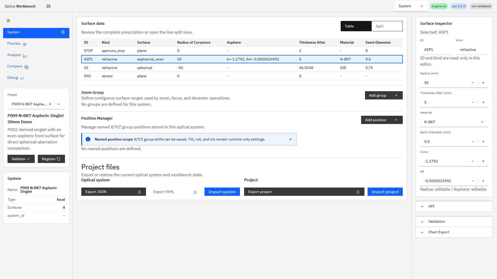
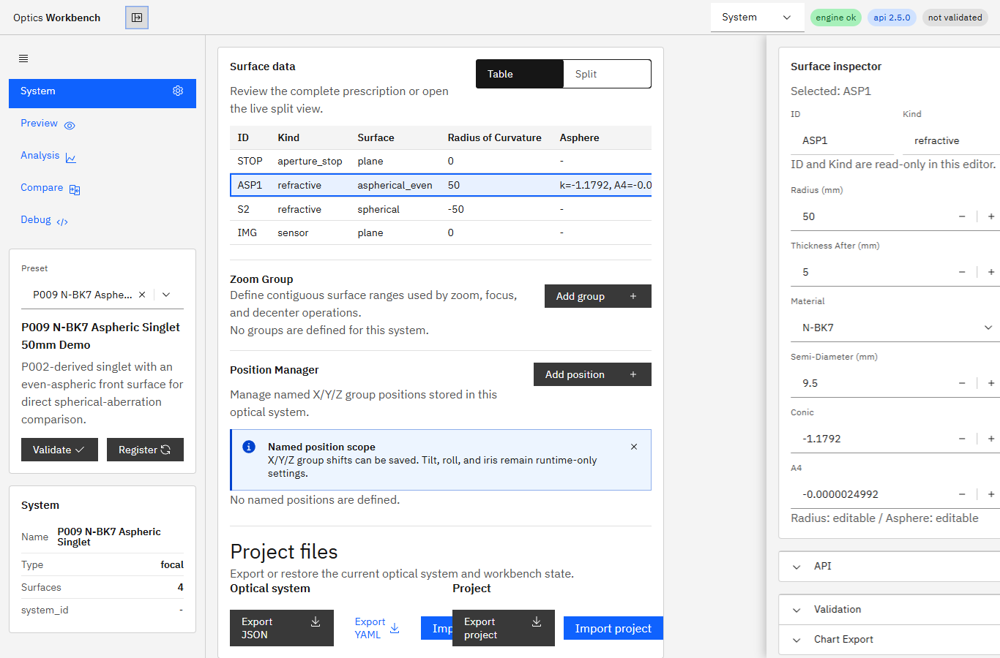

# R127 Surface Inspector右contextパネル移設 完了報告

## 着手前見積もり

- 見積もり: 2〜3時間
- 難易度: 中
- 主な作業: R120 Inspectorの配置変更、1366px drawer導線、E2E更新、実画面確認

## 結果

**Done**。Surface InspectorをSystem画面の中央ペイン下段から右contextパネル最上部へ移設した。Table/Splitの両ビューで同じInspectorを使用し、1366pxのdrawerモードでは面行の選択時にcontext drawerを開く。

機能コミット: `8b12945 feat(ui): move surface inspector to context panel (R127)`

## 修正内容

- 選択面がある場合、Surface Inspectorを右contextパネルのAPI/Validation Accordionより上に表示する。
- 選択面がない場合は、面選択を促すi18n済みplaceholderを同じ位置に表示する。
- 1366px drawerモードで面行を選択すると、右context drawerを自動的に開く。
- 右ペイン内では編集フィールドを1列配置にし、狭い幅でもラベル・入力値が欠けないようにした。
- R120 E2Eを新配置に追従させ、R127の表領域計測、drawer表示、registerとdebounce previewを直接テストした。

## R120編集仕様の維持

配置以外の編集マトリクス、validation、debounce処理は変更していない。

| 項目 | 編集対象 |
|---|---|
| Radius | 非planeのrefractive / mirror |
| Conic / Asphere | `aspherical_even`のrefractive / mirror |
| Thickness After | 終端面以外 |
| Material | refractive。system materialsから選択 |
| Semi-Diameter | refractive / mirror / thin_lens / aperture_stop / mechanical |
| ID / Kind | read-only |

## 表示領域の計測

P013、1920x1080、Tableビューで計測した。

| 指標 | 移設前 | 移設後 | 差 |
|---|---:|---:|---:|
| surface row数 | 15 | 15 | 0 |
| 完全表示row数 | 15 | 15 | 0 |
| center `scrollHeight` | 1908 px | 1540 px | -368 px |
| center `clientHeight` | 1032 px | 1032 px | 0 |

移設前から15行すべてが表示領域内に収まっていたため、完全表示row数そのものは増えなかった。一方、中央ペインの必要高さはInspector相当の368 px減少し、下段コンテンツへのスクロール量が削減された。

## 検証

- `npm.cmd run ci`: 成功、`65 passed (1.8m)`、`i18n:check ok (346 keys)`
- `npm.cmd run ui:build:pseudo`: 成功
- `apps/workbench-ui/tests/e2e/analysis-conditions.spec.ts`
  - R120 Inspector編集回帰
  - R127 1920px表領域計測
  - R127 1366px drawer表示・Radius編集・register・debounce preview
- `git diff --check`: 問題なし（既存のLF/CRLF警告のみ）

最終CI確定までに、実行時間上限によるEPIPE中断を1回確認した。実行時間を延長して全CIを再実行し、上記の全項目が成功した。これとは別に途中実行でP007性能テストとR120 debounce検証のタイミング揺れを確認したが、P007単体再実行は成功し、R120は最新register requestを待つ検証へ修正した。最終全CIはグリーンである。

## 実環境確認

機能コミット直後にAPI/UIを再起動し、次を確認した。

- HEAD: `8b12945`
- `GET /v1/meta` `build_info.git_commit`: `8b12945`
- `build_info.git_dirty`: `true`（R127指示書・報告書・スクリーンショット、および他の未追跡active指示書による）
- UI: `http://127.0.0.1:5173/`

### 1920px Table + 右Inspector

### 1366px drawer内Inspector

## 仕様・スコープ

- UI側のみ変更した。エンジン、API、snapshot構造は変更していない。
- R120の編集可能範囲とvalidationは維持した。
- 未完了項目なし。
