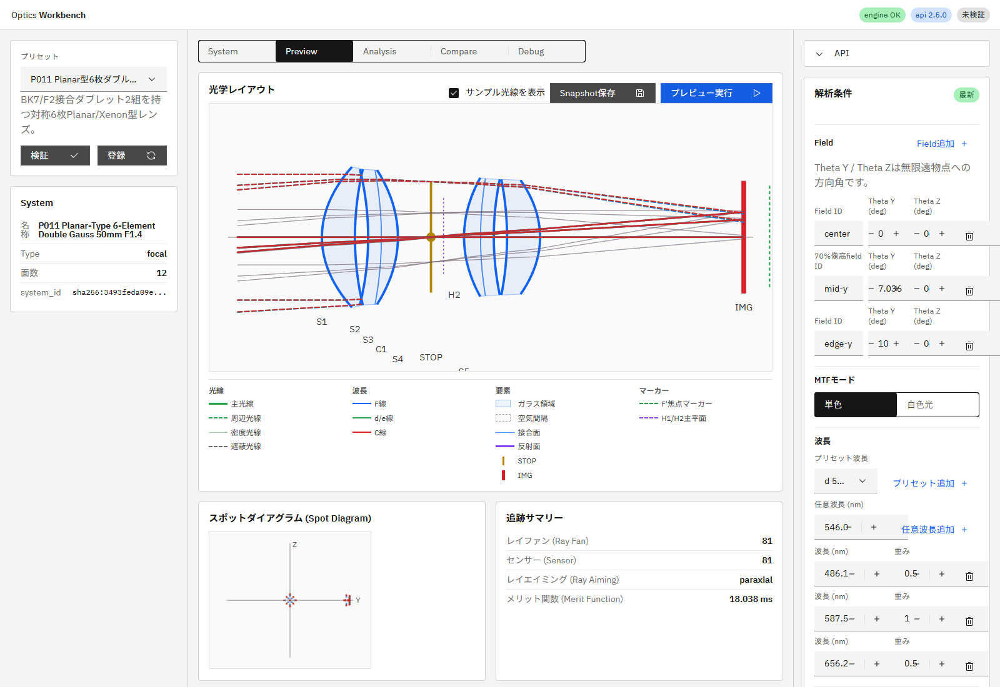

# R94 P011 Layout View光線途中終端 調査報告

## 結論

P011 Previewで途中終端して見える破線光線は`blocked`ではなく、Layout View用baseline rayの`aiming_failed`である。根本原因は既存backlog「P011の周辺fieldでfull aiming収束失敗を解消する」と同一だった。

ただしUI既定のmain trace自体は`paraxial` aimingで`alive 81`である。Layout Viewはmain traceとは別にbaseline rayを常に`full exact`でaimingし、その失敗pathを重ね描画するため、追跡サマリーの`paraxial / arrived 81`と画面上の短い破線が同時に現れる。

## 再現条件

- Preset: P011 Planar-Type 6-Element Double Gauss 50mm F1.4
- fields: `center`、`mid-y (7.036366 deg)`、`edge-y (10 deg)`
- wavelengths: `486.13 / 587.56 / 656.27 nm`
- UI既定main sampling: `9 rays/field`、`grid`、`paraxial`
- options: `store_path: true`、`include_layout_baseline_rays: true`

証跡画像:



画面上部・下部の太い波長色破線がS1/S2付近で終端している。gray短破線や終端×マーカーは表示されていない。

## 実API結果

稼働中の`/v1/trace/forward`と`/v1/education/preview`へ同じpayloadを直接送信し、両endpointで次を確認した。

```text
main trace: alive 81
baseline: alive 15 / aiming_failed 12 / blocked 0
aiming_failed path length: 2 points x 9 rays / 1 point x 3 rays
```

12本の内訳:

| field | role | wavelength | path終端 | 表示 |
|---|---|---|---|---|
| center | marginal lower/upper | 3波長 | S2、2点path | 6本を短い破線として表示 |
| mid-y | marginal lower | 3波長 | S2、2点path | 3本を短い破線として表示 |
| edge-y | marginal lower | 3波長 | S1、1点path | `path.length >= 2` filterで非表示 |

代表座標:

- center / 587.56 nm / lower: S2 `[5.9864424979, -19.8394538828, 0.0] mm`
- mid-y / 587.56 nm / lower: S2 `[6.1541339384, -21.4551054580, 0.0] mm`
- edge-y / 587.56 nm / lower: S1 `[4.6235292908, -22.6925620993, 0.0] mm`

既知の`25 rays/field`・`hexapolar`・`full`条件も再測定し、`alive 213 / aiming_failed 12 / blocked 0`を再現した。失敗pathはS1/S2で終端しており、既存backlog記載と一致する。

## 描画側の評価

`layoutRayItems()`はmain traceから`alive`だけをdensity rayとして選ぶ。一方、`layoutBaselineRayItems()`は`alive`、`aiming_failed`、`blocked`を描画対象にする。

- `blocked`: `ray-baseline-blocked`によりgray短破線となり、終端×マーカーが付く。
- `aiming_failed`: 専用classも終端マーカーもなく、通常の波長色とmarginal ray破線を使う。
- R73のCarbon warning: Analysisのray fan/longitudinal向けで、Preview baselineには表示されない。

このため現状は誤解を招く。DOM実測では`data-total-rays=81`、描画baseline 24本、描画density 27本、描画された`aiming_failed` baseline 9本、blocked marker 0個だった。1点pathの失敗3本は描画されない。

## 対応方針

エンジン側の収束失敗は既存backlogで継続する。表示上の識別問題は別のUI下書きとして `doc/reports/issues_backlog.md` に「Layout Viewでaiming_failed baseline光線を明示する」を追加した。

想定規模は小〜中で、専用class・失敗終端マーカー・Preview warning・P011 E2Eの追加が中心となる。本タスクは調査のみのためコード・描画修正は行っていない。Issue化には`Create Issues From Backlog`ワークフローの手動起動が必要である。

## 実行環境

- R94はコード変更を伴わない調査タスクのため、プロセス再起動は行っていない。
- 実行中APIの機能コミット: `68b5465`（R93最終機能コミット）
- 調査開始時HEAD: `26a72e7e6dc0a147be17abd5d50e20b6a277b87e`
- UI: `http://127.0.0.1:5173/`
- in-app browser制御ランタイムが起動不能だったため、証跡画像はリポジトリ既存のPlaywright/Edge環境で同じローカルUIを再現して取得した。
