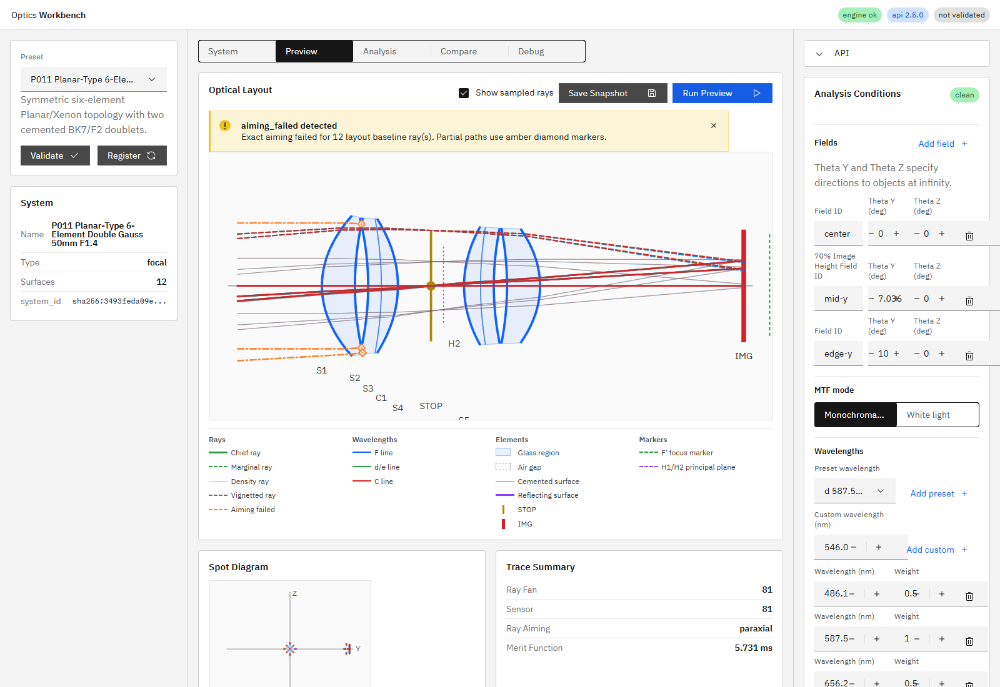

# R95 aiming_failed baseline光線の視覚的明示 完了報告

## 結論

P011 Preview Layout Viewで、`aiming_failed` baseline rayを健全な光線・`blocked`光線から視覚的に区別できるようにした。エンジン側のaiming収束処理は変更していない。

## 実装内容

- `aiming_failed` baseline rayへ`ray-baseline-aiming-failed` classを付与した。
- amberのlong-short dashとdiamond＋center dotの終端マーカーを追加した。
- `blocked`のgray短破線＋×マーカーは変更していない。
- Layout View凡例へ`Aiming failed` / `aiming_failed光線`を追加した。
- PreviewへCarbon `InlineNotification`を追加し、描画対象外の1点pathも含むbaseline失敗総数を表示した。
- P011実API E2Eを追加し、線・marker・warning・凡例・computed colorを固定した。
- R94で追加した未Issue化backlog下書きは実装完了のため削除した。

## 実装根拠

- 機能コミット: `0bac84b3f754266c1409f7d2ca1fc663380cafc4`
- E2E: `apps/workbench-ui/tests/e2e/run-charts-performance.spec.ts`
- 証跡: `screenshots/2026-07-15_r95_aiming_failed_ray_visualization_1.png`



## DOM実測

再起動後のP011実API Previewで次を確認した。

```text
aiming_failed baseline path: 9
aiming_failed diamond marker: 9
blocked marker: 0
warning count: 12 layout baseline rays
legend: Aiming failed x 1
stroke: rgb(255, 131, 43)
stroke-dasharray: 8px, 3px, 2px, 3px
```

`blocked`は既存の`#6f6f6f`、`3 2` dash、×マーカーであり、色とmarker形状の両方が異なる。

## テスト結果

```text
targeted Playwright
1 passed (2.8s)

npm run ci
ui:build: passed
i18n:check: 228 keys / passed
i18n:coverage: passed
i18n:test: passed
svg-export-readback: passed
chart-theme:test: passed
Playwright: 41 passed (51.7s)
```

既存blocked表示を含むE2Eも全てグリーンである。

## 実行環境

機能コミット後にAPI・UI開発サーバーを再起動した。

- `HEAD`: `0bac84b3f754266c1409f7d2ca1fc663380cafc4`
- `GET /v1/meta` の `build_info.git_commit`: `0bac84b`
- UI `http://127.0.0.1:5173/`: HTTP 200
- `build_info.git_dirty`: `true`（完了報告、証跡画像、active指示書を含むため）

R95指示書は本報告と同じコミットで`doc/work_orders/done/`へ移動する。
