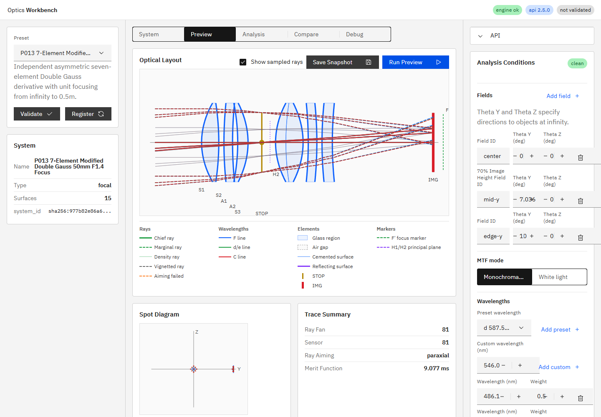
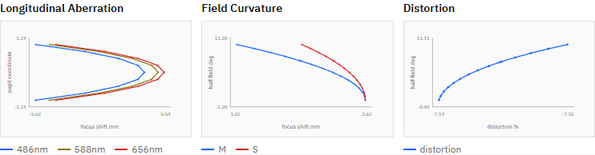

# R98：フォーカス群設定済み50mm F1.4プリセット 実装報告

## 状態

**Done with noted limitation**

機能実装コミットは `a42cb438b2ed657c26ed05845d571011ae4a22c0`（`feat(ui): add focused 50mm F1.4 preset (R98)`）。本報告書コミットの直前時点で、エンジンAPIとUI開発サーバーを再起動し、`GET /v1/meta`の`build_info.git_commit`が機能コミット短縮値`a42cb43`と一致することを確認済み。

## 実装内容

- P013 `7-Element Modified Double Gauss 50mm F1.4 Focus Demo`を追加した。
- 中央STOPを挟む非対称7枚構成とし、N-BK7 / N-F2の既存カタログ材質だけを使用した。
- S1からF2までのレンズ全体を独立した`FOCUS_G`として定義した。OIS群は持たず、P003のFOCUS/OIS重複を継承していない。
- focus positionは`infinity`（`shift_x_mm: 0`）と`close_focus_0_5m`（`shift_x_mm: -9.18`）を登録した。
- 日英プリセット名・説明、`doc/ui_spec.md` 9.1節の個数、9.4節の処方・期待値を更新した。
- `doc/engine_spec.md`は変更していない。P013は既存のgroups / zoom_positions / runtime configuration契約だけを使用し、新しいエンジン契約を追加していないためである。

## 数値結果

| 項目 | 結果 |
|---|---:|
| EFL | 50.966258210916834 mm |
| BFL | 32.81807179554631 mm |
| F number | 1.404029151815891 |
| infinity近軸像位置 | 70.8180717955463 mm |
| close_focus_0_5m近軸像位置 | 61.6380717955463 mm |
| infinity center 81-ray RMS | 0.33692389372465137 mm |
| 最小edge thickness | 0.8896725160981589 mm |

全7枚のedge thicknessは約`0.940529 / 2.500000 / 1.268194 / 0.889673 / 1.262385 / 2.500000 / 3.000000 mm`で、すべて正。

推奨3 field × 3 wavelength × 25-ray hexapolar、`ray_aiming.mode=full`の実測は次のとおり。

| focus position | alive | aiming_failed | blocked | alive比率 |
|---|---:|---:|---:|---:|
| infinity | 225 | 0 | 0 | 100% |
| close_focus_0_5m | 225 | 0 | 0 | 100% |

0.5 m軸上物点からSTOPへNewton aimingした近軸域5本の実光線RMSは、`infinity`位置の`0.28962965540011143 mm`から`close_focus_0_5m`位置の`0.00005690397516130479 mm`へ低下した。これにより、群移動による近軸像位置変化と有限物点の実光線合焦を直接固定した。

## テスト

- `python -m pytest -q`: `190 passed, 1 skipped, 1 warning in 16.25s`
- `tests/test_preset_api_smoke.py`: `26 passed, 1 warning in 13.40s`
- `npm run ci`: build / i18n:check / i18n:coverage / i18n:test / SVG / chart / Playwrightすべて成功、Playwrightは`42 passed`
- `tests/test_preset_api_smoke.py::test_p013_modified_double_gauss_focus_positions_are_clear_and_focus_at_half_meter`でEFL、F値、edge thickness、両focus positionのfull aiming、近軸像移動、0.5 m実光線合焦を固定した。
- `apps/workbench-ui/tests/e2e/analysis-conditions.spec.ts`でP013の自然順登録、7枚レイアウト、IMGまでのpreview pathを固定した。
- P001〜P012の期待status・近軸値を保持したプリセット横断テストがグリーンであり、既存プリセット数値への影響はない。

## 画面確認

P013のレイアウト、preview光線、spot概要：

P013のLongitudinal Aberration / Field Curvature / Distortion標準パネル：

## 注記

Workbenchのfield editorから有限距離物点を入力するUIは既存未実装であり、`doc/reports/issues_backlog.md`の「有限距離物体のWorkbench UI対応」に登録済みである。R98では新しいfield/API契約を先取りせず、既存トレースカーネルへ0.5 m物点から直接射出する回帰テストで近距離合焦を検証した。プリセットの通常preview推奨fieldは従来どおりangular fieldである。

`build_info.git_dirty`は`true`だった。内訳は本報告書・スクリーンショット・active指示書、およびR98対象外の未追跡指示書であり、機能コミットの追跡ファイル差分ではない。
